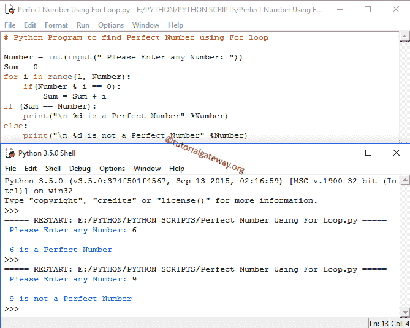

# Python 程序：寻找完美数

> 原文：<https://www.tutorialgateway.org/python-program-to-find-perfect-number/>

如何使用 For 循环、While 循环和函数编写 Python 程序来寻找完美数。

## Python 完美数

在 Python 中，任何数都可以是完美数，只要它的除数之和(不包括数本身)等于该数。

例如，6 在 Python 中是一个完美数，因为 6 可以被 1、2、3 和 6 整除。所以，这些值的总和是:1+2+3 = 6(记住，我们必须排除数字本身。这就是为什么我们这里没有增加 6)。一些完美数是 6，28，496，8128 和 33550336 等等。

## 使用 For 循环寻找完美数的 Python 程序

这个完美数字的 Python 程序允许用户输入任何数字。使用这个数字，它将使用 Python For 循环来计算这个数字是否是完美数。

```py
#  find Perfect Number using For loop

Number = int(input(" Please Enter any Number: "))
Sum = 0
for i in range(1, Number):
    if(Number % i == 0):
        Sum = Sum + i
if (Sum == Number):
    print(" %d is a Perfect Number" %Number)
else:
    print(" %d is not a Perfect Number" %Number)
```

在这个 Python 完美数字程序中，以下语句将要求用户输入任意数字，并将用户输入的值存储在变量 Number 中

```py
Number = int(input(" Please Enter any Number: "))
```

下一行，我们声明了整数变量 Sum = 0。接下来，我们使用了带 range()的 for 循环，这里不解释 for 循环。如果您不理解 for 循环，请访问我们的文章 [Python For 循环](https://www.tutorialgateway.org/python-for-loop/)。

```py
for i in range(1, Number):
```

在 For 循环中，我们放置了 Python If 语句来测试条件

```py
if(Number % i == 0):
        Sum = Sum + i
```

for 循环中的 If 语句将检查数字是否能被 I 值完美整除。如果这个数完全能被 I 整除，那么这个值将被加到和上。请参考文章 [Python If 语句](https://www.tutorialgateway.org/python-if-statement/)了解 [Python](https://www.tutorialgateway.org/python-tutorial/) 中的 If 语句。



从上面的 Python 完美数示例中，用户输入的值是:Number = 6

第一次迭代:对于第一次迭代，数= 6，和= 0，i = 1

If (Number % i == 0)
6 % 1 == 0

如果此处语句成功，那么，

Sum = Sum + i
Sum = 0 +1 = 1

第二次迭代:对于第二次迭代，Sum 和 I 的值都被更改为:Sum = 1 和 i = 2

If (Number % i == 0)
6 % 2 == 0

如果此处语句成功，那么，

Sum = Sum+I
Sum = 1+2 = 3

第三次迭代:对于这个 python 完美数字程序的第三次迭代，Sum 和 I 的值都被更改为:Sum = 3 和 i = 3

If (Number % i == 0)
6 % 3 == 0

如果这里的语句成功了那么，

Sum = Sum + i
Sum = 3 + 3 = 6

对于第四次和第五次迭代，if 条件内的条件将失败

6 % 4 == 0 (FALSE)

6 % 5 == 0(假)

因此，编译器将终止 for 循环。

在下一行中，我们有 If 语句来检查 Sum 变量中的值是否完全等于给定的 Number。

如果条件(总和==数字)为真，将执行以下打印语句

```py
print(" %d is a Perfect Number" %Number)
```

如果条件(总和==数字)为假，将执行以下打印语句

```py
print(" %d is not a Perfect Number" %Number)
```

本例中(总和==数字)为真。所以，给定的数是完美数

## 使用 While 循环寻找完美数的 Python 程序

这个 Python 完美数字程序允许用户输入任何数字。使用这个数字，它将使用 Python While 循环计算用户输入是否是完美数字。

```py
# find Perfect Number using While loop

Number = int(input(" Please Enter any Number: "))
i = 1
Sum = 0
while(i < Number):
    if(Number % i == 0):
        Sum = Sum + i
    i = i + 1
if (Sum == Number):
    print(" %d is a Perfect Number" %Number)
else:
    print(" %d is not the Perfect Number" %Number)
```

在这个例子中，我们没有做任何特别的事情。我们刚刚将上面 [python 程序](https://www.tutorialgateway.org/python-programming-examples/)中的 For 循环替换为 While 循环，如果您发现 While 循环功能难以理解，请参考 [Python While 循环](https://www.tutorialgateway.org/python-while-loop/)一文。

```py
 Please Enter any Number: 496
 496 is a Perfect Number
>>> 
 Please Enter any Number: 525
 525 is not the Perfect Number
```

## 用函数求完美数的 Python 程序

这个完美号码的程序允许用户输入任何号码。使用这个数字，它将使用函数计算这个数字是否是完美数。

```py
# Python Program to find Perfect Number using Functions

def Perfect_Number(Number):
    Sum = 0
    for i in range(1, Number):
        if(Number % i == 0):
            Sum = Sum + i
    return Sum        

# Taking input from the user
Number = int(input("Please Enter any number: "))
if (Number == Perfect_Number(Number)):
    print("\n %d is a Perfect Number" %Number)
else:
    print("\n %d is not a Perfect Number" %Number)
```

如果您观察上面的代码，我们在这个例子中没有做任何特别的事情。我们刚刚定义了新的用户定义函数，并添加了我们在 For 循环示例中提到的代码。

```py
Please Enter any number: 33550336

 33550336 is a Perfect Number
>>> 
Please Enter any number: 54

 54 is not a Perfect Number
```

## 寻找 1 到 1000 之间的完美数的 Python 程序

这个完美数字程序允许用户输入最小值和最大值。接下来，这个 Python 程序将找到最小值和最大值之间的完美数字。

```py
# Python Program to find Perfect Number between 1 to 1000

# Taking input from the user
Minimum = int(input("Please Enter any Minimum Value: "))
Maximum = int(input("Please Enter any Maximum Value: "))

# initialise sum

# Checking the Perfect Number
for Number in range(Minimum, Maximum - 1):
    Sum = 0
    for n in range(1, Number - 1):
        if(Number % n == 0):
            Sum = Sum + n       
    # display the result
    if(Sum == Number):
        print(" %d " %Number)
```

Python 完美数从 1 到 100 和 1 到 1000 输出

```py
Please Enter any Minimum Value: 1
Please Enter any Maximum Value: 100
 6 
 28 
>>> 
Please Enter any Minimum Value: 1
Please Enter any Maximum Value: 1000
 6 
 28 
 496 
```

在这个完美的数字程序中，这个 For 循环帮助编译器在最小和最大变量之间迭代，迭代从最小开始，然后它不会超过最大变量。

```py
for Number in range(Minimum, Maximum):
```

在 for 循环中，我们检查这个数是否是完美数。我们已经在第一个例子中解释了 for 循环迭代。