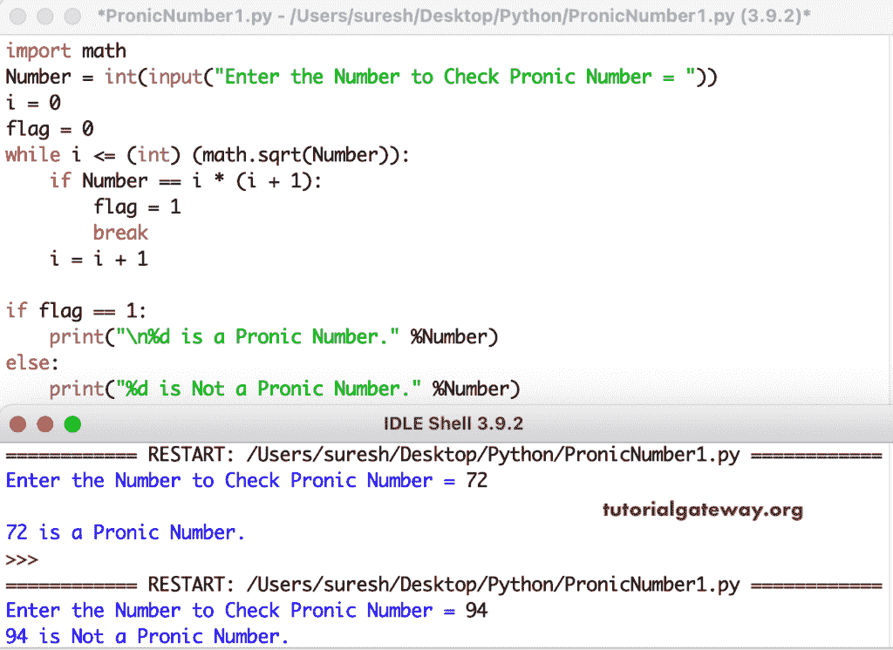

# Python 程序：检查数字是不是 Pronic 数字

> 原文：<https://www.tutorialgateway.org/python-program-to-check-a-number-is-a-pronic-number/>

编写一个 Python 程序来检查一个数字是不是 Pronic 数字，或者是否使用 while 循环。例如，如果一个数等于两个连续数的乘积，则它是一个 Pronic 数，这意味着 number = n(n + 1)。

在这个 Python 程序中，I 值从零迭代到该数字的平方根，并检查任意两个连续数字的乘积是否等于实际数字。如果为真，标志值变为 1，break 语句将退出循环。如果标志等于 1，则它是一个 Pronic 数。

```py
import math

Number = int(input("Enter the Number to Check Pronic Number = "))

i = 0
flag = 0

while i <= (int) (math.sqrt(Number)):
    if Number == i * (i + 1):
        flag = 1
        break
    i = i + 1

if flag == 1:
    print("\n%d is a Pronic Number." %Number)
else:
    print("%d is Not a Pronic Number." %Number)
```



Python 程序，使用 for 循环检查给定的数字是否是 Pronic 数字。

```py
Number = int(input("Enter the Number to Check Pronic Number = "))

flag = 0

for i in range(Number + 1):
    if Number == i * (i + 1):
        flag = 1
        break

if flag == 1:
    print("\n%d is a Pronic Number." %Number)
else:
    print("%d is Not a Pronic Number." %Number)
```

```py
Enter the Number to Check Pronic Number = 42

42 is a Pronic Number.

Enter the Number to Check Pronic Number = 55
55 is Not a Pronic Number.
```

Python [程序](https://www.tutorialgateway.org/python-programming-examples/)查找一个数字是不是 Pronic 数或者不使用函数。

```py
def pronicNumber(Number):
    flag = 0
    for i in range(Number + 1):
        if Number == i * (i + 1):
            flag = 1
            break
    return flag

Number = int(input("Enter the Number to Check Pronic Number = "))

if pronicNumber(Number) == 1:
    print("\n%d is a Pronic Number." %Number)
else:
    print("%d is Not a Pronic Number." %Number)

```

```py
Enter the Number to Check Pronic Number = 52
52 is Not a Pronic Number.

Enter the Number to Check Pronic Number = 72

72 is a Pronic Number.
```