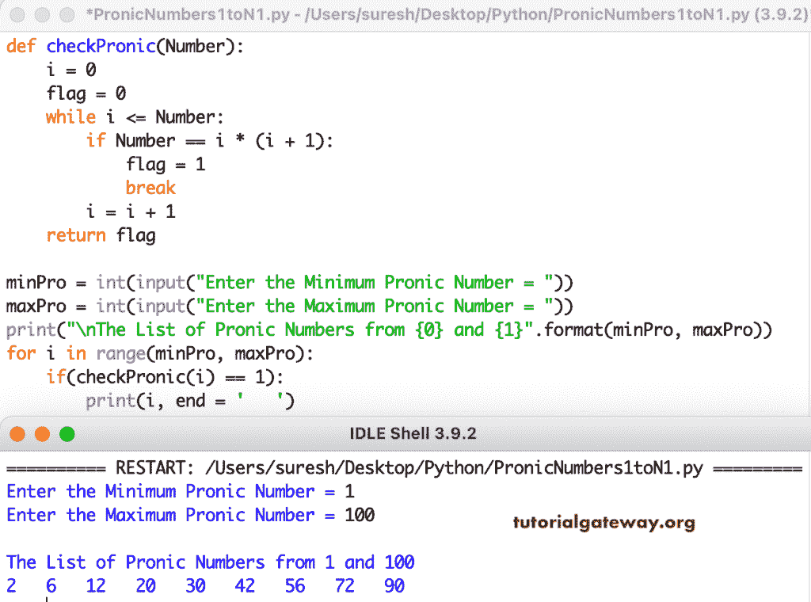

# Python 程序：打印从 1 到 100 的复数

> 原文：<https://www.tutorialgateway.org/python-program-to-print-pronic-numbers-from-1-to-100/>

编写一个 Python 程序，使用 while 循环打印 1 到 100 或一定范围内的 Pronic 数字。这个 Python 示例接受最小值和最大值，并显示该范围内的 Pronic 数字。

```py
def checkPronic(Number):
    i = 0
    flag = 0
    while i <= Number:
        if Number == i * (i + 1):
            flag = 1
            break
        i = i + 1
    return flag

minPro = int(input("Enter the Minimum Pronic Number = "))
maxPro = int(input("Enter the Maximum Pronic Number = "))

print("\nThe List of Pronic Numbers from {0} and {1}".format(minPro, maxPro)) 
for i in range(minPro, maxPro):
    if(checkPronic(i) == 1):
        print(i, end = '   ')
```



Python [程序](https://www.tutorialgateway.org/python-programming-examples/)使用 for 循环打印从 1 到 n 的 Pronic 数字。

```py
def checkPronic(Number):
    flag = 0
    for i in range(Number + 1):
        if Number == i * (i + 1):
            flag = 1
            break
    return flag

minPro = int(input("Enter the Minimum Pronic Number = "))
maxPro = int(input("Enter the Maximum Pronic Number = "))

print("\nThe List of Pronic Numbers from {0} and {1}".format(minPro, maxPro)) 
for i in range(minPro, maxPro):
    if(checkPronic(i) == 1):
        print(i, end = '   ')
```

```py
Enter the Minimum Pronic Number = 200
Enter the Maximum Pronic Number = 400

The List of Pronic Numbers from 200 and 400
210   240   272   306   342   380 
```