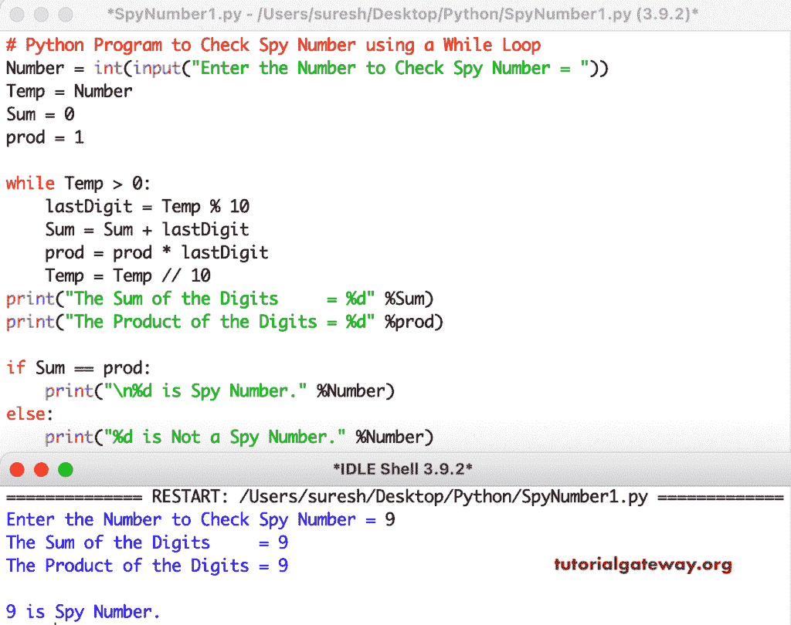

# Python 程序：检查数字是不是间谍数字

> 原文：<https://www.tutorialgateway.org/python-program-to-check-a-number-is-a-spy-number/>

编写一个 Python 程序来检查一个数字是否是间谍数字，或者是否使用 for 循环。例如，如果数字的总和等于一个数字中各个数字的乘积，那么它就是一个间谍号。在这个 Python 间谍号的例子中，我们使用了一个 while 循环来将数字分成数字，并找到这些数字的总和和乘积。if 语句检查总和是否等于乘积，如果为真，则检查间谍号。

```py
Number = int(input("Enter the Number to Check Spy Number = "))
Temp = Number
Sum = 0
prod = 1

while Temp > 0:
    lastDigit = Temp % 10
    Sum = Sum + lastDigit
    prod = prod * lastDigit
    Temp = Temp // 10

print("The Sum of the Digits     = %d" %Sum)
print("The Product of the Digits = %d" %prod)

if Sum == prod:
    print("\n%d is Spy Number." %Number)
else:
    print("%d is Not a Spy Number." %Number)
```



Python 程序使用递归或递归函数来检查一个数字是否是间谍数字。

```py
total = 0
prod = 1
reminder = 0
def spyNumber(number):
    global reminder, total, prod
    if(number > 0):
        reminder = number % 10
        total = total + reminder
        prod = prod * reminder
        spyNumber(number // 10)
        return total, prod
    else:
        return 0

Number = int(input("Enter the Number to Check Spy Number = "))
total, prod = spyNumber(Number)

print("The Sum of the Digits     = %d" %total)
print("The Product of the Digits = %d" %prod)

if total == prod:
    print("\n%d is Spy Number." %Number)
else:
    print("%d is Not a Spy Number." %Number)
```

```py
Enter the Number to Check Spy Number = 1421
The Sum of the Digits     = 8
The Product of the Digits = 8

1421 is Spy Number.
```

这个 Python [程序](https://www.tutorialgateway.org/python-programming-examples/)打印从 1 到 n 的间谍号或者某个范围内的间谍号。

```py
MinSpy = int(input("Please Enter the Minimum Spy Value: "))
MaxSpy = int(input("Please Enter the Maximum Spy Value: "))

for i in range(MinSpy, MaxSpy + 1):
    Temp = i
    Sum = 0
    prod = 1
    while Temp > 0:
        lastDigit = Temp % 10
        Sum = Sum + lastDigit
        prod = prod * lastDigit
        Temp = Temp // 10

    if Sum == prod:
        print(i, end = '   ')
```

```py
Please Enter the Minimum Spy Value: 1
Please Enter the Maximum Spy Value: 10000
1   2   3   4   5   6   7   8   9   22   123   132   213   231   312   321   1124   1142   1214   1241   1412   1421   2114   2141   2411   4112   4121   4211 
```