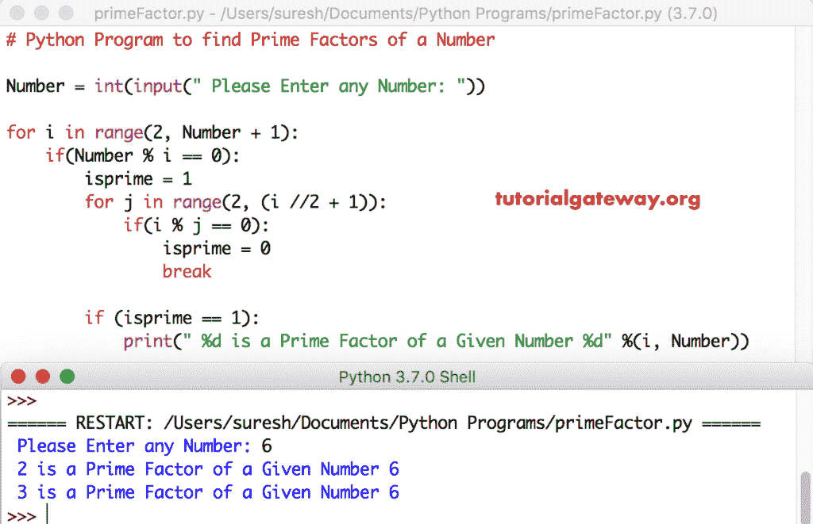

# Python 程序：寻找一个数的质因数

> 原文：<https://www.tutorialgateway.org/python-program-to-find-prime-factors-of-a-number/>

用 For 循环和 While 循环编写一个 Python 程序来寻找一个数的质因数，并给出一个例子。

## 用 For 循环求一个数的质因数的 Python 程序

这个 python 程序允许用户输入任何正整数。接下来，Python 使用 For 循环返回该数的质因数。

提示:建议大家参考[一个数的因数](https://www.tutorialgateway.org/python-program-to-find-factors-of-a-number/)、[质数](https://www.tutorialgateway.org/python-program-to-find-prime-number/)的文章来理解这个 [python 程序](https://www.tutorialgateway.org/python-programming-examples/)的逻辑。

```py
# Python Program to find Prime Factors of a Number

Number = int(input(" Please Enter any Number: "))

for i in range(2, Number + 1):
    if(Number % i == 0):
        isprime = 1
        for j in range(2, (i //2 + 1)):
            if(i % j == 0):
                isprime = 0
                break

        if (isprime == 1):
            print(" %d is a Prime Factor of a Given Number %d" %(i, Number))
```



## 使用 While 循环显示一个数的质因数的 Python 程序

这个 Python 质数因数程序和上面的一样。在本 [Python](https://www.tutorialgateway.org/python-tutorial/) 示例中，我们将 [For Loop](https://www.tutorialgateway.org/python-for-loop/) 替换为 [While Loop](https://www.tutorialgateway.org/python-while-loop/)

```py
# Python Program to find Prime Factors of a Number

Number = int(input(" Please Enter any Number: "))
i = 1

while(i <= Number):
    count = 0
    if(Number % i == 0):
        j = 1
        while(j <= i):
            if(i % j == 0):
                count = count + 1
            j = j + 1

        if (count == 2):
            print(" %d is a Prime Factor of a Given Number %d" %(i, Number))
    i = i + 1
```

Python 一个数的质因数输出

```py
 Please Enter any Number: 250
 2 is a Prime Factor of a Given Number 250
 5 is a Prime Factor of a Given Number 250
```