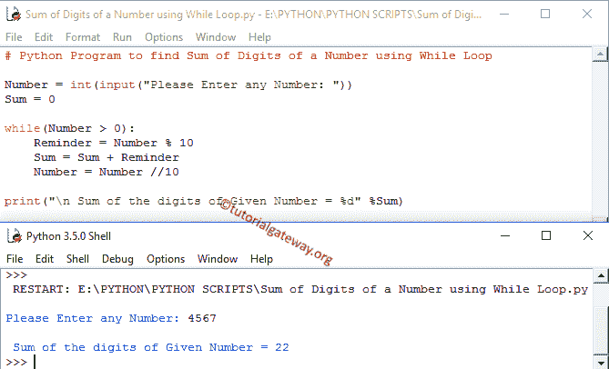

# Python 程序：一个寻找数字总和

> 原文：<https://www.tutorialgateway.org/python-program-to-find-sum-of-digits-of-a-number/>

在本节中，我们将讨论如何使用 While 循环、函数和递归编写一个 Python 程序来查找数字的位数总和。

## Python 程序使用 While 循环查找数字的位数总和

这个 Python 数字总和程序允许用户输入任何正整数。然后，它将给定的数字分成单个数字，并使用 Python While Loop 将这些单个数字相加。

```py
Number = int(input("Please Enter any Number: "))
Sum = 0

while(Number > 0):
    Reminder = Number % 10
    Sum = Sum + Reminder
    Number = Number //10

print("\n Sum of the digits of Given Number = %d" %Sum)
```



这个 python 中的数字总和程序允许用户输入任意正整数，然后将该值赋给变量 Number。接下来， [Python While Loop](https://www.tutorialgateway.org/python-while-loop/) 中的条件确保给定的数字大于 0(表示正整数且大于 0)。

用户在 python 程序中输入的数字总和值:数字= 4567，总和= 0

第一次迭代

提醒=数字%10
提醒= 4567 % 10 = 7

总和=总和+提醒
总和= 0 + 7 = 7

数字=数字/10
数字= 4567 / 10 = 456

寻找数字二次迭代位数和的 Python 程序:

从第一次 [Python](https://www.tutorialgateway.org/python-tutorial/) 迭代开始，Number= 456，Sum= 7

提醒= 456 % 10 = 6

总和= 7 + 6 = 13

数字= 456 / 10 = 45

第三次迭代:对于第三次迭代，Number= 45，Sum= 13 的值

提醒= 45 % 10 = 5

总和= 13 + 5 = 18

数量= 45 / 10 = 4

第四次迭代:对于第四次迭代，数= 4，和= 18

提醒= 4 % 10 = 4

总和= 18+4 = 22

数字= 4 / 10 = 0

这里数字= 0。所以 while 循环条件失败。

最后一条打印语句将变量打印为输出。所以，给定变量 4567 的数字输出的数字总和的 Python 程序是:

## 用函数求数字和的 Python 程序

[python 程序](https://www.tutorialgateway.org/python-programming-examples/)中的数字总和允许用户输入任意正整数。然后，它将给定的数字分成单个数字，并使用函数将这些单个数字相加。

```py
# Python Program to find Sum of Digits of a Number using Functions

def Sum_Of_Digits(Number):
    Sum = 0
    while(Number > 0):
        Reminder = Number % 10
        Sum = Sum + Reminder
        Number = Number //10
    return Sum

Number = int(input("Please Enter any Number: "))
Sum = Sum_Of_Digits(Number)
print("\n Sum of the digits of Given Number = %d" %Sum)
```

```py
Please Enter any Number: 12345

 Sum of the digits of Given Number = 15
```

在这个 Python 数字求和程序中，当编译器到达 Sum_Of_Digits(数字)行时，编译器会立即跳转到下面的函数:

```py
def Sum_Of_Digits(Number):
```

## 用递归求数字和的 Python 程序

这个寻找数字总和的程序允许用户输入任意正整数。然后，它将给定的整数分成单个数字，并通过递归调用函数将这些单个数字相加。

```py
Sum = 0
def Sum_Of_Digits(Num):
    global Sum
    if(Num > 0):
        Reminder = Num % 10
        Sum = Sum + Reminder
        Sum_Of_Digits(Num //10)
    return Sum

Num = int(input("Please Enter any Value: "))
Sum = Sum_Of_Digits(Num)
print("\n Sum of the digits = %d" %Sum)
```

```py
Please Enter any Value: 456

 Sum of the digits = 15
```

在这个 Python 数字程序中，当编译器到达 Sum= Sum_Of_Digits (Num)行时，它会立即跳转到下面的函数:

```py
def Sum_Of_Digits(Num):
```

在这个函数中，下面的语句有助于用更新的值递归调用函数。如果您错过此语句，在完成第一行后，它将终止。

```py
Sum_Of_Digits(Num //10)
```

对于这个 Python 程序来说，找到一个数字的数字总和的例子，Number= 4567 返回输出为 7。

让我们看看 [Python If 语句](https://www.tutorialgateway.org/python-if-statement/)，

如果(Num > 0)，检查 Num 是否大于 0。对于递归函数，在递归使用函数之前放置一个条件是非常重要的。否则，我们最终会陷入无限执行(就像无限循环一样)。