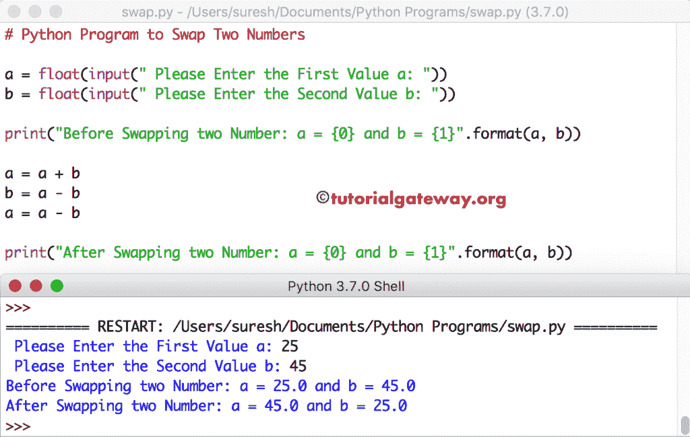

# Python 程序：交换两个数字

> 原文：<https://www.tutorialgateway.org/python-program-to-swap-two-numbers/>

编写一个 Python 程序，使用临时变量、按位运算符和算术运算符交换两个数字。

## 交换两个数字的 Python 程序

这个交换两个数字的 python 程序帮助用户输入两个数值。接下来，Python 使用临时变量交换这两个值。

```py
a = float(input(" Please Enter the First Value a: "))
b = float(input(" Please Enter the Second Value b: "))

print("Before Swapping two Number: a = {0} and b = {1}".format(a, b))

temp = a
a = b
b = temp

print("After Swapping two Number: a = {0} and b = {1}".format(a, b))
```

Python 交换两个数字输出

```py
 Please Enter the First Value a: 10
 Please Enter the Second Value b: 20
Before Swapping two Number: a = 10.0 and b = 20.0
After Swapping two Number: a = 20.0 and b = 10.0
```

在上面的 [python 程序](https://www.tutorialgateway.org/python-programming-examples/)示例中，我们分配了 a = 10 和 b = 20

Temp = a–为 Temp 变量
赋值 Temp = 10

a = b–将 b 值赋给变量 a
a = 20

b =温度–变量 b 的温度值
b = 10

## 用函数交换两个数字的 Python 程序

这个换号的程序和上面一样，但是这次我们用[函数](https://www.tutorialgateway.org/functions-in-python/)分离逻辑。

```py
def swap_numbers(a, b):
    temp = a
    a = b
    b = temp

    print("After: num1 = {0} and num2 = {1}".format(a, b))

num1 = float(input(" Please Enter the First Value : "))
num2 = float(input(" Please Enter the Second Value : "))

print("Before: num1 = {0} and num2 = {1}".format(num1, num2))
swap_numbers(num1, num2)
```

```py
 Please Enter the First Value : 15
 Please Enter the Second Value : 25
Before: num1 = 15.0 and num2 = 25.0
After: num1 = 25.0 and num2 = 15.0
```

## Python 使用算术运算符交换两个数字

在这个 [Python](https://www.tutorialgateway.org/python-tutorial/) 示例中，我们将使用[算术运算符](https://www.tutorialgateway.org/python-arithmetic-operators/)来代替使用 temp 或第三个变量来交换两个数字

```py
a = float(input(" Please Enter the First Value a: "))
b = float(input(" Please Enter the Second Value b: "))

print("Before Swapping two Number: a = {0} and b = {1}".format(a, b))

a = a + b
b = a - b
a = a - b

print("After Swapping two Number: a = {0} and b = {1}".format(a, b))
```



用户输入的值是 a = 25 和 b = 45

a = a+b = 25 + 45 = 70

b = a-b = 70 -45 = 25

a = a-b = 70–25 = 45

## Python 使用按位运算符交换两个数字

这里，我们使用[位运算符](https://www.tutorialgateway.org/python-bitwise-operators/)来交换两个数字。

```py
a = int(input(" Please Enter the First Value : "))
b = int(input(" Please Enter the Second Value : "))

print("Before: a = {0} and b = {1}".format(a, b))

a = a^b
b = a^b
a = a^b

print("After: a = {0} and b = {1}".format(a, b))
```

使用按位运算符输出

```py
 Please Enter the First Value : 111
 Please Enter the Second Value : 222
Before: a = 111 and b = 222
After: a = 222 and b = 111
```