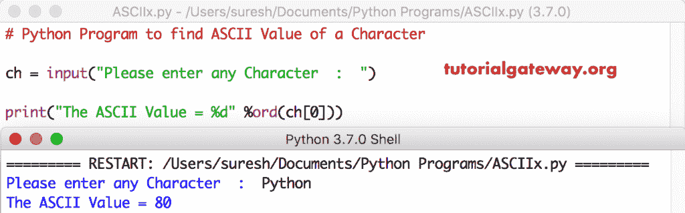

# Python 程序：查找字符的 ASCII 值

> 原文：<https://www.tutorialgateway.org/python-program-to-find-ascii-value-of-a-character/>

用例子写一个 Python 程序来查找一个字符的 ASCII 值。在 Python 中，每个字符都有自己的 ASCII 值(只有一个整数)。例如，A 的 ASCII 值是 65。

## Python 程序查找字符的 ASCII 值示例 1

这个 python 程序返回 t 的 ASCII 值，请参考 [Python](https://www.tutorialgateway.org/python-tutorial/) 中的 [ASCII 表](https://www.tutorialgateway.org/ascii-table/)一文，了解 ASCII 字符及其十进制、十六进制和八进制数字的列表。

```py
# Python Program to find ASCII Value of a Character

ch = 'T'

print("The ASCII Value of %c = %d" %(ch, ord(ch)))
```

```py
The ASCII Value of T = 84
```

## 显示字符 ASCII 值的 Python 程序示例 2

这个返回 ASCII 值的 Python 程序与上面相同。但是，这次我们允许用户输入自己的字符。

```py
ch = input("Please enter any Character  :  ")

print("The ASCII Value of %c = %d" %(ch, ord(ch)))
```

```py
Please enter any Character  :  a
The ASCII Value of a = 97
```

## 返回字符 ASCII 值的 Python 程序示例 3

如果你的用户输入了多个字符，那么上面的 [python 程序](https://www.tutorialgateway.org/python-programming-examples/)返回错误。在这个程序中，我们使用索引位置来返回第一个字符的 ASCII 值。

```py
ch = input("Please enter any Character  :  ")

print("The ASCII Value = %d" %ord(ch[0]))
```

