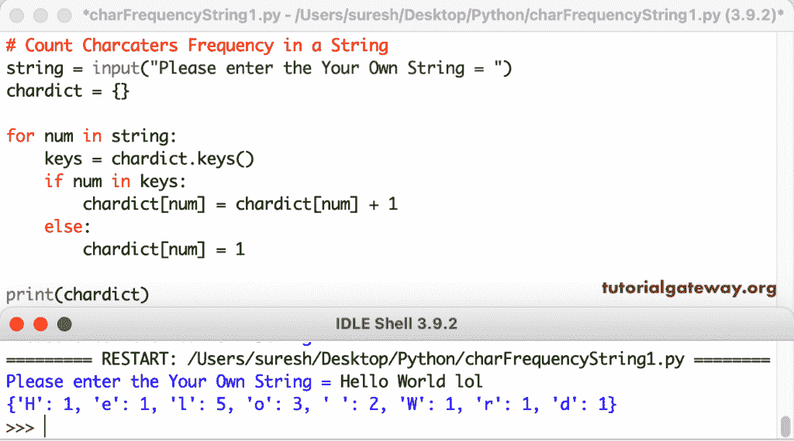

# Python 程序：计算字符串中的字符频率

> 原文：<https://www.tutorialgateway.org/python-program-to-count-characters-frequency-in-a-string/>

编写一个 Python 程序，使用 for 循环和字典来计算字符串中的字符频率。在这个 Python 示例中，for 循环迭代整个字符串。我们把所有的字符数分配给字典键。

```py
# Count Charcaters Frequency in a String

string = input("Please enter the Your Own String = ")
chardict = {}

for num in string:
    keys = chardict.keys()
    if num in keys:
        chardict[num] += 1
    else:
        chardict[num] = 1

print(chardict)
```



这个 [Python 程序](https://www.tutorialgateway.org/python-programming-examples/)使用 Counter 集合对给定字符串中的所有字符频率进行计数。

```py
# Count Charcaters Frequency in a String

from collections import Counter

string = input("Please enter the Your Own String = ")

chars = Counter(string)

print("Total Characters Frequency in this String = ")
print(chars)
```

```py
Please enter the Your Own String = hello python programmers
Total Characters Frequency in this String = 
Counter({'o': 3, 'r': 3, 'h': 2, 'e': 2, 'l': 2, ' ': 2, 'p': 2, 'm': 2, 'y': 1, 't': 1, 'n': 1, 'g': 1, 'a': 1, 's': 1})
```