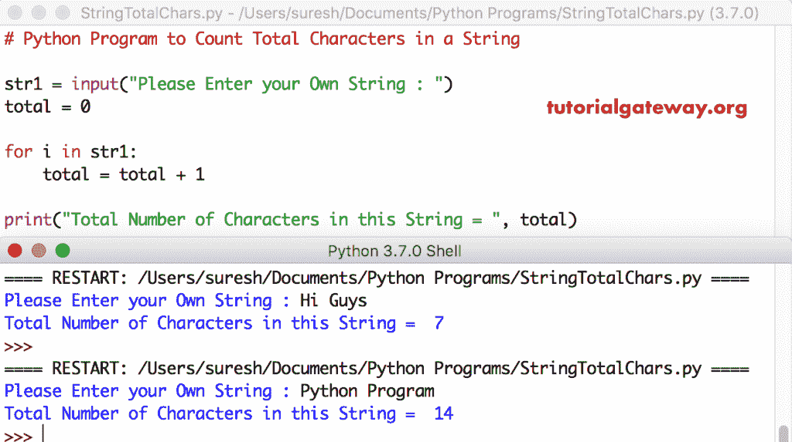

# Python 程序：计算字符串中的字符总数

> 原文：<https://www.tutorialgateway.org/python-program-to-count-total-characters-in-a-string/>

写一个 Python 程序，使用 For 循环和 While 循环计算字符串中的总字符数，并给出一个实例。

## 计算字符串中的字符总数的 Python 程序示例 1

这个 python 程序允许用户输入一个字符串。接下来，它使用 For 循环计算该字符串中的字符总数。

这里，我们使用 Python For 循环来迭代字符串中的每个字符。在 For 循环中，我们递增每个字符的总值。

```py
# Python Program to Count Total Characters in a String

str1 = input("Please Enter your Own String : ")
total = 0

for i in str1:
    total = total + 1

print("Total Number of Characters in this String = ", total)
```



## Python 程序计算字符串中的字符数示例 2

这个[字符串](https://www.tutorialgateway.org/python-string/)字符程序和上面的例子一样。然而，在这个 [Python](https://www.tutorialgateway.org/python-tutorial/) 代码中，我们使用了带有[范围](https://www.tutorialgateway.org/python-range-function/)的 [For Loop](https://www.tutorialgateway.org/python-for-loop/) 。

```py
# Python Program to Count Total Characters in a String

str1 = input("Please Enter your Own String : ")
total = 0

for i in range(len(str1)):
    total = total + 1

print("Total Number of Characters in this String = ", total)
```

Python 计数字符串输出

```py
Please Enter your Own String : Tutorial Gateway
Total Number of Characters in this String =  16
>>> 
Please Enter your Own String : Python
Total Number of Characters in this String =  6
```

## 计算字符串中的字符数的 Python 程序示例 3

这个 [python 程序](https://www.tutorialgateway.org/python-programming-examples/)对字符进行计数同上。然而，我们只是将 For 循环替换为 [While 循环](https://www.tutorialgateway.org/python-while-loop/)。

```py
# Python Program to Count Total Characters in a String

str1 = input("Please Enter your Own String : ")
total = 0
i = 0

while(i < len(str1)):
    total = total + 1
    i = i + 1

print("Total Number of Characters in this String = ", total)
```

```py
Please Enter your Own String : Python Programming
Total Number of Characters in this String =  18
```