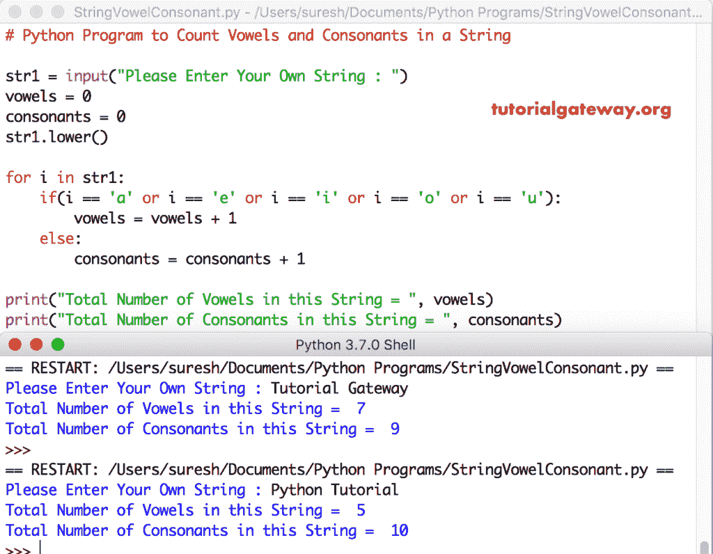

# Python 程序：计算字符串中元音和辅音

> 原文：<https://www.tutorialgateway.org/python-program-to-count-vowels-and-consonants-in-a-string/>

写一个 Python 程序，使用 For 循环和 ASCII 值计算字符串中的元音和辅音，并给出一个实际例子。

## 计算字符串中元音和辅音的 Python 程序示例 1

这个 python 程序允许用户输入一个字符串。接下来，它使用 For 循环计算该字符串中元音和辅音的总数。首先，我们使用 Python For 循环来迭代字符串中的每个字符。在 [For Loop](https://www.tutorialgateway.org/python-for-loop/) 中，我们使用 [If 语句](https://www.tutorialgateway.org/python-if-statement/)检查[字符串](https://www.tutorialgateway.org/python-string/)字符是否为 A、E、I、O、u、A、E、I、O、u，如果为真，则增加元音值，否则增加辅音值

```py
# Python Program to Count Vowels and Consonants in a String

str1 = input("Please Enter Your Own String : ")
vowels = 0
consonants = 0

for i in str1:
    if(i == 'a' or i == 'e' or i == 'i' or i == 'o' or i == 'u'
       or i == 'A' or i == 'E' or i == 'I' or i == 'O' or i == 'U'):
        vowels = vowels + 1
    else:
        consonants = consonants + 1

print("Total Number of Vowels in this String = ", vowels)
print("Total Number of Consonants in this String = ", consonants)
```

Python 计算字符串输出中的元音和辅音

```py
Please Enter Your Own String : Hello WOrld
Total Number of Vowels in this String =  3
Total Number of Consonants in this String =  8
>>> 
Please Enter Your Own String : Python Programs
Total Number of Vowels in this String =  3
Total Number of Consonants in this String =  12
```

## 计算字符串中元音和辅音的程序示例 2

在这个[程序](https://www.tutorialgateway.org/python-programming-examples/)中，我们使用[降低](https://www.tutorialgateway.org/python-lower/)功能将字符串覆盖为小写。这样，您只能在 [Python](https://www.tutorialgateway.org/python-tutorial/) If 语句中使用 a、e、I、o、u(避免大写字母)。

```py
# Python Program to Count Vowels and Consonants in a String

str1 = input("Please Enter Your Own String : ")
vowels = 0
consonants = 0
str1.lower()

for i in str1:
    if(i == 'a' or i == 'e' or i == 'i' or i == 'o' or i == 'u'):
        vowels = vowels + 1
    else:
        consonants = consonants + 1

print("Total Number of Vowels in this String = ", vowels)
print("Total Number of Consonants in this String = ", consonants)
```



## 计算元音和辅音总数的 Python 程序示例 3

这个程序使用 ASCII 值来查找元音和辅音。建议大家参考 [ASCII 表](https://www.tutorialgateway.org/ascii-table/)文章了解 ASCII 值。

```py
# Python Program to Count Vowels and Consonants in a String

str1 = input("Please Enter Your Own String : ")
vowels = 0
consonants = 0
str1.lower()

for i in str1:
    if(ord(i) == 65 or ord(i) == 69 or ord(i) == 73
       or ord(i) == 79 or ord(i) == 85
       or ord(i) == 97 or ord(i) == 101 or ord(i) == 105
       or ord(i) == 111 or ord(i) == 117):
        vowels = vowels + 1
    elif((ord(i) >= 97 and ord(i) <= 122) or (ord(i) >= 65 and ord(i) <= 90)):
        consonants = consonants + 1

print("Total Number of Vowels in this String = ", vowels)
print("Total Number of Consonants in this String = ", consonants)
```

Python 计算字符串输出中的元音和辅音

```py
Please Enter Your Own String : Python Examples
Total Number of Vowels in this String =  4
Total Number of Consonants in this String =  10
>>> 
Please Enter Your Own String : Learn Python Programming
Total Number of Vowels in this String =  6
Total Number of Consonants in this String =  16
>>> 
```