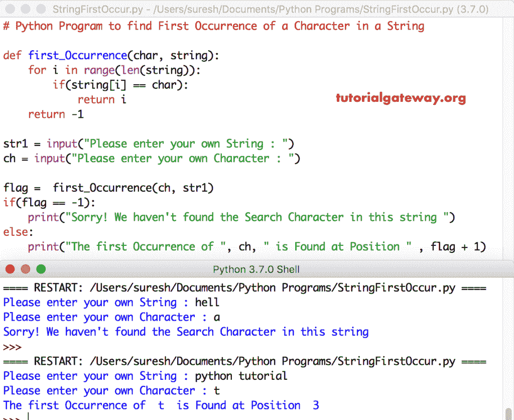

# Python 程序：寻找字符串中第一个字符

> 原文：<https://www.tutorialgateway.org/python-program-to-find-first-occurrence-of-a-character-in-a-string/>

写一个 Python 程序，用一个实际的例子找到字符串中第一个出现的字符。

## python 程序查找字符串中第一次出现的字符示例 1

这个 python 程序允许用户输入字符串和字符。

请参考[弦](https://www.tutorialgateway.org/python-string/)文章了解[蟒](https://www.tutorialgateway.org/python-tutorial/)弦的一切。

```py
# Python Program to check First Occurrence of a Character in a String

string = input("Please enter your own String : ")
char = input("Please enter your own Character : ")

flag = 0
for i in range(len(string)):
    if(string[i] == char):
        flag = 1
        break

if(flag == 0):
    print("Sorry! We haven't found the Search Character in this string ")
else:
    print("The first Occurrence of ", char, " is Found at Position " , i + 1)
```

Python 字符串输出中出现的第一个字符

```py
Please enter your own String : hello world
Please enter your own Character : l
The first Occurrence of  l  is Found at Position  3
```

这里，我们使用 [For Loop](https://www.tutorialgateway.org/python-for-loop/) 来迭代字符串中的每个字符。在 For 循环中，我们使用 [If 语句](https://www.tutorialgateway.org/python-if-statement/)来检查 str1 字符串中的任何字符是否等于字符 ch。如果为真，则标志= 1，并执行[中断语句](https://www.tutorialgateway.org/python-break/)。

string = hello world
ch = l
flag = 0

对于循环第一次迭代:对于范围(11)中的 I，如果(字符串[i] == char)
如果(h = = l)–条件为假。

第二次迭代:如果(e = = l)–条件为假，范围(11)
中的 1。

第三次迭代:对于范围(11)中的 2，如果(str[2] == ch) = >如果(l = = l)–条件为真。

标志= 1，中断语句退出循环。接下来，我们使用 [If Else 语句](https://www.tutorialgateway.org/python-if-else/)检查标志值是否等于 0。这里，条件为假。所以，在执行的 else 块内打印。

## Python 程序查找字符串中第一个出现的字符示例 2

这个 Python 第一次出现的字符程序与上面的相同。然而，我们只是将 For 循环替换为 [While 循环](https://www.tutorialgateway.org/python-while-loop/)。

```py
# Python Program to check First Occurrence of a Character in a String

string = input("Please enter your own String : ")
char = input("Please enter your own Character : ")
i = 0
flag = 0

while(i < len(string)):
    if(string[i] == char):
        flag = 1
        break
    i = i + 1

if(flag == 0):
    print("Sorry! We haven't found the Search Character in this string ")
else:
    print("The first Occurrence of ", char, " is Found at Position " , i + 1)
```

Python 字符串输出中出现的第一个字符

```py
Please enter your own String : python programming
Please enter your own Character : o
The first Occurrence of  o  is Found at Position  5
```

## 获取字符串中第一个字符的 Python 程序示例 3

这个 [python 程序](https://www.tutorialgateway.org/python-programming-examples/)查找字符串中字符的第一次出现与第一个例子相同。然而，这一次，我们使用了[函数](https://www.tutorialgateway.org/functions-in-python/)概念来分离逻辑。

```py
# Python Program to check First Occurrence of a Character in a String

def first_Occurrence(char, string):
    for i in range(len(string)):
        if(string[i] == char):
            return i
    return -1

str1 = input("Please enter your own String : ")
ch = input("Please enter your own Character : ")

flag =  first_Occurrence(ch, str1)
if(flag == -1):
    print("Sorry! We haven't found the Search Character in this string ")
else:
    print("The first Occurrence of ", ch, " is Found at Position " , flag + 1)
```

