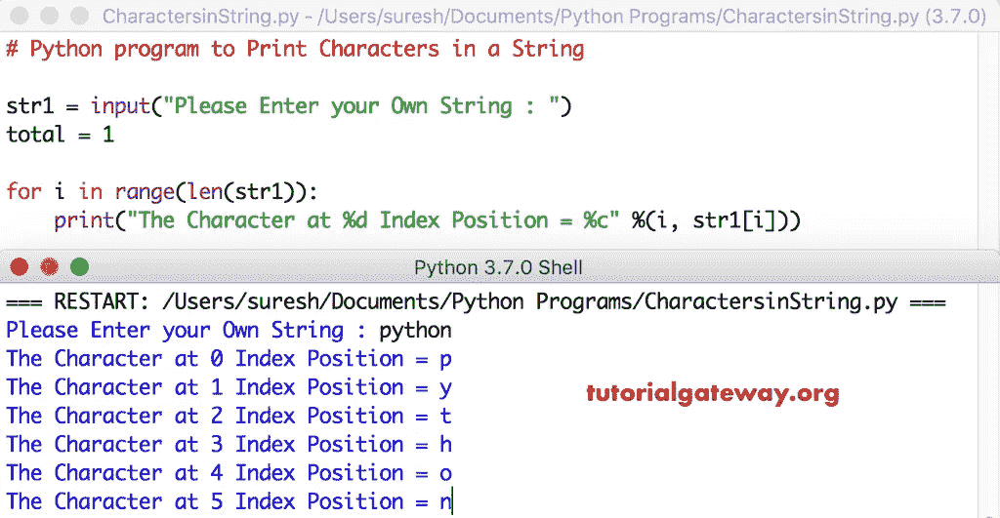

# Python 程序：打印字符串中的字符

> 原文：<https://www.tutorialgateway.org/python-program-to-print-characters-in-a-string/>

写一个 Python 程序来打印字符串中的字符，并给出一个实例。

## 打印字符串中的字符的 Python 程序示例 1

这个 python 程序允许用户输入一个字符串。接下来，它使用 For 循环打印该字符串中的字符。这里，我们使用 For 循环来迭代字符串中的每个字符。在 Python For 循环中，我们使用 print 语句打印该字符串中的字符。

提示:请参考[字符串](https://www.tutorialgateway.org/python-string/)文章，了解 [Python](https://www.tutorialgateway.org/python-tutorial/) 中关于字符串的一切。

```py
# Python program to Print Characters in a String

str1 = input("Please Enter your Own String : ")

for i in range(len(str1)):
    print("The Character at %d Index Position = %c" %(i, str1[i]))
```



## 返回字符串中的字符的 Python 程序示例 2

这个 [python 程序](https://www.tutorialgateway.org/python-programming-examples/)显示字符串中的字符同上。然而，我们只是将[换成了](https://www.tutorialgateway.org/python-for-loop/)[同时换成了](https://www.tutorialgateway.org/python-while-loop/)。

```py
# Python program to Print Characters in a String

str1 = input("Please Enter your Own String : ")
i = 0

while(i < len(str1)):
    print("The Character at %d Index Position = %c" %(i, str1[i]))
    i = i + 1
```

Python 打印字符串输出

```py
Please Enter your Own String : Tutorial Gateway
The Character at 0 Index Position = T
The Character at 1 Index Position = u
The Character at 2 Index Position = t
The Character at 3 Index Position = o
The Character at 4 Index Position = r
The Character at 5 Index Position = i
The Character at 6 Index Position = a
The Character at 7 Index Position = l
The Character at 8 Index Position =  
The Character at 9 Index Position = G
The Character at 10 Index Position = a
The Character at 11 Index Position = t
The Character at 12 Index Position = e
The Character at 13 Index Position = w
The Character at 14 Index Position = a
The Character at 15 Index Position = y
```