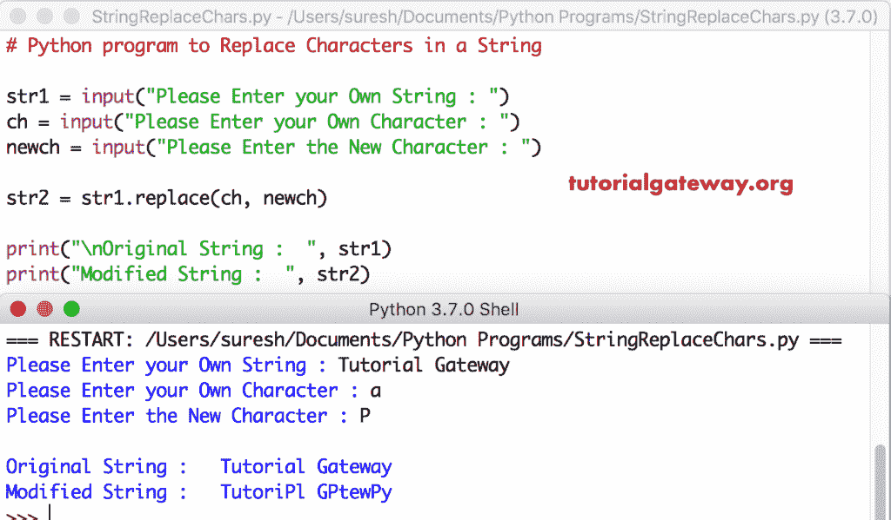

# Python 程序：替换字符串中的字符

> 原文：<https://www.tutorialgateway.org/python-program-to-replace-characters-in-a-string/>

用替换函数和 For 循环编写一个 Python 程序来替换字符串中的字符。

## 替换字符串 1 中字符的 Python 程序

该程序允许用户输入字符串、要替换的字符和要替换的新字符。接下来，我们使用一个名为 replace 的内置字符串函数，用一个新字符替换用户给定的字符。

```py
# Python program to Replace Characters in a String

str1 = input("Please Enter your Own String : ")
ch = input("Please Enter your Own Character : ")
newch = input("Please Enter the New Character : ")

str2 = str1.replace(ch, newch)

print("\nOriginal String :  ", str1)
print("Modified String :  ", str2)
```



## 替换字符串的程序示例 2

在这个[程序](https://www.tutorialgateway.org/python-programming-examples/)中，我们使用 For 循环来迭代字符串中的每个字符。在 [For 循环](https://www.tutorialgateway.org/python-for-loop/)中，我们使用 [If 语句](https://www.tutorialgateway.org/python-if-statement/)来检查[字符串](https://www.tutorialgateway.org/python-string/)字符是否等于 ch。如果为真， [Python](https://www.tutorialgateway.org/python-tutorial/) 替换为 Newch

```py
# Python program to Replace Characters in a String

str1 = input("Please Enter your Own String : ")
ch = input("Please Enter your Own Character : ")
newch = input("Please Enter the New Character : ")

str2 = ''
for i in range(len(str1)):
    if(str1[i] == ch):
        str2 = str2 + newch
    else:
        str2 = str2 + str1[i]

print("\nOriginal String :  ", str1)
print("Modified String :  ", str2)
```

Python 替换字符串输出

```py
Please Enter your Own String : tutorial gateway team
Please Enter your Own Character : t
Please Enter the New Character : P

Original String :   tutorial gateway team
Modified String :   PuPorial gaPeway Peam
```

## Python 替换字符串中的字符示例 3

这个 Python 替换字符串字符的代码与上面的例子相同。然而，我们使用的是对象循环。

```py
# Python program to Replace Characters in a String

str1 = input("Please Enter your Own String : ")
ch = input("Please Enter your Own Character : ")
newch = input("Please Enter the New Character : ")

str2 = ''
for i in str1:
    if(i == ch):
        str2 = str2 + newch
    else:
        str2 = str2 + i

print("\nOriginal String :  ", str1)
print("Modified String :  ", str2)
```

Python 替换字符串输出

```py
Please Enter your Own String : python programming examples
Please Enter your Own Character : o
Please Enter the New Character : G

Original String :   python programming examples
Modified String :   pythGn prGgramming examples
```