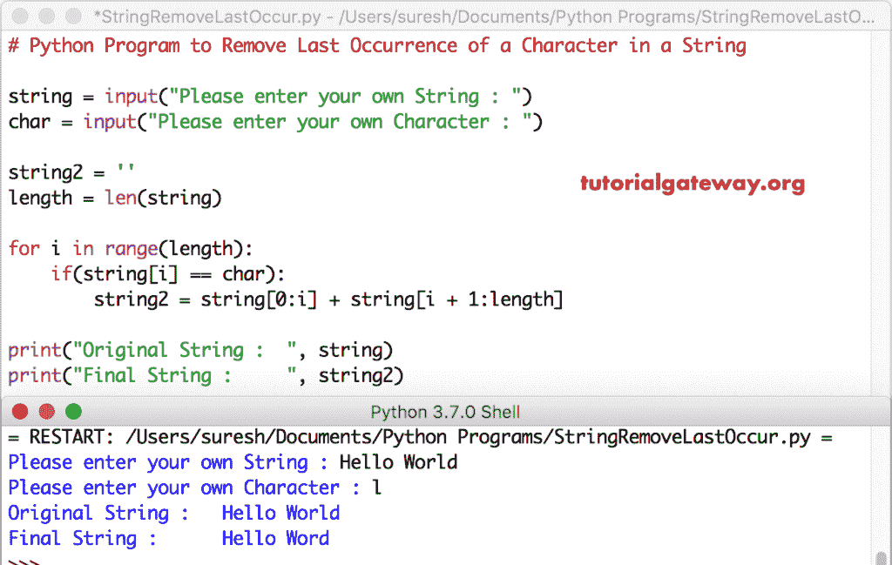

# Python 程序：删除字符串中字符的最后一次出现

> 原文：<https://www.tutorialgateway.org/python-program-to-remove-last-occurrence-of-a-character-in-a-string/>

编写一个 Python 程序，使用 For 循环、while 循环删除字符串中的字符的最后一次出现，并通过一个示例运行。

## 删除字符串中字符的最后一次出现的 Python 程序示例 1

这个 python 程序允许用户输入字符串和字符。接下来，它使用 For 循环查找并删除给定字符串中的字符的最后一次出现。

首先，我们使用 For 循环来迭代字符串中的字符。在 Python [For Loop](https://www.tutorialgateway.org/python-for-loop/) 中，我们使用 [If 语句](https://www.tutorialgateway.org/python-if-statement/)来检查字符是否等于 ch。如果为真，则使用字符串切片索引删除该字符。

即使找到多个匹配项，它也会遍历直到找到字符的最后一次出现。因为要退出循环，我们不使用 [Break 语句](https://www.tutorialgateway.org/python-break/)。请参考[弦](https://www.tutorialgateway.org/python-string/)文章了解[蟒](https://www.tutorialgateway.org/python-tutorial/)弦的一切。

```py
# Python Program to Remove Last Occurrence of a Character in a String

string = input("Please enter your own String : ")
char = input("Please enter your own Character : ")

string2 = ''
length = len(string)

for i in range(length):
    if(string[i] == char):
        string2 = string[0:i] + string[i + 1:length]

print("Original String :  ", string)
print("Final String :     ", string2)
```



## 删除字符串中字符的最后一次出现的 Python 程序示例 2

这个 [python 代码](https://www.tutorialgateway.org/python-programming-examples/)删除一个字符最后一次出现的地方同上。然而，我们只是将 For 循环替换为 [While 循环](https://www.tutorialgateway.org/python-while-loop/)。

```py
# Python Program to Remove Last Occurrence of a Character in a String

string = input("Please enter your own String : ")
char = input("Please enter your own Character : ")

string2 = ''
length = len(string)
i = 0

while(i < length):
    if(string[i] == char):
        string2 = string[0 : i] + string[i + 1 : length]
    i = i + 1

print("Original String :  ", string)
print("Final String :     ", string2)
```

Python 删除字符串输出中的字符的最后一次出现

```py
Please enter your own String : tutorial gateway
Please enter your own Character : t
Original String :   tutorial gateway
Final String :      tutorial gaeway
```

## 删除字符串最后一次出现的 Python 程序示例 3

这个 Python 删除字符的最后一次出现串代码与第一个示例相同——但是，这次我们使用了[函数](https://www.tutorialgateway.org/functions-in-python/)来分离逻辑。

```py
# Python Program to Remove Last Occurrence of a Character in a String

def removeLastOccur(string, char):
    string2 = ''
    length = len(string)
    i = 0

    while(i < length):
        if(string[i] == char):
            string2 = string[0 : i] + string[i + 1 : length]
        i = i + 1
    return string2

str1 = input("Please enter your own String : ")
char = input("Please enter your own Character : ")

print("Original String :  ", str1)
print("Final String :     ", removeLastOccur(str1, char))
```

Python 删除字符串输出中最后出现的字符

```py
Please enter your own String : Python Programs
Please enter your own Character : o
Original String :   Python Programs
Final String :      Python Prgrams
```