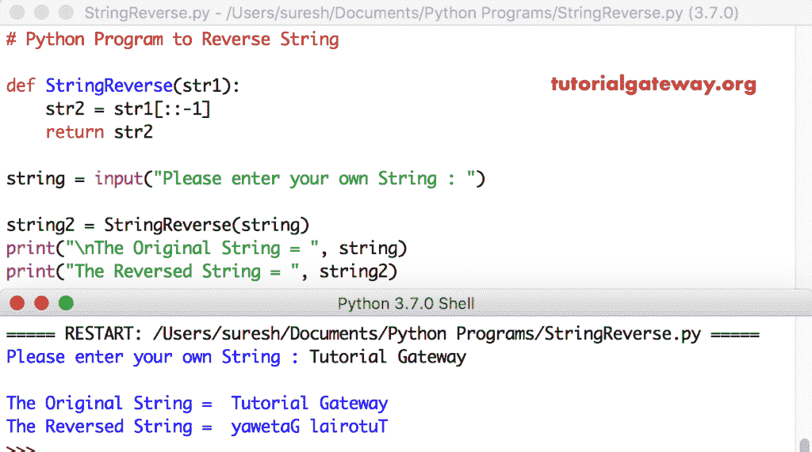

# Python 程序：反转字符串

> 原文：<https://www.tutorialgateway.org/python-program-to-reverse-string/>

编写一个 Python 程序，使用 For 循环、while 循环和函数来反转字符串，并给出一个例子。

## 使用 For 循环反转字符串的 Python 程序

这个程序允许用户输入任何句子。接下来，这段 Python 代码使用 For 循环反转字符串。

```py
st1 = input("Please enter your own : ")

st2 = ''

for i in st1:
    st2 = i + st2

print("\nOriginal = ", st1)
print("After = ", st2)
```

```py
Please enter your own : Coding

Original =  Coding
After =  gnidoC
```

从上面反向一个字符串程序截图可以观察到，word 是 Coding。

对于循环第一次迭代:对于 st1 中的 I
=>对于编码中的 C
str 2 = C+st2 =>C+”

第二次迭代:对于编码中的 o
st2 = o+C =>oC

对剩余的迭代做同样的事情。请参考[字符串](https://www.tutorialgateway.org/python-string/)文章，在 [Python](https://www.tutorialgateway.org/python-tutorial/) 中了解它们。

### 使用 While 循环

这个使用 while 循环的 Python 字符串反向程序与上面相同。然而，我们只是将循环的[替换为循环](https://www.tutorialgateway.org/python-for-loop/)的[。在这里，](https://www.tutorialgateway.org/python-while-loop/) [len](https://www.tutorialgateway.org/python-program-to-find-a-string-length/) 函数用于查找一个句子中字符的总长度。

```py
a = input("Please enter your own : ")

b = ''
i = len(a) - 1

while(i >= 0):
    b = b + a[i]
    i = i - 1

print("\nThe Original = ", a)
print("The Reversed = ", b))
```

```py
Please enter your own : Tutorial Gateway

The Original =  Tutorial Gateway
The Reversed =  yawetaG lairotuT
```

### 使用函数

这是使用函数反转字符串的另一种方式。

```py
def StringReverse(str1):
    str2 = str1[::-1]
    return str2

a = input("Please enter your own : ")

b = StringReverse(a)
print("\nOriginal = ", a)
print("After = ", b)
```

```py
Please enter your own : Hello World!

Original =  Hello World!
After =  !dlroW olleH
```

### 使用递归

在这段代码中，我们通过递归调用函数来进行字符串反转。

```py
def StringReverse(str1):
    if(len(str1) == 0):
        return str1
    else:
        return StringReverse(str1[1:]) + str1[0]

string = input("Please enter your own String : ")

string2 = StringReverse(string)
print("\nThe Original String = ", string)
print("The Reversed String = ", string2)
```

