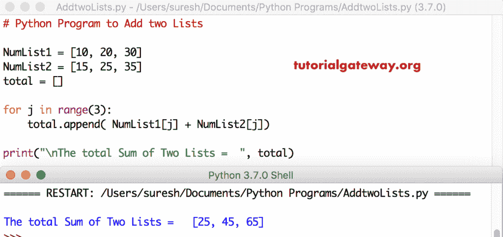

# Python 程序：添加两个列表

> 原文：<https://www.tutorialgateway.org/python-program-to-add-two-lists/>

编写一个 Python 程序，通过一个实际例子，使用 For 循环和 While 循环添加两个列表(列表项)。

## 添加两个列表的 Python 程序示例

在这个 python 程序中，我们使用 For 循环来迭代给定列表中的每个元素。在循环中，我们添加了第一个和第二个列表的元素。

```py
# Python Program to Add two Lists

NumList1 = [10, 20, 30]
NumList2 = [15, 25, 35]
total = []

for j in range(3):
    total.append( NumList1[j] + NumList2[j])

print("\nThe total Sum of Two Lists =  ", total)
```



在这个 [Python](https://www.tutorialgateway.org/python-tutorial/) 例子中，NumList1 = [10，20，30]，NumList2 = [15，25，35]，total = []是[列表](https://www.tutorialgateway.org/python-list/)

对于循环–第一次迭代:对于范围(3)中的 0–条件为真
总计。追加((NumList1[0] + NumList2[0] )
总计[0] = 25 (10 + 15)

第二次迭代:对于范围(3)中的 1–条件为真
total . append((numlist 1[1]+numlist 2[1])
total[1]= 45(20+25)

第三次迭代:对于范围(3)中的 2–条件为真
总计。追加((NumList1[2] + NumList2[0] )
总计[2] = 65 (30 + 35)

第四次迭代:对于范围(3)中的 3–条件为假。因此，它从[退出进行循环](https://www.tutorialgateway.org/python-for-loop/)

## 使用 For 循环添加两个列表的 Python 程序

在这个 [python 程序](https://www.tutorialgateway.org/python-programming-examples/)中，我们使用了两个[用于循环。](https://www.tutorialgateway.org/python-for-loop/)它们允许用户为每个列表输入自己的元质数量

```py
# Python Program to Add two Lists

NumList1 = []
NumList2 = []
total = []

Number = int(input("Please enter the Total Number of List Elements: "))
print("Please enter the Items of a First List   ")
for i in range(1, Number + 1):
    value = int(input("Please enter the Value of %d Element : " %i))
    NumList1.append(value)

print("Please enter the Items of a Second List   ")
for i in range(1, Number + 1):
    value = int(input("Please enter the Value of %d Element : " %i))
    NumList2.append(value)

for j in range(Number):
    total.append( NumList1[j] + NumList2[j])

print("\nThe total Sum of Two Lists =  ", total)
```

```py
Please enter the Total Number of List Elements: 3
Please enter the Items of a First List   
Please enter the Value of 1 Element : 22
Please enter the Value of 2 Element : 33
Please enter the Value of 3 Element : 44
Please enter the Items of a Second List   
Please enter the Value of 1 Element : 55
Please enter the Value of 2 Element : 66
Please enter the Value of 3 Element : 77

The total Sum of Two Lists =   [77, 99, 121]
```

## Python 使用 For 循环对两个列表求和示例 2

这个 Python 添加两个列表与上面相同。但是，我们使用一个 for 循环来输入列表 1 元素和列表 2 元素

```py
# Python Program to Add two Lists

NumList1 = []
NumList2 = []
total = []

Number = int(input("Please enter the Total Number of List Elements: "))
print("Please enter the Items of a First and Second List   ")
for i in range(1, Number + 1):
    List1value = int(input("Please enter the %d Element of List1 : " %i))
    NumList1.append(List1value)

    List2value = int(input("Please enter the %d Element of List2 : " %i))
    NumList2.append(List2value)

for j in range(Number):
    total.append( NumList1[j] + NumList2[j])

print("\nThe total Sum of Two Lists =  ", total)
```

两个 Python 列表输出的总和

```py
Please enter the Total Number of List Elements: 4
Please enter the Items of a First and Second List   
Please enter the 1 Element of List1 : 10
Please enter the 1 Element of List2 : 35
Please enter the 2 Element of List1 : 20
Please enter the 2 Element of List2 : 45
Please enter the 3 Element of List1 : 50
Please enter the 3 Element of List2 : 75
Please enter the 4 Element of List1 : 90
Please enter the 4 Element of List2 : 135

The total Sum of Two Lists =   [45, 65, 125, 225]
```

## 使用 While 循环添加两个列表

这个添加两个列表元素的程序与上面的相同。我们刚刚将 For 循环替换为 [While 循环](https://www.tutorialgateway.org/python-while-loop/)。

```py
# Python Program to Add two Lists

NumList1 = []
NumList2 = []
total = []
i = 1
j = 0

Number = int(input("Please enter the Total Number of List Elements: "))
print("Please enter the Items of a First and Second List   ")
while(i <= Number):
    List1value = int(input("Please enter the %d Element of List1 : " %i))
    NumList1.append(List1value)

    List2value = int(input("Please enter the %d Element of List2 : " %i))
    NumList2.append(List2value)
    i = i + 1

while(j < Number):
    total.append( NumList1[j] + NumList2[j])
    j = j + 1

print("\nThe total Sum of Two Lists =  ", total)
```

使用 while 循环输出的两个 Python 列表之和

```py
Please enter the Total Number of List Elements: 3
Please enter the Items of a First and Second List   
Please enter the 1 Element of List1 : 100
Please enter the 1 Element of List2 : 200
Please enter the 2 Element of List1 : 300
Please enter the 2 Element of List2 : 400
Please enter the 3 Element of List1 : 500
Please enter the 3 Element of List2 : 600

The total Sum of Two Lists =   [300, 700, 1100]
```