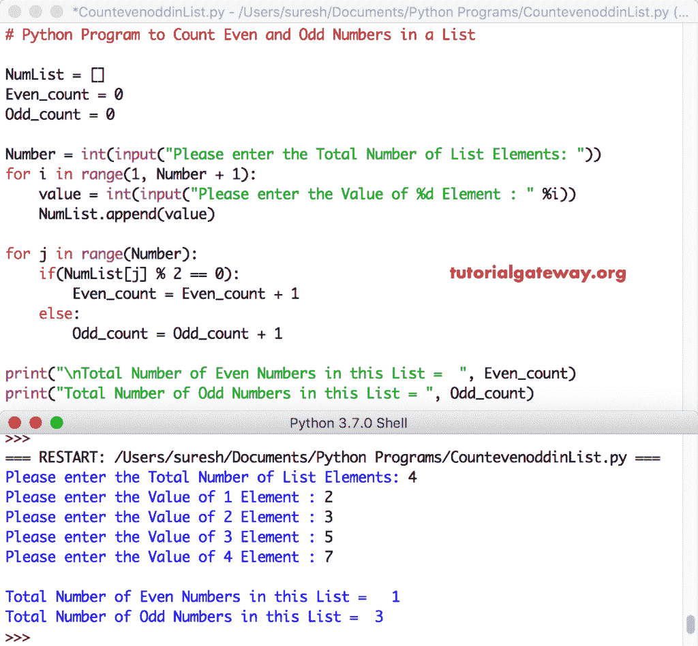

# Python 程序：计算列表中偶数和奇数

> 原文：<https://www.tutorialgateway.org/python-program-to-count-even-and-odd-numbers-in-a-list/>

写一个 Python 程序，用 For 循环、While 循环和函数计算列表中的偶数和奇数，并给出一个实例。

## 使用 For 循环计算列表中偶数和奇数的 Python 程序

在这个 python 程序中，我们使用 For 循环来迭代给定列表中的每个元素。在 Python 循环中，我们使用 If 语句来检查和计数偶数和奇数。

```py
# Python Program to Count Even and Odd Numbers in a List

NumList = []
Even_count = 0
Odd_count = 0

Number = int(input("Please enter the Total Number of List Elements: "))
for i in range(1, Number + 1):
    value = int(input("Please enter the Value of %d Element : " %i))
    NumList.append(value)

for j in range(Number):
    if(NumList[j] % 2 == 0):
        Even_count = Even_count + 1
    else:
        Odd_count = Odd_count + 1

print("\nTotal Number of Even Numbers in this List =  ", Even_count)
print("Total Number of Odd Numbers in this List = ", Odd_count)
```



在这个 [python 程序](https://www.tutorialgateway.org/python-programming-examples/)中，用户输入了[列表](https://www.tutorialgateway.org/python-list/)元素= [2，3，5，7]，偶数计数= 0，奇数计数= 0

[对于循环](https://www.tutorialgateway.org/python-for-loop/)–第一次迭代:对于范围(0，4)
中的 0，条件为真。因此，它进入 [If 语句](https://www.tutorialgateway.org/python-if-statement/)T5 If(NumList[0]% 2 = = 0)=>If(2% 2 = = 0)–条件为真
偶数 _ 计数=偶数 _ 计数+ 1 = > 0 + 1 = 1

第二次迭代:对于范围(0，4)中的 1–条件为真
如果(NumList[1] % 2 == 0) = >如果(3% 2 = = 0)–条件为假
那么，它进入 Else 块。
奇数 _ 计数=奇数 _ 计数+ 1 = > 0 + 1 = 1

第三次迭代:对于范围(0，4)中的 2–条件为真
如果(NumList[2] % 2 == 0) = >如果(5% 2 = = 0)–条件为假并进入否则块。
奇数计数= 1 + 1 = 2

第四次迭代:对于范围(0，4)中的 3–如果(7 % 2 == 0)条件为真【T0)–条件为假并进入否则块。
奇数计数= 2 + 1 = 3

第五次迭代:对于范围(4)中的 4–条件为假。因此，它从 For Loop 退出

## Python 程序使用 While 循环计算列表中的偶数和奇数

这个计算偶数和奇数的 Python 程序与上面的相同。我们刚刚将 [Python](https://www.tutorialgateway.org/python-tutorial/) For Loop 替换为 [While loop](https://www.tutorialgateway.org/python-while-loop/) 。

```py
NumList = []
Even_count = 0
Odd_count = 0
j = 0

Number = int(input("Please enter the Total Number of List Elements: "))
for i in range(1, Number + 1):
    value = int(input("Please enter the Value of %d Element : " %i))
    NumList.append(value)

while(j < Number):
    if(NumList[j] % 2 == 0):
        Even_count = Even_count + 1
    else:
        Odd_count = Odd_count + 1
    j = j + 1

print("\nTotal Number of Even Numbers in this List =  ", Even_count)
print("Total Number of Odd Numbers in this List = ", Odd_count)
```

```py
Please enter the Total Number of List Elements: 5
Please enter the Value of 1 Element : 12
Please enter the Value of 2 Element : 13
Please enter the Value of 3 Element : 14
Please enter the Value of 4 Element : 15
Please enter the Value of 5 Element : 44

Total Number of Even Numbers in this List =   3
Total Number of Odd Numbers in this List =  2
```

## 使用函数计算列表中偶数和奇数的 Python 程序

这个计数偶数和奇数列表的程序与第一个例子相同。但是，我们使用[函数](https://www.tutorialgateway.org/functions-in-python/)来分离逻辑

```py
def count_even(NumList):
    Even_count = 0
    for j in range(Number):
        if(NumList[j] % 2 == 0):
            Even_count = Even_count + 1
    return Even_count

def count_odd(NumList):
    Odd_count = 0
    for j in range(Number):
        if(NumList[j] % 2 != 0):
            Odd_count = Odd_count + 1
    return Odd_count

NumList = []
Number = int(input("Please enter the Total Number of List Elements: "))
for i in range(1, Number + 1):
    value = int(input("Please enter the Value of %d Element : " %i))
    NumList.append(value)

even_cnt = count_even(NumList)
odd_cnt = count_odd(NumList)
print("\nTotal Number of Even Numbers in this List =  ", even_cnt)
print("Total Number of Odd Numbers in this List = ", odd_cnt)
```

```py
Please enter the Total Number of List Elements: 6
Please enter the Value of 1 Element : 12
Please enter the Value of 2 Element : 22
Please enter the Value of 3 Element : 33
Please enter the Value of 4 Element : 44
Please enter the Value of 5 Element : 55
Please enter the Value of 6 Element : 66

Total Number of Even Numbers in this List =   4
Total Number of Odd Numbers in this List =  2
```