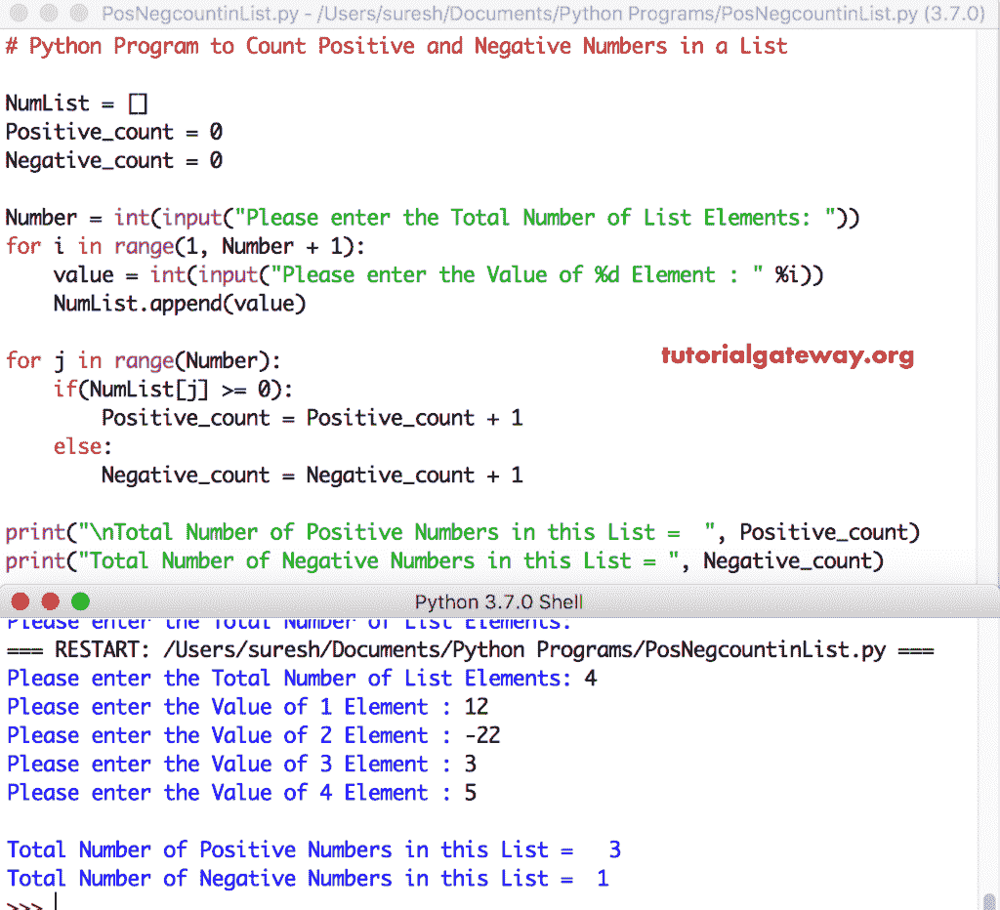

# Python 程序：计算列表中正数和负数

> 原文：<https://www.tutorialgateway.org/python-program-to-count-positive-and-negative-numbers-in-a-list/>

写一个 Python 程序，用 For 循环、While 循环和函数计算列表中的正数和负数，并给出一个实例。

## 使用 For 循环计算列表中正数和负数的 Python 程序

在这个 python 程序中，我们使用 For 循环来迭代给定列表中的每个元素。在 Python for 循环中，我们使用 If 语句来检查和计数正数和负数。

```py
# Python Program to Count Positive and Negative Numbers in a List

NumList = []
Positive_count = 0
Negative_count = 0

Number = int(input("Please enter the Total Number of List Elements: "))
for i in range(1, Number + 1):
    value = int(input("Please enter the Value of %d Element : " %i))
    NumList.append(value)

for j in range(Number):
    if(NumList[j] >= 0):
        Positive_count = Positive_count + 1
    else:
        Negative_count = Negative_count + 1

print("\nTotal Number of Positive Numbers in this List =  ", Positive_count)
print("Total Number of Negative Numbers in this List = ", Negative_count)
```



在这个 [python 程序](https://www.tutorialgateway.org/python-programming-examples/)中，用户输入了[列表](https://www.tutorialgateway.org/python-list/)元素= [12，-22，3，5]，正 _ 计数= 0，负 _ 计数= 0

对于循环–第一次迭代:对于范围(0，4)
中的 0，条件为真。因此，进入 [If 语句](https://www.tutorialgateway.org/python-if-statement/)T3 If(NumList[0]>= 0)=>If(12>= 0)–条件为真
正 _ 计数=正 _ 计数+ 1 = > 0 + 1 = 1

第二次迭代:对于范围(0，4)中的 1–条件为真
如果(NumList[1] > = 0) = >如果(-22>= 0)–条件为假，则进入 Else 块。
负 _ 计数=负 _ 计数+ 1 = > 0 + 1 = 1

第三次迭代:对于范围(0，4)中的 2–条件为真
如果(NumList[2] > = 0) = >如果(3>= 0)–条件为真
正 _ 计数= 1 + 1 = > 2

第四次迭代:对于范围(0，4)中的 3，如果(5>= 0)–条件为真，则条件为真
。所以，它进入了 Else 块。
阳性计数= 2 + 1 = > 3

第五次迭代:对于范围(4)中的 4–条件为假。所以，[蟒蛇](https://www.tutorialgateway.org/python-tutorial/)从 离开

## Python 程序使用 While 循环计算列表中的正数和负数

这个计算正数和负数的 Python 程序与上面的相同。我们刚刚将 [For Loop](https://www.tutorialgateway.org/python-for-loop/) 替换为 [While loop](https://www.tutorialgateway.org/python-while-loop/) 。

```py
# Python Program to Count Positive and Negative Numbers in a List

NumList = []
Positive_count = 0
Negative_count = 0
j = 0

Number = int(input("Please enter the Total Number of List Elements: "))
for i in range(1, Number + 1):
    value = int(input("Please enter the Value of %d Element : " %i))
    NumList.append(value)

while(j < Number):
    if(NumList[j] >= 0):
        Positive_count = Positive_count + 1
    else:
        Negative_count = Negative_count + 1
    j = j + 1

print("\nTotal Number of Positive Numbers in this List =  ", Positive_count)
print("Total Number of Negative Numbers in this List = ", Negative_count)
```

Python 使用 while 循环输出计算正负列表数

```py
Please enter the Total Number of List Elements: 5
Please enter the Value of 1 Element : -3
Please enter the Value of 2 Element : -5
Please enter the Value of 3 Element : 9
Please enter the Value of 4 Element : 8
Please enter the Value of 5 Element : -6

Total Number of Positive Numbers in this List =   2
Total Number of Negative Numbers in this List =  3
```

## 使用函数计算列表中正负项目的 Python 程序

这个 Python 计算正负列表项目的程序与第一个示例相同。但是，我们使用[函数](https://www.tutorialgateway.org/functions-in-python/)来分离逻辑

```py
def count_Positive(NumList):
    Positive_count = 0
    for j in range(Number):
        if(NumList[j] >= 0):
            Positive_count = Positive_count + 1
    return Positive_count

def count_Negative(NumList):
    Negative_count = 0
    for j in range(Number):
        if(NumList[j] % 2 != 0):
            Negative_count = Negative_count + 1
    return Negative_count

NumList = []
Number = int(input("Please enter the Total Number of List Elements: "))
for i in range(1, Number + 1):
    value = int(input("Please enter the Value of %d Element : " %i))
    NumList.append(value)

Positive_cnt = count_Positive(NumList)
Negative_cnt = count_Negative(NumList)
print("\nTotal Number of Positive Numbers in this List =  ", Positive_cnt)
print("Total Number of Negative Numbers in this List = ", Negative_cnt)
```

```py
Please enter the Total Number of List Elements: 6
Please enter the Value of 1 Element : -11
Please enter the Value of 2 Element : -22
Please enter the Value of 3 Element : 33
Please enter the Value of 4 Element : 44
Please enter the Value of 5 Element : -55
Please enter the Value of 6 Element : 66

Total Number of Positive Numbers in this List =   3
Total Number of Negative Numbers in this List =  3
```