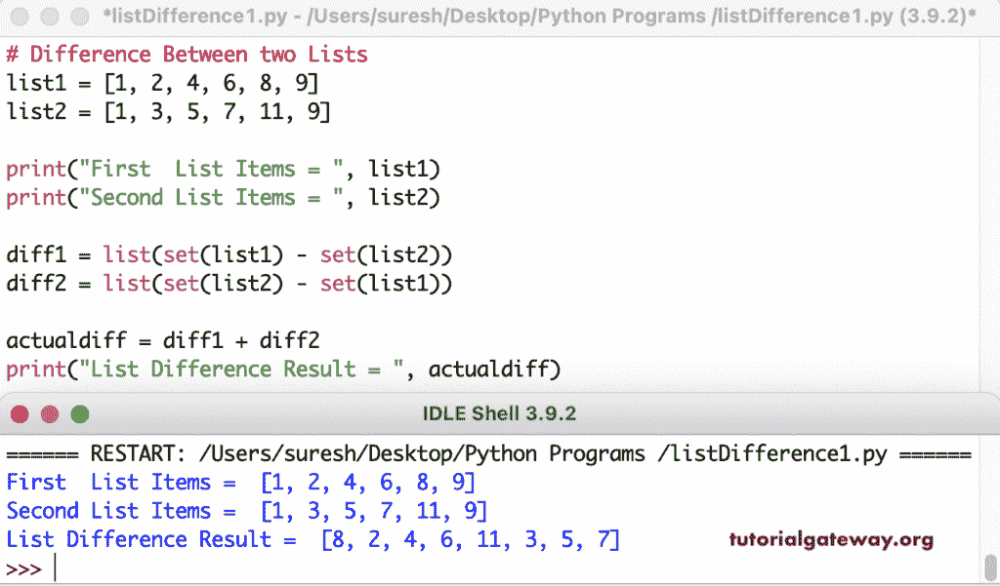

# Python 程序：寻找列表差异

> 原文：<https://www.tutorialgateway.org/python-program-to-find-list-difference/>

写一个 Python 程序来找出两个列表的区别。在本例中，我们将列表转换为集合，找到集合差异，然后将其转换回列表。

```py
# Difference Between two Lists

list1 = [1, 2, 4, 6, 8, 9]
list2 = [1, 3, 5, 7, 11, 9]

print("First  List Items = ", list1)
print("Second List Items = ", list2)

diff1 = list(set(list1) - set(list2))
diff2 = list(set(list2) - set(list1))

actualdiff = diff1 + diff2
print("List Difference Result = ", actualdiff)
```



## 寻找列表差异的 Python 程序

这个 Python 程序允许输入两个列表的列表项，然后使用不同的集合返回列表。

```py
# Difference Between two Lists

list1 = []
listNumber = int(input("Enter the Total List Items = "))
for i in range(1, listNumber + 1):
    listValue = int(input("Enter the %d List Item = " %i))
    list1.append(listValue)

list2 = []
listNumber = int(input("Enter the Total List Items = "))
for i in range(1, listNumber + 1):
    listValue = int(input("Enter the %d List Item = " %i))
    list2.append(listValue)

print("First  List Items = ", list1)
print("Second List Items = ", list2)

actualdiff = list(list(set(list1) - set(list2)) + list(set(list2) - set(list1)))
print("List Difference Result = ", actualdiff)
```

Python 列表差异输出

```py
Enter the Total List Items = 3
Enter the 1 List Item = 1
Enter the 2 List Item = 2
Enter the 3 List Item = 3
Enter the Total List Items = 4
Enter the 1 List Item = 4
Enter the 2 List Item = 5
Enter the 3 List Item = 2
Enter the 4 List Item = 1
First  List Items =  [1, 2, 3]
Second List Items =  [4, 5, 2, 1]
List Difference Result =  [3, 4, 5]
```

在这个 Python 程序中，我们使用 for 循环和 if 语句来检查这两个列表之间的差异。for 循环(列表 1 +列表 2 中的 val)迭代列表 1 和列表 2 中的所有值。if 语句和 not in 运算符(if val 不在列表 1 中或 val 不在列表 2 中)检查项目是否不在列表 1 或列表 2 中。如果为真，则将该项目追加或添加到列表差异中。

```py
# Difference Between two Lists
list1 = [1, 2, 6, 8, 11, 14]
list2 = [2, 3, 11, 9, 7, 14, 22]

print("First  List Items = ", list1)
print("Second List Items = ", list2)

listDifference = []

for val in list1 + list2:
    if val not in list1 or val not in list2:
        listDifference.append(val)

print("List Difference Result = ", listDifference)
```

```py
First  List Items =  [1, 2, 6, 8, 11, 14]
Second List Items =  [2, 3, 11, 9, 7, 14, 22]
List Difference Result =  [1, 6, 8, 3, 9, 7, 22]
```

这个 Python 程序使用[列表理解](https://www.tutorialgateway.org/python-list-comprehensions/)来检查两个给定的[列表](https://www.tutorialgateway.org/python-list/)之间的差异。

```py
# Difference Between two Lists

list1 = [3, 4, 6, 7, 8, 11, 22]
list2 = [1, 3, 5, 11, 8, 9, 16, 44]

print("First  List Items = ", list1)
print("Second List Items = ", list2)

listdiff = [x for x in list1 + list2 if x not in list1 or x not in list2]

print("List Difference Result = ", listdiff)
```

```py
First  List Items =  [3, 4, 6, 7, 8, 11, 22]
Second List Items =  [1, 3, 5, 11, 8, 9, 16, 44]
List Difference Result =  [4, 6, 7, 22, 1, 5, 9, 16, 44]
```