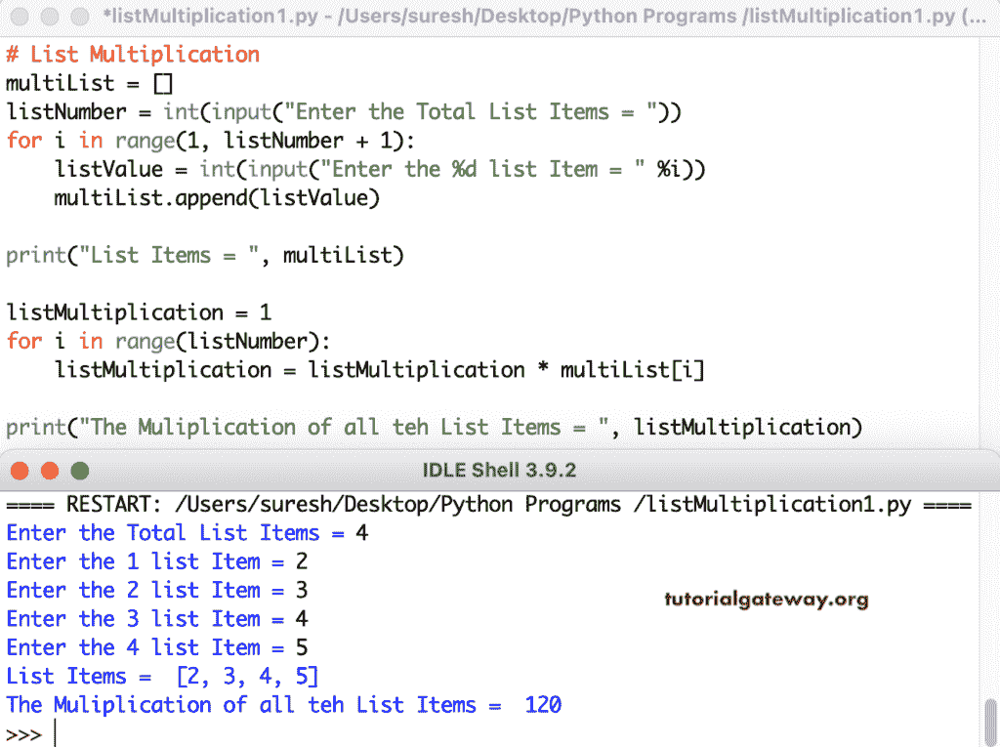

# Python 程序：列表乘法

> 原文：<https://www.tutorialgateway.org/python-list-multiplication-program/>

编写一个 Python 程序，使用 for 循环范围执行列表乘法。在这个 Python 示例中，我们允许用户输入列表项。接下来，我们使用 for 循环范围(for i in range(listNumber))来迭代 multiList 列表项。在循环中，我们将每个列表项相乘并打印结果。

```py
# List Multiplication

multiList = []

listNumber = int(input("Enter the Total List Items = "))
for i in range(1, listNumber + 1):
    listValue = int(input("Enter the %d list Item = " %i))
    multiList.append(listValue)

print("List Items = ", multiList)

listMultiplication = 1

for i in range(listNumber):
    listMultiplication = listMultiplication * multiList[i]

print("The Muliplication of all teh List Items = ", listMultiplication)
```



## 使用 For 循环的 Python 列表乘法程序

```py
# List Multiplication

multiList = []

listNumber = int(input("Enter the Total List Items = "))
for i in range(1, listNumber + 1):
    listValue = int(input("Enter the %d List Item = " %i))
    multiList.append(listValue)

print("List Items = ", multiList)

listMulti = 1

for num in multiList:
    listMulti = listMulti * num

print("The Muliplication of all teh List Items = ", listMulti)
```

```py
Enter the Total List Items = 5
Enter the 1 List Item = 10
Enter the 2 List Item = 4
Enter the 3 List Item = 9
Enter the 4 List Item = 11
Enter the 5 List Item = 7
List Items =  [10, 4, 9, 11, 7]
The Muliplication of all teh List Items =  27720
```

这个 Python 程序使用 While 循环执行列表乘法。

```py
# List Multiplication

multiList = []

listNumber = int(input("Enter the Total List Items = "))
for i in range(1, listNumber + 1):
    listValue = int(input("Enter the %d List Item = " %i))
    multiList.append(listValue)

print("List Items = ", multiList)

listMultiplication = 1
i = 0

while (i < listNumber):
    listMultiplication = listMultiplication * multiList[i]
    i = i + 1

print("The Multiplication of all the List Items = ", listMultiplication)
```

```py
Enter the Total List Items = 4
Enter the 1 List Item = 9
Enter the 2 List Item = 10
Enter the 3 List Item = 2
Enter the 4 List Item = 4
List Items =  [9, 10, 2, 4]
The Multiplication of all the List Items =  720
```

在这个 Python 列表[的例子](https://www.tutorialgateway.org/python-programming-examples/)中，我们创建了一个 list 乘法(multiList)函数，返回结果 go [列表](https://www.tutorialgateway.org/python-list/)乘法。

```py
# List Multiplication

def listMultiplication(multiList):
    listMulti = 1

    for num in multiList:
        listMulti = listMulti * num
    return listMulti

multiList = []

listNumber = int(input("Enter the Total List Items = "))
for i in range(1, listNumber + 1):
    listValue = int(input("Enter the %d List Item = " %i))
    multiList.append(listValue)

print("List Items = ", multiList)

listMultip = listMultiplication(multiList)

print("The Multiplication of all the List Items = ", listMultip)
```

```py
Enter the Total List Items = 3
Enter the 1 List Item = 10
Enter the 2 List Item = 20
Enter the 3 List Item = 8
List Items =  [10, 20, 8]
The Multiplication of all the List Items =  1600
```