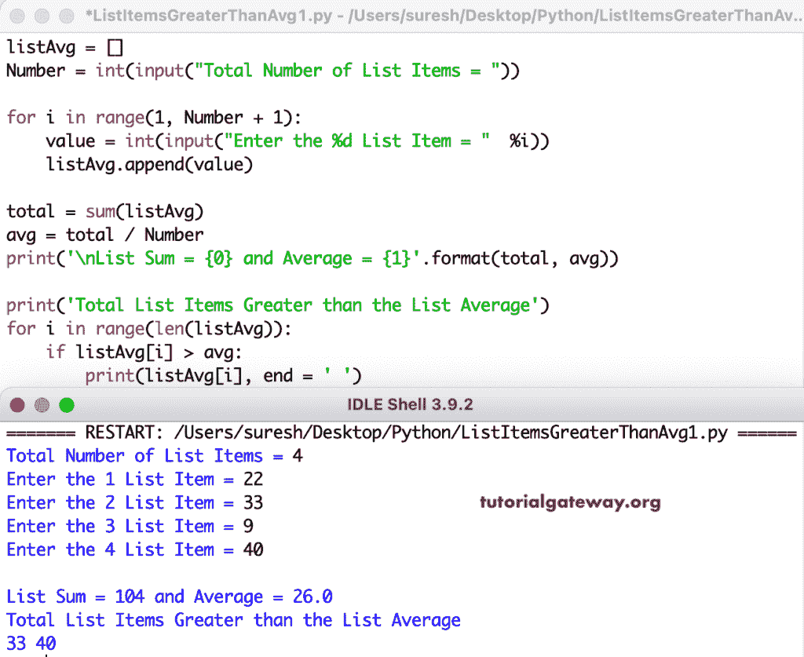

# Python 程序：找到大于平均值的列表项

> 原文：<https://www.tutorialgateway.org/python-program-to-find-list-items-greater-than-average/>

写一个 Python 程序来查找大于平均值的列表项。这个 python 示例允许我们输入列表项，然后我们会找到列表项的平均值。接下来，for 循环将迭代列表项，if 条件根据列表平均值检查每个项。最后，如果大于平均值，则打印该列表项。

```py
listAvg = []
Number = int(input("Total Number of List Items = "))

for i in range(1, Number + 1):
    value = int(input("Enter the %d List Item = "  %i))
    listAvg.append(value)

total = sum(listAvg)
avg = total / Number

print('\nList Sum = {0} and Average = {1}'.format(total, avg))

print('Total List Items Greater than the List Average')
for i in range(len(listAvg)):
    if listAvg[i] > avg:
        print(listAvg[i], end = ' ')
```



这个 Python [示例](https://www.tutorialgateway.org/python-programming-examples/)使用 for 循环查找大于平均值的列表项。

```py
listAvg = []
Number = int(input("Total Number of List Items = "))

total = 0
for i in range(Number):
    value = int(input("Enter the %d List Item = "  %(i+1)))
    listAvg.append(value)
    total = total + listAvg[i]

avg = total / Number

print('\nList Sum = {0} and Average = {1}'.format(total, avg))

print('Total List Items Greater than the List Average')
for i in range(len(listAvg)):
    if listAvg[i] > avg:
        print(listAvg[i], end = ' ')
```

```py
Total Number of List Items = 7
Enter the 1 List Item = 22
Enter the 2 List Item = 9
Enter the 3 List Item = 11
Enter the 4 List Item = 18
Enter the 5 List Item = 29
Enter the 6 List Item = 139
Enter the 7 List Item = 44

List Sum = 272 and Average = 38.857142857142854
Total List Items Greater than the List Average
139 44 
```

Python 程序使用 while 循环查找大于平均值的列表项。

```py
listAvg = []
Number = int(input("Total Number of List Items = "))

total = 0
i = 1
while(i <= Number):
    value = int(input("Enter the %d List Item = "  %(i+1)))
    listAvg.append(value)
    i = i + 1

i = 0
while(i < Number):
    total = total + listAvg[i]
    i = i + 1

avg = total / Number

print('\nList Sum = {0} and Average = {1}'.format(total, avg))

print('Total List Items Greater than the List Average')
for i in range(len(listAvg)):
    if listAvg[i] > avg:
        print(listAvg[i], end = ' ')
```

```py
Total Number of List Items = 9
Enter the 2 List Item = 4
Enter the 3 List Item = 11
Enter the 4 List Item = 3
Enter the 5 List Item = 2
Enter the 6 List Item = 9
Enter the 7 List Item = 22
Enter the 8 List Item = 7
Enter the 9 List Item = 15
Enter the 10 List Item = 17

List Sum = 90 and Average = 10.0
Total List Items Greater than the List Average
11 22 15 17 
```