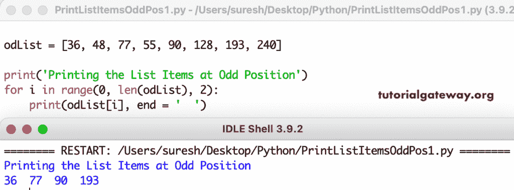

# Python 程序：打印奇数位置的列表项

> 原文：<https://www.tutorialgateway.org/python-program-to-print-list-items-at-odd-position/>

写一个 Python 程序，打印奇数位置或奇数索引位置的列表项。在这个 Python 示例中，我们使用列表切片，从 0 开始，递增 2，以列表长度(列表的末尾)结束。

```py
odList = [2, 4, 7, 11, 14, 22, 19, 90]

print('Printing the List Items at Odd Position')
print(odList[0:len(odList):2])
```



在这个 Python 程序中，我们使用 for 循环范围来迭代列表项，并在奇数索引位置打印列表项。

```py
odList = [36, 48, 77, 55, 90, 128, 193, 240]

print('Printing the List Items at Odd Position')
for i in range(0, len(odList), 2):
    print(odList[i], end = '  ')
```

```py
Printing the List Items at Odd Position
36  77  90  193 
```

## Python 程序使用 while 循环打印奇数位置的列表项

```py
odList = [14, 35, 78, 90, 120, 67, 98]

print('Printing the List Items at Odd Position')
i = 0
while i < len(odList):
    print(odList[i], end = '  ')
    i = i + 2
```

```py
Printing the List Items at Odd Position
14  78  120  98 
```

在本 Python 列表中奇数位置的项目[示例](https://www.tutorialgateway.org/python-programming-examples/)中，for 循环从 0 迭代到列表长度。if 条件检查索引位置除以二是否等于 0。如果为真，打印号码。

```py
import numpy as np

odlist = []
odListTot = int(input("Total List Items to enter = "))

for i in range(1, odListTot + 1):
    odListvalue = int(input("Please enter the %d List Item = "  %i))
    odlist.append(odListvalue)

print('\nPrinting the List Items at Odd Position')
for i in range(0, len(odlist), 2):
    print(odlist[i], end = '  ')

print('\nPrinting the List Items at Odd Position')
for i in range(len(odlist)):
    if i % 2 == 0:
        print(odlist[i], end = '  ')
```

```py
Total List Items to enter = 8
Please enter the 1 List Item = 14
Please enter the 2 List Item = 24
Please enter the 3 List Item = 34
Please enter the 4 List Item = 44
Please enter the 5 List Item = 54
Please enter the 6 List Item = 64
Please enter the 7 List Item = 74
Please enter the 8 List Item = 84

Printing the List Items at Odd Position
14  34  54  74  
Printing the List Items at Odd Position
14  34  54  74 
```