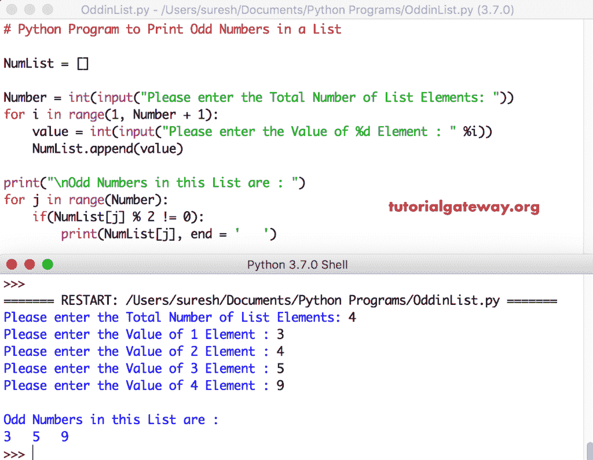

# Python 程序：打印列表中奇数

> 原文：<https://www.tutorialgateway.org/python-program-to-print-odd-numbers-in-a-list/>

编写一个 Python 程序，使用 For 循环、While 循环和函数打印列表中的奇数，并给出一个实例。

## 使用 For 循环打印列表中奇数的 Python 程序

在这个 python 程序中，我们使用 For 循环来迭代这个列表中的每个元素。在 Python for 循环中，我们使用 If 语句来检查和打印奇数。

```py
# Python Program to Print Odd Numbers in a List

NumList = []

Number = int(input("Please enter the Total Number of List Elements: "))
for i in range(1, Number + 1):
    value = int(input("Please enter the Value of %d Element : " %i))
    NumList.append(value)

print("\nOdd Numbers in this List are : ")
for j in range(Number):
    if(NumList[j] % 2 != 0):
        print(NumList[j], end = '   ')
```



用户输入了[列表](https://www.tutorialgateway.org/python-list/)元素= [3，4，5，9]。在这个 [python 程序](https://www.tutorialgateway.org/python-programming-examples/)中， [For Loop](https://www.tutorialgateway.org/python-for-loop/) 迭代是

对于循环–第一次迭代:对于范围(0，4)
中的 0，条件为真。所以，进入 [If 语句](https://www.tutorialgateway.org/python-if-statement/)

if(NumList[0] % 2！= 0) => if(3 % 2！= 0)–条件为真
该数字已打印。

第二次迭代:对于范围(0，4)中的 1–条件为真
如果(NumList[1] % 2！= 0) = > if(4 % 2！= 0)–条件为假
跳过该数字。

第三次迭代:对于范围(0，4)中的 2–条件为真
如果(NumList[2] % 2！= 0) = > if(5 % 2！= 0)–条件为真
该数字已打印。

第四次迭代:对于范围(0，4)中的 3–条件为真
如果(9 % 2！= 0)–条件为真
该数字也打印出来。

第五次迭代:对于范围(0，4)中的 4–条件为假
因此，它退出 [Python](https://www.tutorialgateway.org/python-tutorial/) For Loop

## 使用 While 循环打印列表中奇数的 Python 程序

这个列表中奇数的 Python 程序与上面的相同。我们刚刚将 For 循环替换为 [While 循环](https://www.tutorialgateway.org/python-while-loop/)。

```py
# Python Program to Print Odd Numbers in a List

NumList = []
j = 0

Number = int(input("Please enter the Total Number of List Elements: "))
for i in range(1, Number + 1):
    value = int(input("Please enter the Value of %d Element : " %i))
    NumList.append(value)

print("\nOdd Numbers in this List are : ")
while(j < Number):
    if(NumList[j] % 2 != 0):
        print(NumList[j], end = '   ')
    j = j + 1
```

```py
Please enter the Total Number of List Elements: 5
Please enter the Value of 1 Element : 45
Please enter the Value of 2 Element : 65
Please enter the Value of 3 Element : 78
Please enter the Value of 4 Element : 98
Please enter the Value of 5 Element : 1

Odd Numbers in this List are : 
45   65   1 
```

## 用函数计算列表中奇数的 Python 程序

列表程序中的这个 Python 奇数与第一个示例相同。然而，我们使用[函数](https://www.tutorialgateway.org/functions-in-python/)来分离逻辑

```py
def odd_numbers(NumList):
    for j in range(Number):
        if(NumList[j] % 2 != 0):
            print(NumList[j], end = '   ')

NumList = []
Number = int(input("Please enter the Total Number of List Elements: "))
for i in range(1, Number + 1):
    value = int(input("Please enter the Value of %d Element : " %i))
    NumList.append(value)

print("\nOdd Numbers in this List are : ")
odd_numbers(NumList)
```

```py
Please enter the Total Number of List Elements: 6
Please enter the Value of 1 Element : 22
Please enter the Value of 2 Element : 43
Please enter the Value of 3 Element : 57
Please enter the Value of 4 Element : 98
Please enter the Value of 5 Element : 12
Please enter the Value of 6 Element : 49

Odd Numbers in this List are : 
43   57   49 
```