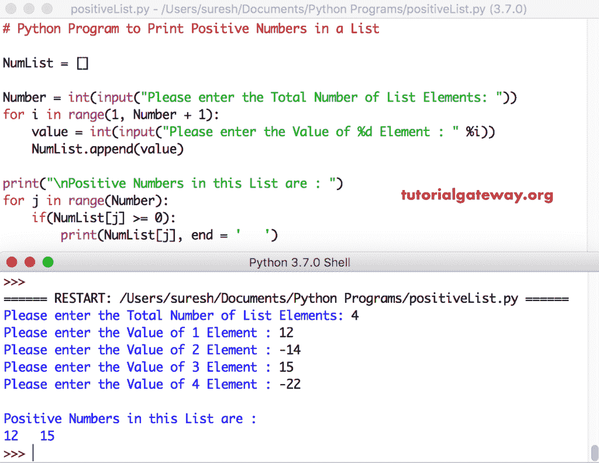

# Python 程序：打印列表中正数

> 原文：<https://www.tutorialgateway.org/python-program-to-print-positive-numbers-in-a-list/>

如何利用 While 循环、For 循环和函数编写一个 Python 程序来打印列表中的正数，并给出一个有用的例子。

## 使用 For 循环打印列表中正数的 Python 程序

在这个 python 程序中，我们利用 For 循环来迭代这个列表中的每个元素。在 Python for 循环中，我们使用 If 语句来验证和打印正数。

```py
# Python Program to Print Positive Numbers in a List

NumList = []

Number = int(input("Please enter the Total Number of List Elements: "))
for i in range(1, Number + 1):
    value = int(input("Please enter the Value of %d Element : " %i))
    NumList.append(value)

print("\nPositive Numbers in this List are : ")
for j in range(Number):
    if(NumList[j] >= 0):
        print(NumList[j], end = '   ')

```



用户在这个 [python 程序中输入了](https://www.tutorialgateway.org/python-programming-examples/)[列表](https://www.tutorialgateway.org/python-list/)元素 = [12，-14，15，-22]

对于循环–第一次迭代:对于范围(0，4)中的 0。条件结果为真。因此，进入 [If 语句](https://www.tutorialgateway.org/python-if-statement/)
If(NumList[0]>= 0)=>If(12>= 0)–条件为真。所以，这个正数被打印出来。

第二次迭代:对于范围(0，4)中的 1–条件为真
如果(NumList[1] > = 0) = >如果(-14>= 0)–条件为假
跳过此数字。

第三次迭代:对于范围(0，4)中的 2–条件为真
如果(NumList[2] > = 0) = >如果(15>= 0)–条件为真
这个正数被打印出来。

第四次迭代:对于范围(0，4)中的 3–条件为真
如果(-22>= 0)–条件为假
跳过该数字。

第五次迭代:对于范围(0，4)中的 4–条件为假
因此，它从[Python](https://www.tutorialgateway.org/python-tutorial/)For Loop退出

## 使用 While 循环打印列表中正数的程序

这个 Python 正数列表程序和上面的一样。我们将 [For Loop](https://www.tutorialgateway.org/python-for-loop/) 替换为 [While loop](https://www.tutorialgateway.org/python-while-loop/) 。

```py
# Python Program to Print Positive Numbers in a List

NumList = []
j = 0

Number = int(input("Please enter the Total Number of List Elements: "))
for i in range(1, Number + 1):
    value = int(input("Please enter the Value of %d Element : " %i))
    NumList.append(value)

print("\nPositive Numbers in this List are : ")
while(j < Number):
    if(NumList[j] >= 0):
        print(NumList[j], end = '   ')
    j = j + 1
```

Python 打印正数列表输出

```py
Please enter the Total Number of List Elements: 5
Please enter the Value of 1 Element : 12
Please enter the Value of 2 Element : 34
Please enter the Value of 3 Element : -12
Please enter the Value of 4 Element : 3
Please enter the Value of 5 Element : -22

Positive Numbers in this List are : 
12   34   3 
```

## 使用函数打印列表中正数的 Python 程序

在这个 List 程序中打印正数，我们使用[函数](https://www.tutorialgateway.org/functions-in-python/)来分离逻辑。

```py
def positive_number(NumList):
    for j in range(Number):
        if(NumList[j] >= 0):
            print(NumList[j], end = '   ')

NumList = []
Number = int(input("Please enter the Total Number of List Elements: "))
for i in range(1, Number + 1):
    value = int(input("Please enter the Value of %d Element : " %i))
    NumList.append(value)

print("\nPositive Numbers in this List are : ")
positive_number(NumList)
```

Python 在列表输出中打印正数

```py
Please enter the Total Number of List Elements: 6
Please enter the Value of 1 Element : -12
Please enter the Value of 2 Element : 33
Please enter the Value of 3 Element : -15
Please enter the Value of 4 Element : 9
Please enter the Value of 5 Element : -13
Please enter the Value of 6 Element : -17

Positive Numbers in this List are : 
33   9 
```