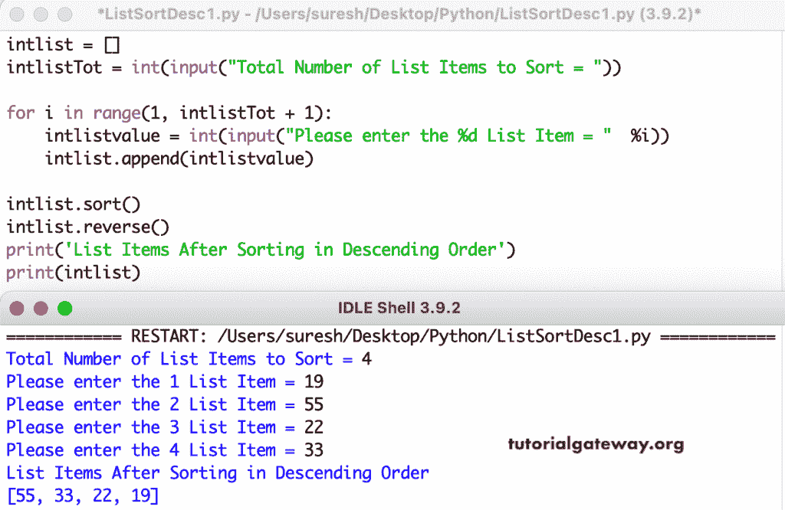

# Python 程序：按降序排序列表项目

> 原文：<https://www.tutorialgateway.org/python-program-to-sort-list-items-in-descending-order/>

编写一个 Python 程序，按照降序对列表项进行排序。在这个 Python 示例中，我们使用列表排序和反向方法对列表进行降序排序。

```py
intlist = []
intlistTot = int(input("Total Number of List Items to Sort = "))

for i in range(1, intlistTot + 1):
    intlistvalue = int(input("Please enter the %d List Item = "  %i))
    intlist.append(intlistvalue)

intlist.sort()
intlist.reverse()

print('List Items After Sorting in Descending Order')
print(intlist)
```



在这个 Python [程序](https://www.tutorialgateway.org/python-programming-examples/)中，我们使用了嵌套 for 循环和 temp 变量对列表项进行降序排序。

```py
intlist = []
intlistTot = int(input("Total Number of List Items to Sort = "))

for i in range(1, intlistTot + 1):
    intlistvalue = int(input("Please enter the %d List Item = "  %i))
    intlist.append(intlistvalue)

for i in range(len(intlist)):
    for j in range(i + 1, len(intlist)):
        if(intlist[i] < intlist[j]):
            temp = intlist[i]
            intlist[i] = intlist[j]
            intlist[j] = temp

print('List Items After Sorting in Descending Order')
for i in range(len(intlist)):
    print(intlist[i], end = '   ')
```

```py
Total Number of List Items to Sort = 8
Please enter the 1 List Item = 17
Please enter the 2 List Item = 47
Please enter the 3 List Item = 12
Please enter the 4 List Item = 99
Please enter the 5 List Item = 55
Please enter the 6 List Item = 4
Please enter the 7 List Item = 60
Please enter the 8 List Item = 75
List Items After Sorting in Descending Order
99   75   60   55   47   17   12   4 
```

Python 程序，使用 while 循环按降序对列表项进行排序。

```py
intlist = []
intlistTot = int(input("Total Number of List Items to Sort = "))

i = 1
while(i <= intlistTot):
    intlistvalue = int(input("Please enter the %d List Item = "  %i))
    intlist.append(intlistvalue)
    i = i + 1

i = 0
while(i < len(intlist)):
    j = i + 1
    while j < len(intlist):
        if(intlist[i] < intlist[j]):
            temp = intlist[i]
            intlist[i] = intlist[j]
            intlist[j] = temp
        j = j + 1
    i = i + 1

print('List Items After Sorting in Descending Order')
i = 0
while(i < len(intlist)):
    print(intlist[i], end = '   ')
    i = i + 1
```

```py
Total Number of List Items to Sort = 7
Please enter the 1 List Item = 19
Please enter the 2 List Item = 55
Please enter the 3 List Item = 89
Please enter the 4 List Item = 32
Please enter the 5 List Item = 47
Please enter the 6 List Item = 15
Please enter the 7 List Item = 7
List Items After Sorting in Descending Order
89   55   47   32   19   15   7 
```