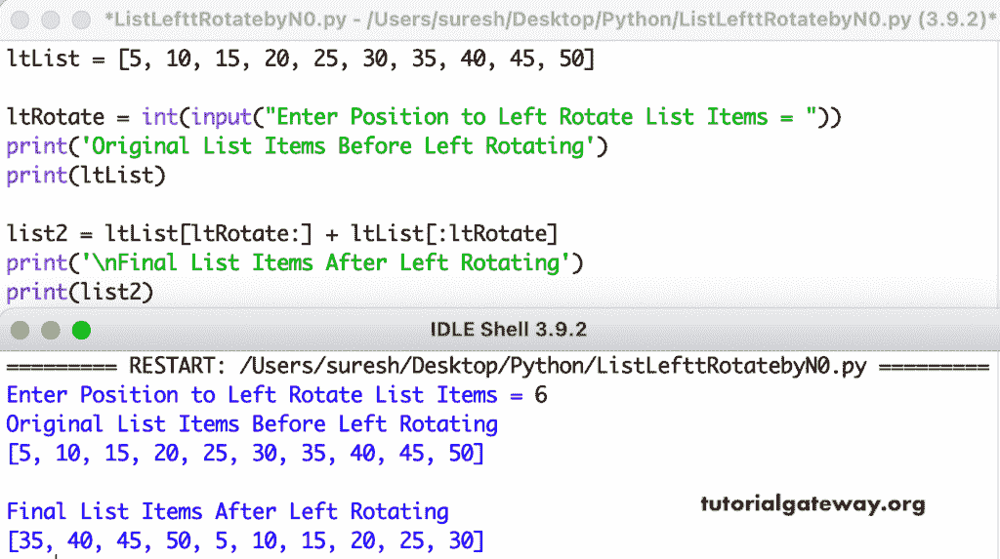

# Python 程序：将列表向左旋转 n 

> 原文：<https://www.tutorialgateway.org/python-program-to-left-rotate-a-list-by-n/>

编写一个 Python 程序，将列表向左旋转 n 次或`N`个位置。在这个 Python 示例中，我们使用位置对列表进行切片，并使用算术+对其进行组合。

```py
ltList = [5, 10, 15, 20, 25, 30, 35, 40, 45, 50]

ltRotate = int(input("Enter Position to Left Rotate List Items = "))

print('Original List Items Before Left Rotating')
print(ltList)

list2 = ltList[ltRotate:] + ltList[:ltRotate]

print('\nFinal List Items After Left Rotating')
print(list2)
```



这个 Python 程序使用 for 循环按照用户给定的位置向左旋转列表元素。

```py
ltList = [11, 22, 33, 44, 55, 66, 77, 88]

ltRotate = int(input("Enter Position to Left Rotate List Items = "))

print('Original List Items Before Left Rotating')
print(ltList)

for i in range(ltRotate):
    firstValue = ltList[0]
    for j in range(len(ltList) - 1):
        ltList[j] = ltList[j + 1]
    ltList[len(ltList) - 1] = firstValue

print('Final List Items After Left Rotating')
print(ltList)
```

```py
Enter Position to Left Rotate List Items = 6
Original List Items Before Left Rotating
[11, 22, 33, 44, 55, 66, 77, 88]
Final List Items After Left Rotating
[77, 88, 11, 22, 33, 44, 55, 66]
```

本 Python [示例](https://www.tutorialgateway.org/python-programming-examples/)允许用户输入列表大小、项目、旋转编号，并将列表项目向左旋转给定的编号。

```py
def printListItems(ltList):
    for i in range(len(ltList)):
        print(ltList[i], end = '   ')

ltList = []
ltListTot = int(input("Total Number of Left Rotate List Items = "))

for i in range(1, ltListTot + 1):
    ltListvalue = int(input("Please enter the %d List Item = "  %i))
    ltList.append(ltListvalue)

ltRotate = int(input("Enter Position to Left Rotate List Items = "))

print('\nOriginal List Items Before Left Rotating')
printListItems(ltList)

for i in range(ltRotate):
    firstValue = ltList[0]
    for j in range(len(ltList) - 1):
        ltList[j] = ltList[j + 1]
    ltList[len(ltList) - 1] = firstValue

print('\nFinal List Items After Left Rotating')
printListItems(ltList)
```

```py
Total Number of Left Rotate List Items = 7
Please enter the 1 List Item = 30
Please enter the 2 List Item = 40
Please enter the 3 List Item = 50
Please enter the 4 List Item = 70
Please enter the 5 List Item = 90
Please enter the 6 List Item = 120
Please enter the 7 List Item = 180
Enter Position to Left Rotate List Items = 2

Original List Items Before Left Rotating
30   40   50   70   90   120   180   
Final List Items After Left Rotating
50   70   90   120   180   30   40 
```

Python 程序使用 while 循环向左旋转列表 n 次。

```py
def printListItems(ltList):
    i = 0
    while i < len(ltList):
        print(ltList[i], end = '   ')
        i = i + 1

ltList = []
ltListTot = int(input("Total Number of Left Rotate List Items = "))
i = 1
while i <= ltListTot:
    ltListvalue = int(input("Please enter the %d List Item = "  %i))
    ltList.append(ltListvalue)
    i = i + 1

ltRotate = int(input("Enter Position to Left Rotate List Items = "))

print('\nOriginal List Items Before Left Rotating')
printListItems(ltList)

i = 0
while i < ltRotate:
    firstValue = ltList[0]
    j = 0
    while j < len(ltList) - 1:
        ltList[j] = ltList[j + 1]
        j = j + 1
    i = i + 1
    ltList[len(ltList) - 1] = firstValue 

print('\nFinal List Items After Left Rotating')
printListItems(ltList)
```

```py
Total Number of Left Rotate List Items = 8
Please enter the 1 List Item = 23
Please enter the 2 List Item = 45
Please enter the 3 List Item = 67
Please enter the 4 List Item = 98
Please enter the 5 List Item = 89
Please enter the 6 List Item = 11
Please enter the 7 List Item = 16
Please enter the 8 List Item = 87
Enter Position to Left Rotate List Items = 3

Original List Items Before Left Rotating
23   45   67   98   89   11   16   87   
Final List Items After Left Rotating
98   89   11   16   87   23   45   67
```