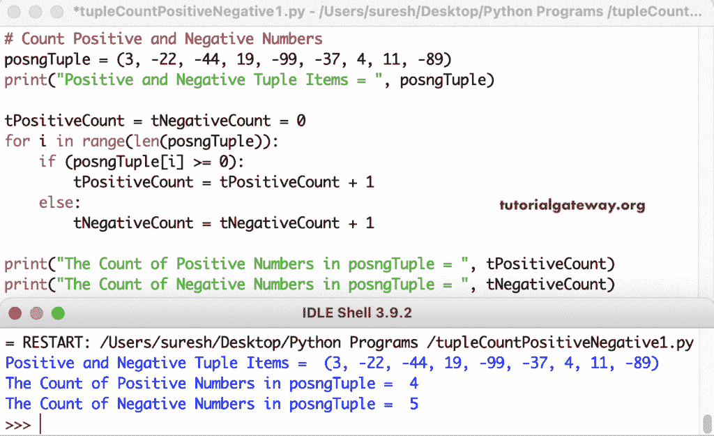

# Python 程序：计数元组中正数和负数

> 原文：<https://www.tutorialgateway.org/python-program-to-count-positive-and-negative-numbers-in-tuple/>

编写一个 Python 程序，使用 for 循环范围来计算元组中的正数和负数。if 条件(if (posngTuple[i] >= 0))检查元组项是否大于或等于零。如果为真，我们向正元组计数添加一个；否则(tNegativeCount = tNegativeCount+1)，在负元组计数值上加 1。

```py
# Count Positive and Negative Numbers

posngTuple = (3, -22, -44, 19, -99, -37, 4, 11, -89)
print("Positive and Negative Tuple Items = ", posngTuple)

tPositiveCount = tNegativeCount = 0

for i in range(len(posngTuple)):
    if (posngTuple[i] >= 0):
        tPositiveCount = tPositiveCount + 1
    else:
        tNegativeCount = tNegativeCount + 1

print("The Count of Positive Numbers in posngTuple = ", tPositiveCount)
print("The Count of Negative Numbers in posngTuple = ", tNegativeCount)
```



## 计算元组中正数和负数的 Python 程序

在这个 Python 正负示例中，我们使用 for 循环(对于 posngTuple 中的 pntup)来迭代实际的元组值，并检查它们是否大于或等于零。

```py
# Count Positive and Negative Numbers

posngTuple = (55, -99, -88, 0, -78, 22, 4, -66, 21, 33)
print("Positive and Negative Tuple Items = ", posngTuple)

tPositiveCount = tNegativeCount = 0
for pntup in posngTuple:
    if(pntup >= 0):
        tPositiveCount = tPositiveCount + 1
    else:
        tNegativeCount = tNegativeCount + 1

print("The Count of Positive Numbers in posngTuple = ", tPositiveCount)
print("The Count of Negative Numbers in posngTuple = ", tNegativeCount)
```

```py
Positive and Negative Tuple Items =  (55, -99, -88, 0, -78, 22, 4, -66, 21, 33)
The Count of Positive Numbers in posngTuple =  6
The Count of Negative Numbers in posngTuple =  4
```

Python 程序使用 While 循环计算元组中的正数和负数。

```py
# Count of Tuple Positive and Negative Numbers

posngTuple = (11, -22, -33, 44, 55, -66, -77, 0, -99)
print("Positive and Negative Tuple Items = ", posngTuple)

tPositiveCount = tNegativeCount = 0
i = 0

while (i < len(posngTuple)):
    if(posngTuple[i] >= 0):
        tPositiveCount = tPositiveCount + 1
    else:
        tNegativeCount = tNegativeCount + 1
    i = i + 1

print("The Count of Positive Numbers in posngTuple = ", tPositiveCount)
print("The Count of Negative Numbers in posngTuple = ", tNegativeCount)
```

```py
Positive and Negative Tuple Items =  (11, -22, -33, 44, 55, -66, -77, 0, -99)
The Count of Positive Numbers in posngTuple =  4
The Count of Negative Numbers in posngTuple =  5
```

在这个 Python [Tuple](https://www.tutorialgateway.org/python-tuple/) 示例中，我们创建了一个返回正数和负数计数的函数。

```py
# Count of Tuple Positive and Negative Numbers

def CountOfPositiveNegativeNumbers(evodTuple):
    tPositiveCount = tNegativeCount = 0
    for pntup in evodTuple:
        if(pntup >= 0):
            tPositiveCount = tPositiveCount + 1
        else:
            tNegativeCount = tNegativeCount + 1
    return tPositiveCount, tNegativeCount

evodTuple = (26, -77, -99, 75, 14, -56, 19, 81, -1, 33) 
print("Positive and Negative Tuple Items = ", evodTuple)

PositiveCount, NegativeCount = CountOfPositiveNegativeNumbers(evodTuple)
print("The Count of Positive Numbers in evodTuple = ", PositiveCount)
print("The Count of Negative Numbers in evodTuple = ", NegativeCount)
```

```py
Positive and Negative Tuple Items =  (26, -77, -99, 75, 14, -56, 19, 81, -1, 33)
The Count of Positive Numbers in evodTuple =  6
The Count of Negative Numbers in evodTuple =  4
```