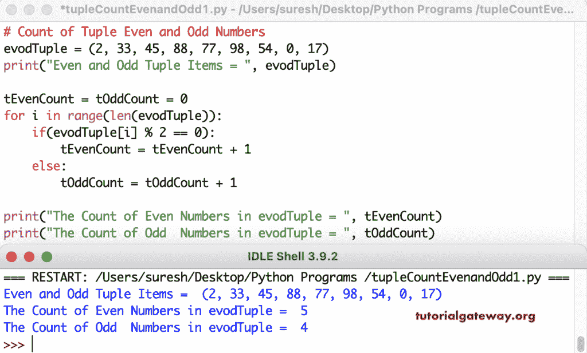

# Python 程序：计算元组中偶数和奇数

> 原文：<https://www.tutorialgateway.org/python-program-to-count-even-and-odd-numbers-in-tuple/>

编写一个 Python 程序，使用 for 循环范围来计算元组中的偶数和奇数(对于 i in 范围(len(evodTuple))。if 条件(if(evodTuple[i] % 2 == 0))检查 Tuple 项是否能被 2 整除。如果为真，我们给偶数元组计数加一；否则，给奇数元组计数值加一。

```py
# Count of Tuple Even and Odd Numbers

evodTuple = (2, 33, 45, 88, 77, 98, 54, 0, 17)
print("Even and Odd Tuple Items = ", evodTuple)

tEvenCount = tOddCount = 0

for i in range(len(evodTuple)):
    if(evodTuple[i] % 2 == 0):
        tEvenCount = tEvenCount + 1
    else:
        tOddCount = tOddCount + 1

print("The Count of Even Numbers in evodTuple = ", tEvenCount)
print("The Count of Odd  Numbers in evodTuple = ", tOddCount)
```



## 计算元组中偶数和奇数的 Python 程序

在这个 Python 示例中，我们使用 for 循环(用于 evodTuple 中的 oetup)来迭代实际的元组值，并检查它们是否能被等于零的 2 整除。

```py
# Count of Tuple Even and Odd Numbers

evodTuple = (11, 34, 17, 44, 66, 19, 89, 64, 90)
print("Even and Odd Tuple Items = ", evodTuple)

tEvenCount = tOddCount = 0
for oetup in evodTuple:
    if(oetup % 2 == 0):
        tEvenCount = tEvenCount + 1
    else:
        tOddCount = tOddCount + 1

print("The Count of Even Numbers in evodTuple = ", tEvenCount)
print("The Count of Odd  Numbers in evodTuple = ", tOddCount)
```

```py
Even and Odd Tuple Items =  (11, 34, 17, 44, 66, 19, 89, 64, 90)
The Count of Even Numbers in evodTuple =  5
The Count of Odd  Numbers in evodTuple =  4
```

使用 While 循环计算元组偶数和奇数的 Python 程序。

```py
# Count of Tuple Even and Odd Numbers

evodTuple = (64, 45, 12, 15, 68, 55, 37, 25, 120, 205)
print("Even and Odd Tuple Items = ", evodTuple)

tEvenCount = tOddCount = 0
i = 0

while (i < len(evodTuple)):
    if(evodTuple[i] % 2 == 0):
        tEvenCount = tEvenCount + 1
    else:
        tOddCount = tOddCount + 1
    i = i + 1

print("The Count of Even Numbers in evodTuple = ", tEvenCount)
print("The Count of Odd  Numbers in evodTuple = ", tOddCount)
```

```py
Even and Odd Tuple Items =  (64, 45, 12, 15, 68, 55, 37, 25, 120, 205)
The Count of Even Numbers in evodTuple =  4
The Count of Odd  Numbers in evodTuple =  6
```

在这个 Python [元组](https://www.tutorialgateway.org/python-tuple/)的例子中，我们创建了一个 CountOfEvenOddOddNumbers 函数，返回偶数和奇数的计数。

```py
# Count of Tuple Even and Odd Numbers

def CountOfEvenOddOddNumbers(evodTuple):
    tEvenCount = tOddCount = 0
    for oetup in evodTuple:
        if(oetup % 2 == 0):
            tEvenCount = tEvenCount + 1
        else:
            tOddCount = tOddCount + 1
    return tEvenCount, tOddCount

evodTuple = (12, 26, 77, 99, 66, 75, 14, 256, 19, 81, 11, 33) 
print("Even and Odd Tuple Items = ", evodTuple)

evenCount, oddCount = CountOfEvenOddOddNumbers(evodTuple)
print("The Count of Even Numbers in evodTuple = ", evenCount)
print("The Count of Odd  Numbers in evodTuple = ", oddCount)
```

```py
Even and Odd Tuple Items =  (12, 26, 77, 99, 66, 75, 14, 256, 19, 81, 11, 33)
The Count of Even Numbers in evodTuple =  5
The Count of Odd  Numbers in evodTuple =  7
```