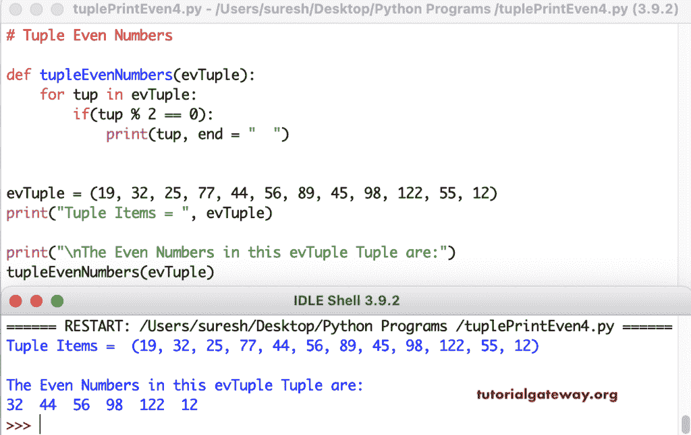

# Python 程序：打印元组中偶数

> 原文：<https://www.tutorialgateway.org/python-program-to-print-even-numbers-in-tuple/>

编写一个 Python 程序，使用 for 循环范围打印元组中的偶数。if 语句(if(evTuple[i] % 2 == 0))检查每个 Tuple 项是否可以被 2 整除。如果为真，则打印该元组偶数。

```py
# Tuple Even Numbers

evTuple = (3, 78, 67, 34, 88, 11, 23, 19)
print("Tuple Items = ", evTuple)

print("\nThe Even Numbers in this evTuple Tuple are:")
for i in range(len(evTuple)):
    if(evTuple[i] % 2 == 0):
        print(evTuple[i], end = "  ")
```

```py
Tuple Items =  (3, 78, 67, 34, 88, 11, 23, 19)

The Even Numbers in this evTuple Tuple are:
78  34  88
```

## 使用 For 循环打印元组中偶数的 Python 程序。

在这个 Python 偶数示例中，我们使用 for 循环(针对 evTuple 中的 tup)来迭代实际的 Tuple 项。

```py
# Tuple Even Numbers

evTuple = (19, 25, 32, 44, 17, 66, 11, 98)
print("Tuple Items = ", evTuple)

print("\nThe Even Numbers in this evTuple Tuple are:")
for tup in evTuple:
    if(tup % 2 == 0):
        print(tup, end = "  ")
```

```py
Tuple Items =  (19, 25, 32, 44, 17, 66, 11, 98)

The Even Numbers in this evTuple Tuple are:
32  44  66  98 
```

Python 程序使用 While 循环返回或显示元组中的偶数。

```py
# Tuple Even Numbers

evTuple = (25, 12, 19, 44, 66, 79, 89, 22, 46) 
print("Tuple Items = ", evTuple)

i = 0

print("\nThe Even Numbers in this evTuple Tuple are:")
while (i < len(evTuple)):
    if(evTuple[i] % 2 == 0):
        print(evTuple[i], end = "  ")
    i = i + 1
```

```py
Tuple Items =  (25, 12, 19, 44, 66, 79, 89, 22, 46)

The Even Numbers in this evTuple Tuple are:
12  44  66  22  46 
```

在这个 Python [元组](https://www.tutorialgateway.org/python-tuple/)的例子中，我们创建了一个函数(tuplevennumbers(evTuple))来查找和打印偶数。

```py
# Tuple Even Numbers

def tupleEvenNumbers(evTuple):
    for tup in evTuple:
        if(tup % 2 == 0):
            print(tup, end = "  ")

evTuple = (19, 32, 25, 77, 44, 56, 89, 45, 98, 122, 55, 12) 
print("Tuple Items = ", evTuple)

print("\nThe Even Numbers in this evTuple Tuple are:")
tupleEvenNumbers(evTuple)
```

