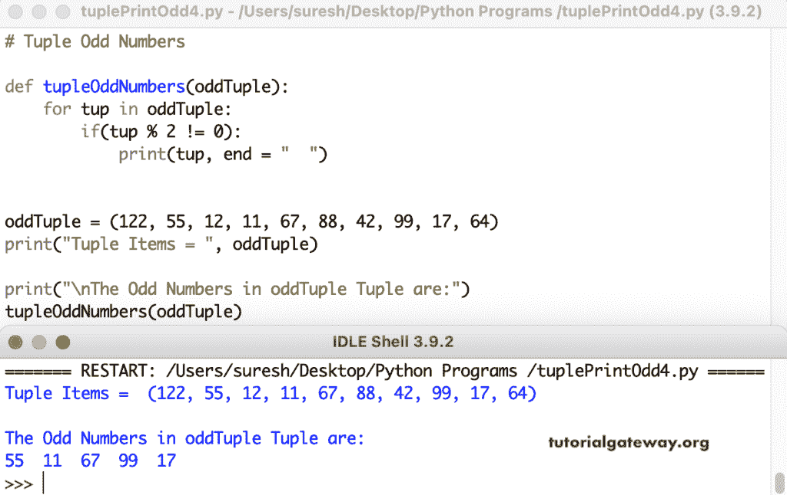

# Python 程序：打印元组中奇数

> 原文：<https://www.tutorialgateway.org/python-program-to-print-odd-numbers-in-tuple/>

编写一个 Python 程序，使用 for 循环范围打印元组中的奇数(对于 i in 范围(len(oddTuple))。if 语句(if(oddTuple[i] % 2！= 0)检查每个可被二整除的元组项是否不等于零。如果为真，打印元组中的奇数。

```py
# Tuple Odd Numbers

oddTuple = (9, 22, 33, 45, 56, 77, 89, 90)
print("Odd Tuple Items = ", oddTuple)

print("\nThe Odd Numbers in oddTuple Tuple are:")
for i in range(len(oddTuple)):
    if(oddTuple[i] % 2 != 0):
        print(oddTuple[i], end = "  ")
```

```py
Odd Tuple Items =  (9, 22, 33, 45, 56, 77, 89, 90)

The Odd Numbers in oddTuple Tuple are:
9  33  45  77  89 
```

## 使用 For 循环打印元组中奇数的 Python 程序

在这个 Python 奇数示例中，我们使用 for 循环(对于 oddTuple 中的 tup)来迭代实际的 Tuple 项以找到奇数。

```py
# Tuple Odd Numbers

oddTuple = (19, 98, 17, 23, 56, 77, 88, 99, 111)
print("Tuple Items = ", oddTuple)

print("\nThe Odd Numbers in this oddTuple Tuple are:")
for tup in oddTuple:
    if(tup % 2 != 0):
        print(tup, end = "  ")
```

```py
Tuple Items =  (19, 98, 17, 23, 56, 77, 88, 99, 111)

The Odd Numbers in this oddTuple Tuple are:
19  17  23  77  99  111 
```

Python 程序使用 While 循环返回元组中的奇数。

```py
# Tuple Odd Numbers

oddTuple = (25, 19, 44, 53, 66, 79, 89, 22, 67) 
print("Odd Tuple Items = ", oddTuple)

i = 0

print("\nThe Odd Numbers in oddTuple Tuple are:")
while (i < len(oddTuple)):
    if(oddTuple[i] % 2 != 0):
        print(oddTuple[i], end = "  ")
    i = i + 1
```

```py
Odd Tuple Items =  (25, 19, 44, 53, 66, 79, 89, 22, 67)

The Odd Numbers in oddTuple Tuple are:
25  19  53  79  89  67 
```

在这个 Python Tuple [示例](https://www.tutorialgateway.org/python-programming-examples/)中，我们创建了一个函数(tupleednumbers(Odd Tuple))来查找和打印奇数。

```py
# Tuple Odd Numbers

def tupleOddNumbers(oddTuple):
    for tup in oddTuple:
        if(tup % 2 != 0):
            print(tup, end = "  ")

oddTuple = (122, 55, 12, 11, 67, 88, 42, 99, 17, 64) 
print("Tuple Items = ", oddTuple)

print("\nThe Odd Numbers in oddTuple Tuple are:")
tupleOddNumbers(oddTuple)
```

