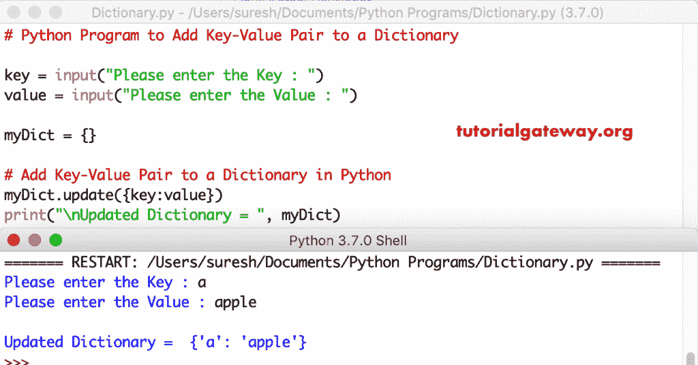

# Python 程序：向字典添加键值对

> 原文：<https://www.tutorialgateway.org/python-program-to-add-key-value-pair-to-a-dictionary/>

编写一个 Python 程序，通过一个实际例子将键值对添加到字典中。

## 向字典添加键值对的 Python 程序示例 1

在这个 [python 程序](https://www.tutorialgateway.org/python-programming-examples/)中，我们使用[字典更新](https://www.tutorialgateway.org/python-dictionary-update/)功能将键值插入到[字典](https://www.tutorialgateway.org/python-dictionary/)中。

```py
# Python Program to Add Key-Value Pair to a Dictionary

key = input("Please enter the Key : ")
value = input("Please enter the Value : ")

myDict = {}

# Add Key-Value Pair to a Dictionary in Python
myDict.update({key:value})
print("\nUpdated Dictionary = ", myDict)
```



## 将键值对插入字典的 Python 程序示例 2

这个 [Python](https://www.tutorialgateway.org/python-tutorial/) 程序是将键值插入字典的另一种方法。

```py
# Python Program to Add Key-Value Pair to a Dictionary

key = input("Please enter the Key : ")
value = input("Please enter the Value : ")

myDict = {}

# Add Key-Value Pair to a Dictionary in Python
myDict[key] = value
print("\nUpdated Dictionary = ", myDict)
```

向字典输出添加键值对

```py
Please enter the Key : M
Please enter the Value : Mango

Updated Dictionary =  {'M': 'Mango'}
```