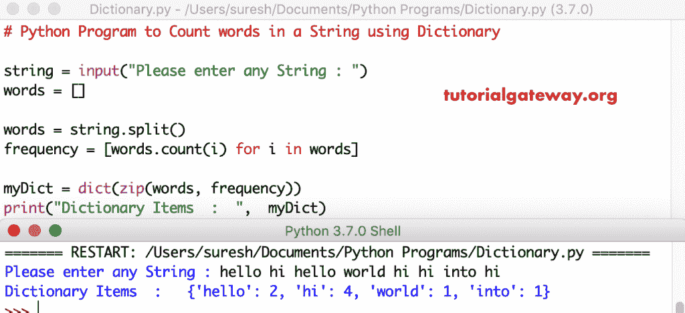

# Python 程序：使用字典计数字符串中单词

> 原文：<https://www.tutorialgateway.org/python-program-to-count-words-in-a-string-using-dictionary/>

写一个 Python 程序，用字典计算字符串中的单词，并给出一个实例。

## 使用字典对字符串中的单词进行计数的 Python 程序示例 1

在这个 [python 程序](https://www.tutorialgateway.org/python-programming-examples/)中，我们使用了一个[分裂函数](https://www.tutorialgateway.org/python-split/)来分裂字符串。接下来，我们使用 for 循环来对字符串中的[字进行计数。然后我们使用](https://www.tutorialgateway.org/python-count-list-items/) [Python](https://www.tutorialgateway.org/python-tutorial/) 字典函数将这些单词和值转换成[字典](https://www.tutorialgateway.org/python-dictionary/)。

```py
# Python Program to Count words in a String using Dictionary

string = input("Please enter any String : ")
words = []

words = string.split()
frequency = [words.count(i) for i in words]

myDict = dict(zip(words, frequency))
print("Dictionary Items  :  ",  myDict)
```



## 使用字典返回字符串的 Python 程序示例 2

这个使用字典计算字符串单词的 Python 代码是另一种计算字符串单词的方法。这里，我们使用[进行循环](https://www.tutorialgateway.org/python-for-loop/)来迭代单词。

```py
# Python Program to Count words in a String using Dictionary

string = input("Please enter any String : ")
words = []

words = string.split() # or string.lower().split()
myDict = {}
for key in words:
    myDict[key] = words.count(key)

print("Dictionary Items  :  ",  myDict)
```

使用字典输出对字符串中的单词进行计数

```py
Please enter any String : python tutorial at tutorial gateway web
Dictionary Items  :   {'python': 1, 'tutorial': 2, 'at': 1, 'gateway': 1, 'web': 1}
```