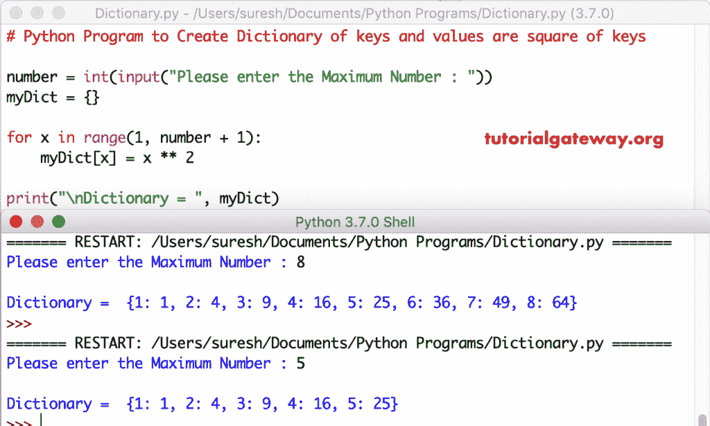

# Python 程序：创建键和值的字典是键的平方

> 原文：<https://www.tutorialgateway.org/python-program-to-create-dictionary-of-keys-and-values-are-square-of-keys/>

写一个 Python 程序来创建键的字典，用一个实际的例子来说明值是键的平方。

## 创建键和值的字典的 Python 程序是键的平方示例 1

在这个 python 程序中，我们使用 for 循环从 1 迭代到用户指定的值。在 Python for 循环中，我们使用[指数运算符](https://www.tutorialgateway.org/python-arithmetic-operators/)为[字典](https://www.tutorialgateway.org/python-dictionary/)赋值。

```py
# Python Program to Create Dictionary of keys and values are square of keys

number = int(input("Please enter the Maximum Number : "))
myDict = {}

for x in range(1, number + 1):
    myDict[x] = x ** 2

print("\nDictionary = ", myDict)
```



在这个 [Python](https://www.tutorialgateway.org/python-tutorial/) 的例子中，number = 5。

第一次迭代 x 将是 1:1，范围为(1，6)
myDict[x]= x * * 2
myDict[x]= 1 * * 2 = 1

第二次迭代 x 将是 2:对于范围(1，6)
中的 2，my dict[x]= 2 * * 2 = 2

对循环迭代的剩余[进行同样的操作](https://www.tutorialgateway.org/python-for-loop/)

## 创建从 1 到 n 的键的字典的程序，值是键的平方示例 2

这个 [python 代码](https://www.tutorialgateway.org/python-programming-examples/)创建键和值的字典是键的平方是另一种方法。

```py
# Python Program to Create Dictionary of keys and values are square of keys

number = int(input("Please enter the Maximum Number : "))

myDict = {x:x ** 2 for x in range(1, number + 1)}

print("\nDictionary = ", myDict)
```

将键字典和键方块输出为值

```py
Please enter the Maximum Number : 6

Dictionary =  {1: 1, 2: 4, 3: 9, 4: 16, 5: 25, 6: 36}
>>> 
Please enter the Maximum Number : 9

Dictionary =  {1: 1, 2: 4, 3: 9, 4: 16, 5: 25, 6: 36, 7: 49, 8: 64, 9: 81}
>>> 
```