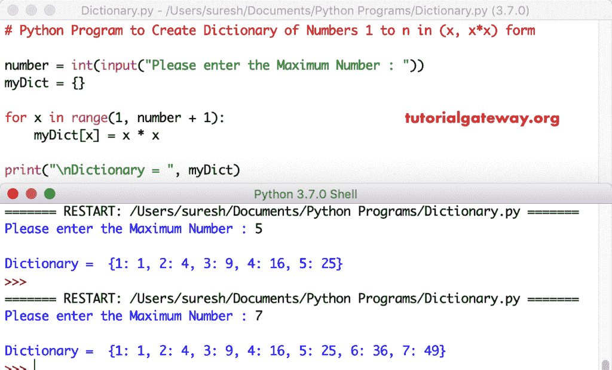

# Python 程序：创建`(x, x*x)`形式的 1 到`n`的数字字典

> 原文：<https://www.tutorialgateway.org/python-program-to-create-dictionary-of-numbers-1-to-n-in-x-xx-form/>

写一个 Python 程序，用一个实例创建(x，x*x)形式的 1 到 n 的数字字典。

## 创建(x，x*x)形式的 1 到 n 的数字字典的 Python 程序示例 1

在这个 python 程序中，我们使用 for 循环从 1 迭代到用户指定的值。在 Python for 循环中，我们使用*运算符为字典赋值。

```py
# Python Program to Create Dictionary of Numbers 1 to n in (x, x*x) form

number = int(input("Please enter the Maximum Number : "))
myDict = {}

for x in range(1, number + 1):
    myDict[x] = x * x

print("\nDictionary = ", myDict)
```



在本 [python 程序](https://www.tutorialgateway.org/python-programming-examples/)中，给定数= 5。

第一次迭代 x 将是 1:1，范围为(1，6)
myDict[x]= x * x
myDict[1]= 1 * 1 = 1

第二次迭代 x 将是 2:对于范围(1，6)
中的 2，myDict[2] = 2 * 2 = 4

对循环迭代的剩余[进行同样的操作](https://www.tutorialgateway.org/python-for-loop/)

## Python 程序以(x，x*x)的形式生成 1 到 n 的数字字典示例 2

这是 Python 创建字典的另一种方法。这里我们用单行生成 x，x*x 形式的数字的[字典](https://www.tutorialgateway.org/python-dictionary/)，请参考 [*算术运算符](https://www.tutorialgateway.org/python-arithmetic-operators/)。

```py
# Python Program to Create Dictionary of Numbers 1 to n in (x, x*x) form

number = int(input("Please enter the Maximum Number : "))

myDict = {x:x * x for x in range(1, number + 1)}

print("\nDictionary = ", myDict)
```

在为 x 生成字典，x* x 输出

```py
Please enter the Maximum Number : 6

Dictionary =  {1: 1, 2: 4, 3: 9, 4: 16, 5: 25, 6: 36}
>>> 
Please enter the Maximum Number : 9

Dictionary =  {1: 1, 2: 4, 3: 9, 4: 16, 5: 25, 6: 36, 7: 49, 8: 64, 9: 81}
>>> 
```