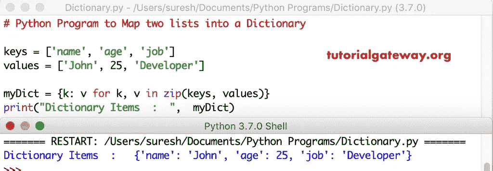

# Python 程序：将两个列表映射到一个字典中

> 原文：<https://www.tutorialgateway.org/python-program-to-map-two-lists-into-a-dictionary/>

写一个 Python 程序，用一个实例将两个列表映射成一个字典。

## 将两个列表映射到字典中的 Python 程序示例 1

在这个 python 程序中，我们使用[进行循环](https://www.tutorialgateway.org/python-for-loop/)，并带有 [zip 功能](https://www.tutorialgateway.org/python-zip-function/)。

```py
# Python Program to Map two lists into a Dictionary

keys = ['name', 'age', 'job']
values = ['John', 25, 'Developer']

myDict = {k: v for k, v in zip(keys, values)}
print("Dictionary Items  :  ",  myDict)
```



## 将两个列表插入字典的 Python 程序示例 2

这段 [Python](https://www.tutorialgateway.org/python-tutorial/) 代码是将列表插入[字典](https://www.tutorialgateway.org/python-dictionary/)的另一种方法。在这个程序中，我们使用了 dict 关键字和 zip 函数。

```py
keys = ['name', 'age', 'job']
values = ['John', 25, 'Developer']

myDict = dict(zip(keys, values))
print("Dictionary Items  :  ",  myDict)
```

Python 将两个列表映射到字典输出中

```py
Dictionary Items  :   {'name': 'John', 'age': 25, 'job': 'Developer'}
>>> 
```

## 将两个列表映射到字典中的程序示例 3

这个 Python 将两个列表映射到一个字典中的代码与上面相同。然而，在这个 [python 程序](https://www.tutorialgateway.org/python-programming-examples/)中，我们允许用户插入键和值。

```py
keys = []
values = []
num = int(input("Please enter the Number of elements for this Dictionary : "))
print("Integer Values for Keys")
for i in range(0, num):
    x = int(input("Enter Key " + str(i + 1) + " = "))
    keys.append(x)

print("Integer Values for Values")
for i in range(0, num):
    x = int(input("Enter Value " + str(i + 1) + " = "))
    values.append(x)

myDict = dict(zip(keys, values))
print("Dictionary Items  :  ",  myDict)
```

```py
Please enter the Number of elements for this Dictionary : 3
Integer Values for Keys
Enter Key 1 = 2
Enter Key 2 = 4
Enter Key 3 = 6
Integer Values for Values
Enter Value 1 = 50
Enter Value 2 = 100
Enter Value 3 = 150
Dictionary Items  :   {2: 50, 4: 100, 6: 150}
```