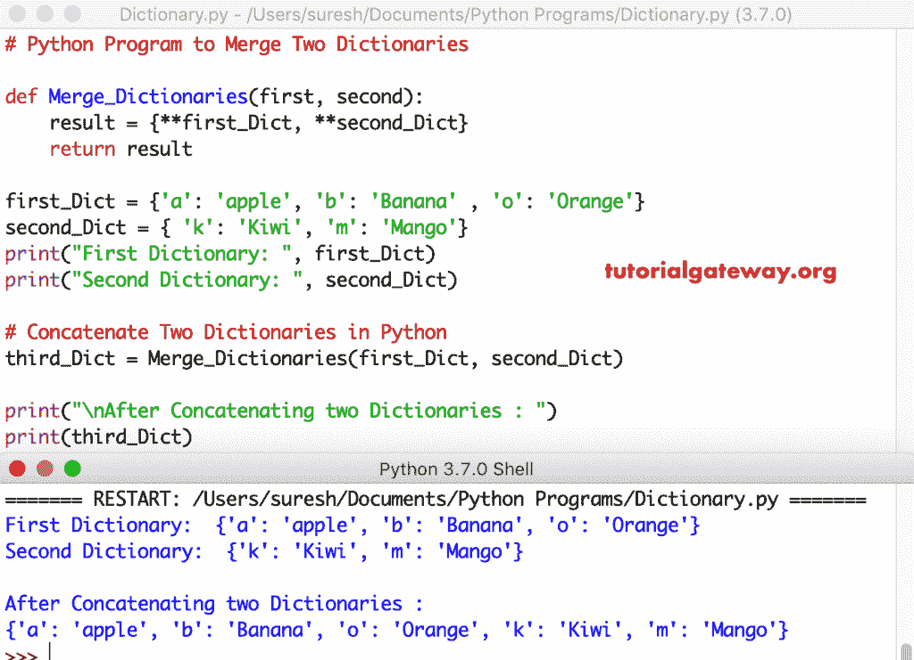

# Python 程序：合并两本词典

> 原文：<https://www.tutorialgateway.org/python-program-to-merge-two-dictionaries/>

用一个实例写一个 Python 程序来合并两本词典。

## 合并两本词典的 Python 程序示例

在这个 python 程序中，我们使用 [update](https://www.tutorialgateway.org/python-dictionary-update/) 函数用第二个 _Dict 值更新第一个 _Dict。

```py
first_Dict = {1: 'apple', 2: 'Banana' , 3: 'Orange'}
second_Dict = { 4: 'Kiwi', 5: 'Mango'}
print("First Dictionary: ", first_Dict)
print("Second Dictionary: ", second_Dict)

first_Dict.update(second_Dict)

print("\nAfter Concatenating : ")
print(first_Dict)
```

```py
First Dictionary:  {1: 'apple', 2: 'Banana', 3: 'Orange'}
Second Dictionary:  {4: 'Kiwi', 5: 'Mango'}

After Concatenating : 
{1: 'apple', 2: 'Banana', 3: 'Orange', 4: 'Kiwi', 5: 'Mango'}
```

## 连接字典的 Python 程序示例 2

是在 [Python](https://www.tutorialgateway.org/python-tutorial/) 中合并的另一种方式。在这个程序中，我们使用 dict 关键字使用 first_Dict 和** second_Dict 创建一个新的[词典](https://www.tutorialgateway.org/python-dictionary/)。在这里，**允许您传递多个参数。

```py
first_Dict = {'a': 'apple', 'b': 'Banana' , 'o': 'Orange'}
second_Dict = { 'k': 'Kiwi', 'm': 'Mango'}
print("First Dictionary: ", first_Dict)
print("Second Dictionary: ", second_Dict)

print("\nAfter Concatenating : ")
print(dict(first_Dict, **second_Dict) )
```

Python 字典串联输出

```py
First Dictionary:  {'a': 'apple', 'b': 'Banana', 'o': 'Orange'}
Second Dictionary:  {'k': 'Kiwi', 'm': 'Mango'}

After Concatenating : 
{'a': 'apple', 'b': 'Banana', 'o': 'Orange', 'k': 'Kiwi', 'm': 'Mango'}
```

## 连接两个字典的 Python 程序示例 3

这个 Python 字典串联代码与上面的相同。然而，在这个[程序](https://www.tutorialgateway.org/python-programming-examples/)中，我们使用[函数](https://www.tutorialgateway.org/functions-in-python/)分离了两个字典的串联逻辑。

```py
def Merge_Dictionaries(first, second):
    result = {**first_Dict, **second_Dict}
    return result

first_Dict = {'a': 'apple', 'b': 'Banana' , 'o': 'Orange'}
second_Dict = { 'k': 'Kiwi', 'm': 'Mango'}
print("First Dictionary: ", first_Dict)
print("Second Dictionary: ", second_Dict)

# Concatenate Two Dictionaries 
third_Dict = Merge_Dictionaries(first_Dict, second_Dict)

print("\nAfter Concatenating two Dictionaries : ")
print(third_Dict)
```

