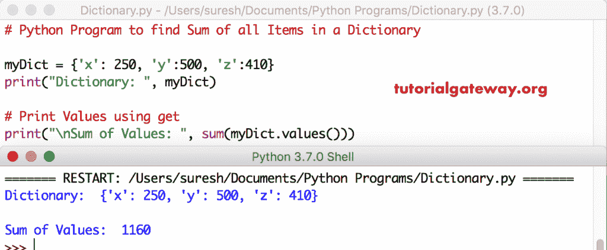

# Python 程序：在字典中查找项目的和

> 原文：<https://www.tutorialgateway.org/python-program-to-find-sum-of-items-in-a-dictionary/>

写一个 Python 程序，用一个实际的例子找到字典中项目的总和。

## 在字典中查找项目总和的 Python 程序示例 1

在这个程序中我们使用的是求和函数，[字典值](https://www.tutorialgateway.org/python-dictionary-values/)函数求字典值的和。 [Python](https://www.tutorialgateway.org/python-tutorial/) sum 函数是返回一个[字典](https://www.tutorialgateway.org/python-dictionary/) 中所有值的总和

```py
# Python Program to find Sum of Items in a Dictionary

myDict = {'x': 250, 'y':500, 'z':410}
print("Dictionary: ", myDict)

# Print Values using get
print("\nSum of Values: ", sum(myDict.values()))
```



## 计算字典中项目总和的 Python 程序示例 2

这个 [Python 程序](https://www.tutorialgateway.org/python-programming-examples/)使用 For 循环和值函数在字典中添加值。

```py
myDict = {'x': 250, 'y':500, 'z':410}
print("Dictionary: ", myDict)
total = 0

# Print Values using get
for i in myDict.values():
    total = total + i

print("\nThe Total Sum of Values : ", total)
```

Python 字典项输出的总和

```py
Dictionary:  {'x': 250, 'y': 500, 'z': 410}

The Total Sum of Values :  1160
```

## 计算字典中所有项目总和的 Python 程序示例 3

在这个 Python 程序中，我们使用 [For Loop](https://www.tutorialgateway.org/python-for-loop/) 来迭代这个字典中的每个元素。在 Python 循环中，我们将这些字典值添加到总变量中。

```py
myDict = {'x': 250, 'y':500, 'z':410}
print("Dictionary: ", myDict)
total = 0

# Print Values using get
for i in myDict:
    total = total + myDict[i]

print("\nThe Total Sum of Values : ", total)
```

```py
Dictionary:  {'x': 250, 'y': 500, 'z': 410}

The Total Sum of Values :  1160
```