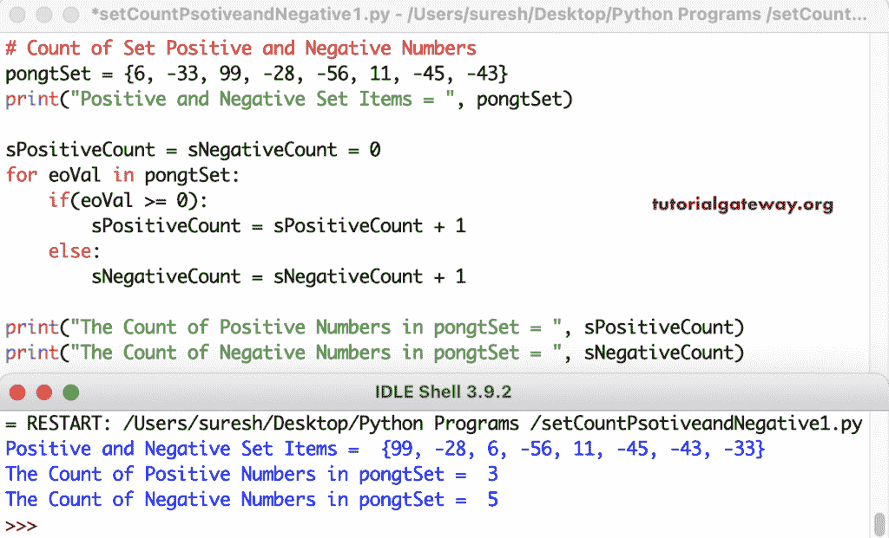

# Python 程序：计算集合中的正数和负数

> 原文：<https://www.tutorialgateway.org/python-program-to-count-positive-and-negative-numbers-in-set/>

写一个 Python 程序来计算集合中的正数和负数。for 循环(用于 pongtSet 中的 eoVal)迭代所有集合项。if 条件(if(eoVal >= 0))检查 Set 项是否大于或等于零。如果为真，我们在正集合计数上加一；否则，将负集计数值加 1。

```py
# Count of Set Positive and Negative Numbers

pongtSet = {6, -33, 99, -28, -56, 11, -45, -43}
print("Positive and Negative Set Items = ", pongtSet)

sPositiveCount = sNegativeCount = 0

for eoVal in pongtSet:
    if(eoVal >= 0):
        sPositiveCount = sPositiveCount + 1
    else:
        sNegativeCount = sNegativeCount + 1

print("The Count of Positive Numbers in pongtSet = ", sPositiveCount)
print("The Count of Negative Numbers in pongtSet = ", sNegativeCount)
```



## Python 程序计算集合中的正数和负数

该 Python 正数和负数示例允许使用 for 循环范围输入[设置](https://www.tutorialgateway.org/python-set/)项。

```py
# Count of Set Positive and Negative Numbers

pongtSet = set()

number = int(input("Enter the Total Positive Negative Set Items = "))
for i in range(1, number + 1):
    value = int(input("Enter the %d Set Item = " %i))
    pongtSet.add(value)

print("Positive and Negative Set Items = ", pongtSet)

sPositiveCount = sNegativeCount = 0

for eoVal in pongtSet:
    if(eoVal >= 0):
        sPositiveCount = sPositiveCount + 1
    else:
        sNegativeCount = sNegativeCount + 1

print("The Count of Positive Numbers in pongtSet = ", sPositiveCount)
print("The Count of Negative  Numbers in pongtSet = ", sNegativeCount)
```

Python 计数正负集合数输出

```py
Enter the Total Positive Negative Set Items = 4
Enter the 1 Set Item = -22
Enter the 2 Set Item = -99
Enter the 3 Set Item = 8
Enter the 4 Set Item = -67
Positive and Negative Set Items =  {8, -22, -99, -67}
The Count of Positive Numbers in pongtSet =  1
The Count of Negative  Numbers in pongtSet =  3
```

在这个 Python 集的例子中，我们创建了一个 countofsetpositiveandneblenumbers 函数，该函数返回正数和负数的计数。

```py
# Count of Set Positive and Negative Numbers

def CountOfSetPositiveandNegativeNumbers(pongtSet):
    sPositiveCount = sNegativeCount = 0

    for eoVal in pongtSet:
        if(eoVal >= 0):
            sPositiveCount = sPositiveCount + 1
        else:
            sNegativeCount = sNegativeCount + 1
    return sPositiveCount, sNegativeCount

pongtSet = set()

number = int(input("Enter the Total Positive Negative Set Items = "))
for i in range(1, number + 1):
    value = int(input("Enter the %d Set Item = " %i))
    pongtSet.add(value)

print("Positive and Negative Set Items = ", pongtSet)

sECount, sOCount = CountOfSetPositiveandNegativeNumbers(pongtSet)
print("The Count of Positive Numbers in pongtSet = ", sECount)
print("The Count of Negative  Numbers in pongtSet = ", sOCount)
```

```py
Enter the Total Positive Negative Set Items = 6
Enter the 1 Set Item = 22
Enter the 2 Set Item = -90
Enter the 3 Set Item = -78
Enter the 4 Set Item = 9
Enter the 5 Set Item = 32
Enter the 6 Set Item = 8
Positive and Negative Set Items =  {32, -90, 8, 9, -78, 22}
The Count of Positive Numbers in pongtSet =  4
The Count of Negative  Numbers in pongtSet =  2
```