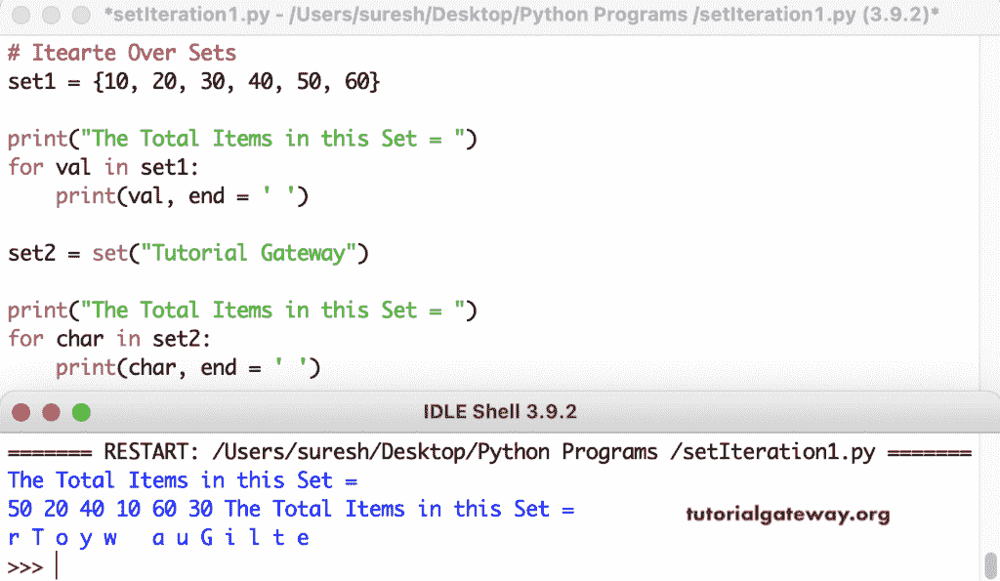

# Python 程序：迭代集合项

> 原文：<https://www.tutorialgateway.org/python-program-to-iterate-set-items/>

编写一个 Python 程序来迭代集合项。Python for 循环是迭代集合项最常见的循环。在这个例子中，我们使用 for 循环来迭代数字和字符串集。

```py
# Itearte Over Sets

set1 = {10, 20, 30, 40, 50, 60}

print("The Total Items in this Set = ")
for val in set1:
    print(val, end = ' ')

set2 = set("Tutorial Gateway")

print("The Total Items in this Set = ")
for char in set2:
    print(char, end = ' ')
```



## 迭代集合项的 Python 程序

在这里，我们将集合转换为列表，并使用 for 循环范围根据索引迭代和打印集合项。

```py
# Itearte Over Sets

set1 = {11, 33, 55, 77, 99, 111}

list1 = list(set1)

print("The Total Items in this Set = ")
for i in range(len(list1)):
    print(list1[i], end = ' ')

set2 = set("TutorialGateway")
list2 = list(set2)

print("\n\nThe Total Items in this Set = ")
for i in range(len(list2)):
    print(list2[i], end = ' ')
```

迭代用于循环输出的集合项

```py
The Total Items in this Set = 
33 99 55 11 77 111 

The Total Items in this Set = 
l r G w u i y o t a e T 
```

这个 Python 程序使用枚举来迭代集合项。一般来说，我们不需要身份证。所以可以在 enumerate(setName)中使用 for _，值。

```py
# Itearte Over Sets

set1 = {11, 33, 55, 77, 99, 111}

print("The Total Items in this Set = ")
for i, value in enumerate(set1):
    print(i, value)

set2 = set("Python")

print("\nThe Total Items in this Set = ")
for i, value in enumerate(set2):
     print(i, value)

print("\nThe Total Items in this Set = ")
for _, value in enumerate(set1):
    print(value, end = '  ')

print("\nThe Total Items in this Set = ")
for _, value in enumerate(set2):
     print(value, end = '  ')
```

迭代设定值枚举输出

```py
The Total Items in this Set = 
0 33
1 99
2 55
3 11
4 77
5 111

The Total Items in this Set = 
0 y
1 o
2 n
3 t
4 P
5 h

The Total Items in this Set = 
33  99  55  11  77  111  
The Total Items in this Set = 
y  o  n  t  P  h 
```

这是使用[列表](https://www.tutorialgateway.org/python-list/)和[列表理解](https://www.tutorialgateway.org/python-list-comprehensions/)迭代[集合](https://www.tutorialgateway.org/python-set/)的另一个例子。

```py
# Itearte Over Sets

set1 = {5, 10, 20, 25, 30, 35, 40}

print("The Total Items in this Set = ")
x = [print(val, end = ' ') for val in set1]

set2 = set("Python")

print("The Total Items in this Set = ")
x = list(val for val in set2)
print(x)
print(*x)
```

使用列表理解输出迭代集合项

```py
The Total Items in this Set = 
35 20 5 40 25 10 30 The Total Items in this Set = 
['h', 'P', 'y', 'o', 't', 'n']
h P y o t n
```