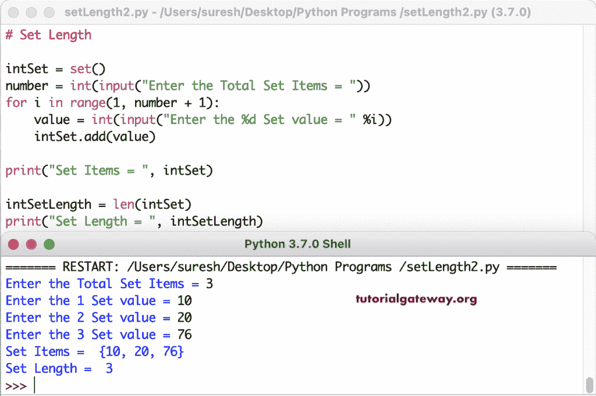

# Python 程序：计算集合长度

> 原文：<https://www.tutorialgateway.org/python-program-to-find-set-length/>

写一个 Python 程序来找到一个集合的长度。在这个例子中，我们声明了不同类型的集合，并使用 Python len 函数来查找这些集合的长度。

```py
# Set Length

intSet = {10, 25, 136, 44, 150}
print("Set Items = ", intSet)

intSetLength = len(intSet)
print("Set Length = ", intSetLength)

strSet = {'apple', 'banana', 'Mango', 'kiwi'}
print("String Set Items = ", strSet)

strSetLength = len(strSet)
print("String Set Length = ", strSetLength)

mSet = {'Apple', 2.46, 45, 'Banana', (2, 4, 6, 8), 1}
print("Mixed Set Items = ", mSet)

mSetLength = len(mSet)
print("Mixed Set Length = ", mSetLength)
```

```py
Set Items =  {150, 136, 25, 10, 44}
Set Length =  5
String Set Items =  {'kiwi', 'Mango', 'apple', 'banana'}
String Set Length =  4
Mixed Set Items =  {1, 2.46, 'Apple', (2, 4, 6, 8), 45, 'Banana'}
Mixed Set Length =  6
```

在这个 Python 程序中，我们声明了一个空集合并允许输入集合项，并计算了长度。

```py
# Set Length

intSet = set()
number = int(input("Enter the Total Set Items = "))
for i in range(1, number + 1):
    value = int(input("Enter the %d Set value = " %i))
    intSet.add(value)

print("Set Items = ", intSet)

intSetLength = len(intSet)
print("Set Length = ", intSetLength)
```

