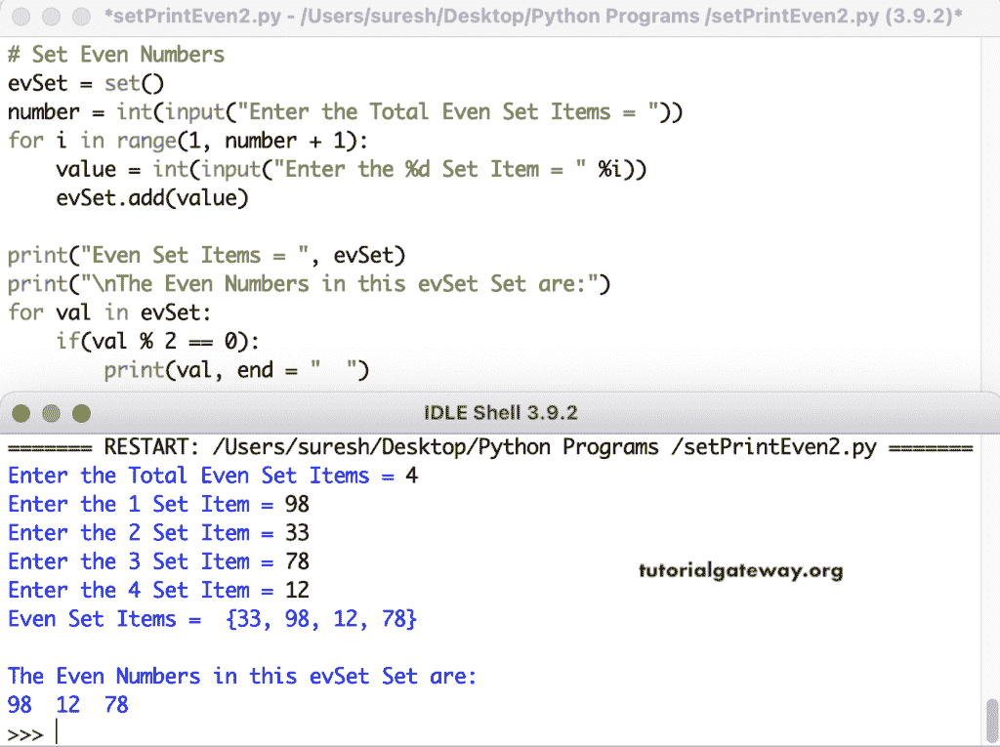

# Python 程序：打印集合中的偶数

> 原文：<https://www.tutorialgateway.org/python-program-to-print-even-numbers-in-set/>

写一个 Python 程序来打印集合中的偶数。if 语句(if(val % 2 == 0))测试 Set 项是否可被 2 整除，并返回零。如果为真，则在集合中打印该偶数。

```py
# Set Even Numbers

evSet = {15, 26, 19, 78, 64, 35, 66}
print("Even Set Items = ", evSet)

print("\nThe Even Numbers in this evSet Set are:")
for val in evSet:
    if(val % 2 == 0):
        print(val, end = "  ")
```

在 Python 集中打印偶数输出

```py
Even Set Items =  {64, 66, 35, 19, 26, 78, 15}

The Even Numbers in this evSet Set are:
64  66  26  78 
```

这个 Python 集合程序允许输入集合项目并打印偶数。

```py
# Set Even Numbers

evSet = set()

number = int(input("Enter the Total Even Set Items = "))
for i in range(1, number + 1):
    value = int(input("Enter the %d Set Item = " %i))
    evSet.add(value)

print("Even Set Items = ", evSet)

print("\nThe Even Numbers in this evSet Set are:")
for val in evSet:
    if(val % 2 == 0):
        print(val, end = "  ")
```



在这个 Python [Set](https://www.tutorialgateway.org/python-set/) 的例子中，我们创建了一个 setEvenNumbers 函数，它打印偶数。

```py
# Set Even Numbers

def setEvenNumbers(evset):
    for val in evSet:
        if(val % 2 == 0):
            print(val, end = "  ")

evSet = set()

number = int(input("Enter the Total Even Set Items = "))
for i in range(1, number + 1):
    value = int(input("Enter the %d Set Item = " %i))
    evSet.add(value)

print("Even Set Items = ", evSet)

print("\nThe Even Numbers in this evSet Set are:")
setEvenNumbers(evSet)
```

```py
Enter the Total Even Set Items = 7
Enter the 1 Set Item = 22
Enter the 2 Set Item = 33
Enter the 3 Set Item = 44
Enter the 4 Set Item = 55
Enter the 5 Set Item = 66
Enter the 6 Set Item = 77
Enter the 7 Set Item = 89
Even Set Items =  {33, 66, 44, 77, 22, 55, 89}

The Even Numbers in this evSet Set are:
66  44  22 
```