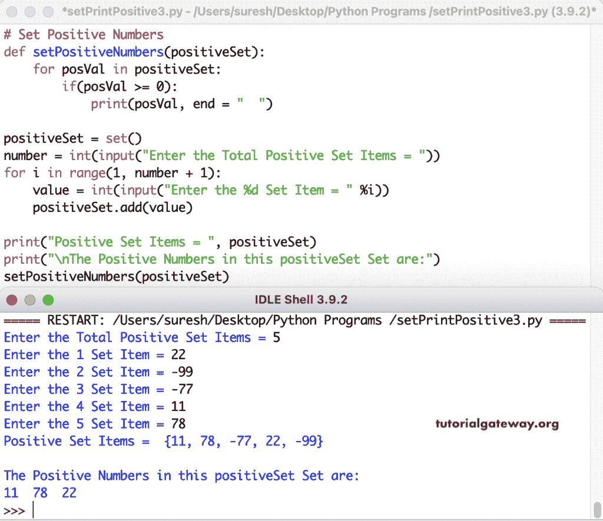

# Python 程序：打印集合中正数

> 原文：<https://www.tutorialgateway.org/python-program-to-print-positive-numbers-in-set/>

编写一个 Python 程序来打印集合中的正数或项目。for 循环(PositiveSet 中的 posival)内的 if 语句(if(posival > = 0))检查 Set 项是否大于或等于零。如果为真，则打印该正数。

```py
# Set Positive Numbers

PositiveSet = {7, -8, -11, 4, -85, 14, -22, 78, 11}
print("Positive Set Items = ", PositiveSet)

print("\nThe Positive Numbers in this PositiveSet Set are:")
for posVal in PositiveSet:
    if(posVal >= 0):
        print(posVal, end = "  ")
```

在 Python 集中打印正数输出

```py
Positive Set Items =  {4, 7, -22, 11, -85, 14, 78, -11, -8}

The Positive Numbers in this PositiveSet Set are:
4  7  11  14  78 
```

在这个 Python 程序中，我们允许您输入集合项目并在集合中打印正数。

```py
# Set Positive Numbers

positiveSet = set()

number = int(input("Enter the Total Positive Set Items = "))
for i in range(1, number + 1):
    value = int(input("Enter the %d Set Item = " %i))
    positiveSet.add(value)

print("Positive Set Items = ", positiveSet)

print("\nThe Positive Numbers in this positiveSet Set are:")
for posVal in positiveSet:
    if(posVal >= 0):
        print(posVal, end = "  ")
```

Python 打印正片集项目输出

```py
Enter the Total Positive Set Items = 4
Enter the 1 Set Item = -32
Enter the 2 Set Item = 23
Enter the 3 Set Item = -99
Enter the 4 Set Item = 77
Positive Set Items =  {-32, 77, -99, 23}

The Positive Numbers in this positiveSet Set are:
77  23 
```

在这个 Python [Set](https://www.tutorialgateway.org/python-set/) 的例子中，我们创建了一个 setPositiveNumbers 函数来查找和打印正数。

```py
# Set Positive Numbers

def setPositiveNumbers(positiveSet):
    for posVal in positiveSet:
        if(posVal >= 0):
            print(posVal, end = "  ")

positiveSet = set()

number = int(input("Enter the Total Positive Set Items = "))
for i in range(1, number + 1):
    value = int(input("Enter the %d Set Item = " %i))
    positiveSet.add(value)

print("Positive Set Items = ", positiveSet)

print("\nThe Positive Numbers in this positiveSet Set are:")
setPositiveNumbers(positiveSet)
```

