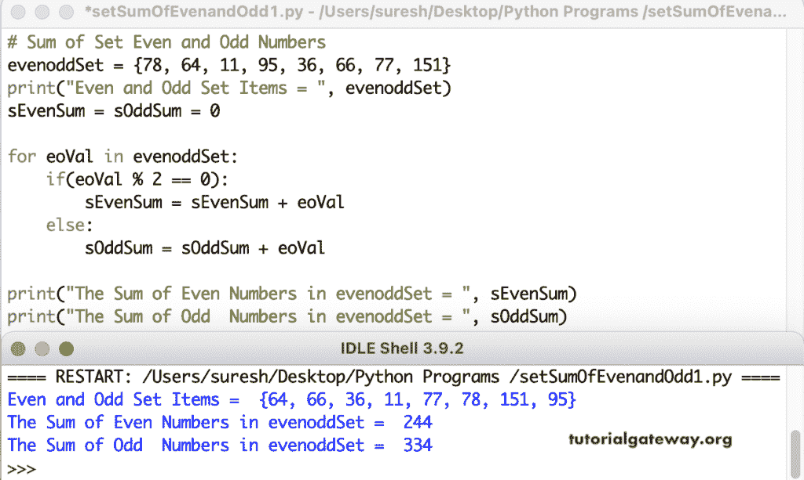

# Python 程序：求集合中偶数和奇数的和

> 原文：<https://www.tutorialgateway.org/python-program-to-find-sum-of-even-and-odd-numbers-in-set/>

写一个 Python 程序来求一个集合中偶数和奇数的和。if 条件(if(eoVal % 2 == 0))检查可被二整除的集合项是否等于零。如果为真，则将该设置值添加到 sEvenSum 否则，添加到 sOddSum。

```py
# Sum of Set Even and Odd Numbers

evenoddSet = {78, 64, 11, 95, 36, 66, 77, 151}
print("Even and Odd Set Items = ", evenoddSet)

sEvenSum = sOddSum = 0

for eoVal in evenoddSet:
    if(eoVal % 2 == 0):
        sEvenSum = sEvenSum + eoVal
    else:
        sOddSum = sOddSum + eoVal

print("The Sum of Even Numbers in evenoddSet = ", sEvenSum)
print("The Sum of Odd  Numbers in evenoddSet = ", sOddSum)
```



## Python 程序求集合中偶数和奇数的和

这个 Python 奇偶和示例允许输入集合项。

```py
# Sum of Set Even and Odd Numbers

evenoddSet = set()

number = int(input("Enter the Total Even Odd Set Items = "))
for i in range(1, number + 1):
    value = int(input("Enter the %d Set Item = " %i))
    evenoddSet.add(value)

print("Even and Odd Set Items = ", evenoddSet)

sEvenSum = sOddSum = 0

for eoVal in evenoddSet:
    if(eoVal % 2 == 0):
        sEvenSum = sEvenSum + eoVal
    else:
        sOddSum = sOddSum + eoVal

print("The Sum of Even Numbers in evenoddSet = ", sEvenSum)
print("The Sum of Odd  Numbers in evenoddSet = ", sOddSum)
```

Python 集合输出中偶数和奇数的和

```py
Enter the Total Even Odd Set Items = 7
Enter the 1 Set Item = 22
Enter the 2 Set Item = 44
Enter the 3 Set Item = 87
Enter the 4 Set Item = 99
Enter the 5 Set Item = 122
Enter the 6 Set Item = 321
Enter the 7 Set Item = 439
Even and Odd Set Items =  {321, 439, 99, 44, 22, 87, 122}
The Sum of Even Numbers in evenoddSet =  188
The Sum of Odd  Numbers in evenoddSet =  946
```

在这个 Python 集合的例子中，我们创建了一个 sumOfSetEvenandOddNumbers 函数，该函数返回一个[集合](https://www.tutorialgateway.org/python-set/)中偶数和奇数的总和。

```py
# Sum of Set Even and Odd Numbers

def sumOfSetEvenandOddNumbers(evenoddSet):
    sEvenSum = sOddSum = 0

    for eoVal in evenoddSet:
        if(eoVal % 2 == 0):
            sEvenSum = sEvenSum + eoVal
        else:
            sOddSum = sOddSum + eoVal
    return sEvenSum, sOddSum

evenoddSet = set()

number = int(input("Enter the Total Even Odd Set Items = "))
for i in range(1, number + 1):
    value = int(input("Enter the %d Set Item = " %i))
    evenoddSet.add(value)

print("Even and Odd Set Items = ", evenoddSet)

sESum, sOSum = sumOfSetEvenandOddNumbers(evenoddSet)
print("The Sum of Even Numbers in evenoddSet = ", sESum)
print("The Sum of Odd  Numbers in evenoddSet = ", sOSum)
```

```py
Enter the Total Even Odd Set Items = 5
Enter the 1 Set Item = 12
Enter the 2 Set Item = 33
Enter the 3 Set Item = 44
Enter the 4 Set Item = 86
Enter the 5 Set Item = 99
Even and Odd Set Items =  {33, 99, 12, 44, 86}
The Sum of Even Numbers in evenoddSet =  142
The Sum of Odd  Numbers in evenoddSet =  132
```