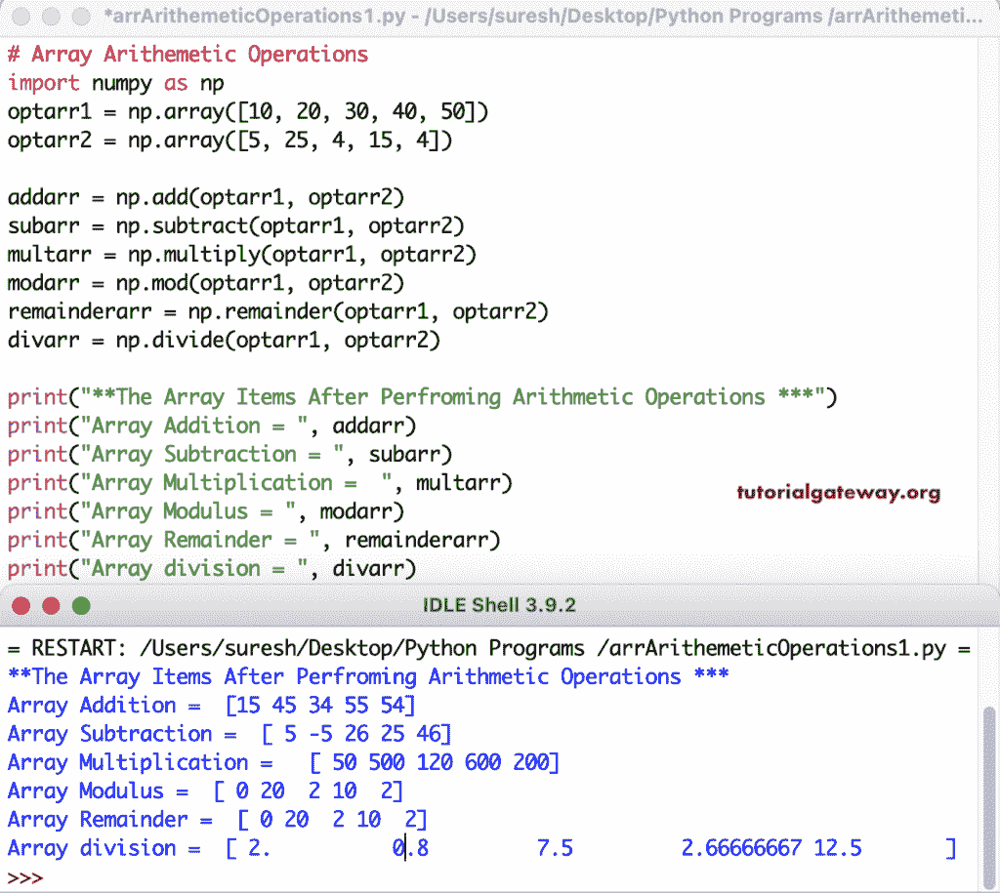

# Python 程序：对数组执行算术运算

> 原文：<https://www.tutorialgateway.org/python-program-to-perform-arithmetic-operations-on-array/>

Python Numpy 模块具有加、减、乘、除、模和余数功能，可对 Numpy 数组执行算术运算。

```py
# Array Arithemetic Operations
import numpy as np

optarr1 = np.array([10, 20, 30, 40, 50])
optarr2 = np.array([5, 25, 4, 15, 4])

addarr = np.add(optarr1, optarr2)
subarr = np.subtract(optarr1, optarr2)
multarr = np.multiply(optarr1, optarr2)
modarr = np.mod(optarr1, optarr2)
remainderarr = np.remainder(optarr1, optarr2)
divarr = np.divide(optarr1, optarr2)

print("**The Array Items After Perfroming Arithmetic Operations ***")
print("Array Addition = ", addarr)
print("Array Subtraction = ", subarr)
print("Array Multiplication =  ", multarr)
print("Array Modulus = ", modarr)
print("Array Remainder = ", remainderarr)
print("Array division = ", divarr)
```



在这个 Python 程序中，我们使用算术运算符对 Numpy 数组执行算术运算。

```py
# Array Arithemetic Operations
import numpy as np

optarr1 = np.array([10, 25, 35, 45, 50, 70, 90])
optarr2 = np.array([5, 40, 65, 7, 19, 22, 11])

addarr = optarr1 + optarr2
subarr = optarr1 - optarr2
multarr = optarr1 * optarr2
modarr = optarr1 % optarr2
divarr = optarr1 / optarr2

print("**The Array Items After Perfroming Arithmetic Operations ***")
print("Array Addition = ", addarr)
print("Array Subtraction = ", subarr)
print("Array Multiplication =  ", multarr)
print("Array Modulus = ", modarr)
print("Array division = ", divarr)
```

```py
**The Array Items After Perfroming Arithmetic Operations ***
Array Addition =  [ 15  65 100  52  69  92 101]
Array Subtraction =  [  5 -15 -30  38  31  48  79]
Array Multiplication =   [  50 1000 2275  315  950 1540  990]
Array Modulus =  [ 0 25 35  3 12  4  2]
Array division =  [2\.         0.625      0.53846154 6.42857143 2.63157895 3.18181818
 8.18181818]
```

使用 For 循环对数组执行算术运算的 Python 程序。

```py
# Array Arithemetic Operations
import numpy as np

optarr1 = np.array([10, 25, 35, 45, 50, 70, 90])
optarr2 = np.array([5, 40, 65, 7, 19, 22, 11])
addarr = np.empty(7)
subarr = np.empty(7)
multarr = np.empty(7)
modarr = np.empty(7)
divarr = np.empty(7)

for i in range(len(optarr1)):
    addarr[i] = optarr1[i] + optarr2[i]
    subarr[i] = optarr1[i] - optarr2[i]
    multarr[i] = optarr1[i] * optarr2[i]
    modarr[i] = optarr1[i] % optarr2[i]
    divarr[i] = optarr1[i] / optarr2[i]

print("**The Array Items After Perfroming Arithmetic Operations ***")
print("Array Addition = ", addarr)
print("Array Subtraction = ", subarr)
print("Array Multiplication =  ", multarr)
print("Array Modulus = ", modarr)
print("Array division = ", divarr)
```

NumPy 数组输出的 Python 算术运算

```py
**The Array Items After Perfroming Arithmetic Operations ***
Array Addition =  [ 15\.  65\. 100\.  52\.  69\.  92\. 101.]
Array Subtraction =  [  5\. -15\. -30\.  38\.  31\.  48\.  79.]
Array Multiplication =   [  50\. 1000\. 2275\.  315\.  950\. 1540\.  990.]
Array Modulus =  [ 0\. 25\. 35\.  3\. 12\.  4\.  2.]
Array division =  [2\.         0.625      0.53846154 6.42857143 2.63157895 3.18181818
 8.18181818]
```