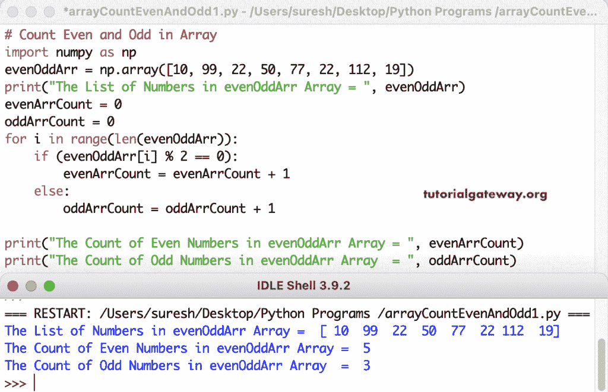

# Python 程序：计算数组中偶数和奇数

> 原文：<https://www.tutorialgateway.org/python-program-to-count-even-and-odd-numbers-in-an-array/>

编写一个 Python 程序来计算数组中的偶数和奇数，用于循环范围。if 条件(if (evenOddArr[i] % 2 == 0))检查数组项是否可被二整除。如果为真，我们将偶数数组计数加 1；否则，将奇数数组计数值加 1。

```py
# Count Even and Odd in Array

import numpy as np

evenOddArr = np.array([10, 99, 22, 50, 77, 22, 112, 19])
print("The List of Numbers in evenOddArr Array = ", evenOddArr)

evenArrCount = 0
oddArrCount = 0

for i in range(len(evenOddArr)):
    if (evenOddArr[i] % 2 == 0):
        evenArrCount = evenArrCount + 1
    else:
        oddArrCount = oddArrCount + 1

print("The Count of Even Numbers in evenOddArr Array = ", evenArrCount)
print("The Count of Odd Numbers in evenOddArr Array  = ", oddArrCount)
```



## 计算数组中偶数和奇数的 Python 程序

在这个 Python 例子中，我们使用 numpy mod 和余数函数来检查每个项目的余数是否等于零。

```py
# Count Even and Odd in Array

import numpy as np

evenArr = np.array([4, 29, 88, 5, 0, 11, 17, 18, 7, 44, 9, 89])
evenArrCount = evenArrCount1 = evenArrCount2 = 0
oddArrCount = oddArrCount1 = oddArrCount2 = 0

for i in evenArr:
    if (i % 2 == 0):
        evenArrCount = evenArrCount + 1
    else:
        oddArrCount = oddArrCount + 1

print("The Count of Even Numbers in evenOddArr Array = ", evenArrCount)
print("The Count of Odd Numbers in evenOddArr Array  = ", oddArrCount)

print("\n=== Using mod function===")
for i in evenArr:
    if (np.mod(i, 2) == 0):
        evenArrCount1 = evenArrCount1 + 1
    else:
        oddArrCount1 = oddArrCount1 + 1

print("The Count of Even Numbers in evenOddArr Array = ", evenArrCount1)
print("The Count of Odd Numbers in evenOddArr Array  = ", oddArrCount1)

print("\n=== Using remainder function===")
for i in evenArr:
    if (np.remainder(i, 2) == 0):
        evenArrCount2 = evenArrCount2 + 1
    else:
        oddArrCount2 = oddArrCount2 + 1
print("The Count of Even Numbers in evenOddArr Array = ", evenArrCount2)
print("The Count of Odd Numbers in evenOddArr Array  = ", oddArrCount2)
```

Python 计算 Numpy 数组输出中的偶数和奇数

```py
The Count of Even Numbers in evenOddArr Array =  5
The Count of Odd Numbers in evenOddArr Array  =  7

=== Using mod function===
The Count of Even Numbers in evenOddArr Array =  5
The Count of Odd Numbers in evenOddArr Array  =  7

=== Using remainder function===
The Count of Even Numbers in evenOddArr Array =  5
The Count of Odd Numbers in evenOddArr Array  =  7
```

Python 程序使用 While 循环计算 Numpy 数组中的偶数和奇数。

```py
# Count Even and Odd in Array
import numpy as np
evenOddArr = np.array([4, 15, 19, 22, 9, 18, 140])
i = 0
evenArrCount = 0
oddArrCount = 0
while (i < len(evenOddArr)):
    if (np.equal(evenOddArr[i] % 2, 0)):
        evenArrCount = evenArrCount + 1
    else:
        oddArrCount = oddArrCount + 1
    i = i + 1

print("The Count of Even Numbers in evenOddArr Array = ", evenArrCount)
print("The Count of Odd Numbers in evenOddArr Array  = ", oddArrCount)
```

使用 While 循环输出 计算 Python Numpy 数组中的偶数和奇数

```py
The Count of Even Numbers in evenOddArr Array =  4
The Count of Odd Numbers in evenOddArr Array  =  3
```

在这个 Python [numpy 数组](https://www.tutorialgateway.org/python-numpy-array/)的例子中，我们创建了一个(counterevenoddles(evenOddArr))函数，返回偶数和奇数的计数。

```py
# Count Even and Odd in Array
import numpy as np
def CountEvenOddNumbers(evenOddArr):
    evenArrCount = 0
    oddArrCount = 0
    for i in evenOddArr:
        if (np.remainder(i, 2) == 0):
            evenArrCount = evenArrCount + 1
        else:
            oddArrCount = oddArrCount + 1

    return evenArrCount, oddArrCount

evenOddArr = np.array([11, 88, 15, 122, 140, 17, 10, 48, 35, 64])
even, odd = CountEvenOddNumbers(evenOddArr)
print("The Count of Even Numbers in evenOddArr Array = ", even)
print("The Count of Odd Numbers in evenOddArr Array  = ", odd)
```

使用函数输出计算 Numpy 数组中的偶数和奇数

```py
The Count of Even Numbers in evenOddArr Array =  6
The Count of Odd Numbers in evenOddArr Array  =  4
```