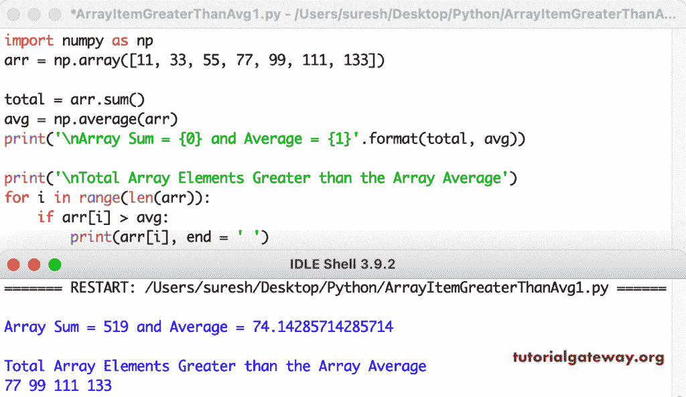

# Python 程序：寻找大于平均值的数组元素

> 原文：<https://www.tutorialgateway.org/python-program-to-find-array-elements-greater-than-average/>

写一个 Python 程序来寻找大于平均值的数组元素。在这个 python 示例中，首先，我们将找到 numpy 数组元素的平均值。然后 for 循环迭代数组元素，if 条件(if arr[i] > avg)检查每个项目是否大于数组平均值。最后，如果为真，打印该项目。

```py
import numpy as np

arr = np.array([11, 33, 55, 77, 99, 111, 133])

total = arr.sum()
avg = np.average(arr)

print('\nArray Sum = {0} and Average = {1}'.format(total, avg))

print('\nTotal Array Elements Greater than the Array Average')
for i in range(len(arr)):
    if arr[i] > avg:
        print(arr[i], end = ' ')
```



这个 Python 程序使用 for 循环找到大于平均值的数组元素。

```py
import numpy as np

arr = np.random.randint(10, 150, size = 11)

print('The Random Array Genegrated')
print(arr)

total = 0

for i in range(len(arr)):
    total = total + arr[i]

avg = total / len(arr)

print('\nArray Sum = {0} and Average = {1}'.format(total, avg))

print('\nTotal Array Elements Greater than the Array Average')
for i in range(len(arr)):
    if arr[i] > avg:
        print(arr[i], end = ' ')
```

```py
The Random Array Genegrated
[ 46  43 132  55  13  14  15 140 104  13 101]

Array Sum = 676 and Average = 61.45454545454545

Total Array Elements Greater than the Array Average
132 140 104 101 
```

## 使用 while 循环查找大于平均值的数组元素的 Python 程序

```py
import numpy as np

arr = np.random.randint(50, 300, size = 14)

print('The Random Array Genegrated')
print(arr)

total = 0
i = 0
while(i < len(arr)):
    total = total + arr[i]
    i = i + 1

avg = total / len(arr)

print('\nArray Sum = {0} and Average = {1}'.format(total, avg))

print('\nTotal Array Elements Greater than the Array Average')
i = 0
while(i < len(arr)):
    if arr[i] > avg:
        print(arr[i], end = ' ')
    i = i + 1
```

```py
The Random Array Genegrated
[ 91 291 111 157 276  99  94 177 143 134 178 289 272 206]

Array Sum = 2518 and Average = 179.85714285714286

Total Array Elements Greater than the Array Average
291 276 289 272 206 
```

这个 [Python 示例](https://www.tutorialgateway.org/python-programming-examples/)允许输入 [numpy](https://www.tutorialgateway.org/python-numpy-array/) 数组元素，并查找大于数组平均值的数组项目。

```py
import numpy as np

arrlist = []
Number = int(input("Total Array Elements to enter = "))

for i in range(1, Number + 1):
    value = int(input("Please enter the %d Array Value = "  %i))
    arrlist.append(value)

arr = np.array(arrlist)

total = 0

for i in range(len(arr)):
    total = total + arr[i]

avg = total / len(arr)

print('\nArray Sum = {0} and Average = {1}'.format(total, avg))

print('\nTotal Array Elements Greater than the Array Average')
for i in range(len(arr)):
    if arr[i] > avg:
        print(arr[i], end = ' ')
```

```py
Total Array Elements to enter = 7
Please enter the 1 Array Value = 22
Please enter the 2 Array Value = 33
Please enter the 3 Array Value = 44
Please enter the 4 Array Value = 55
Please enter the 5 Array Value = 76
Please enter the 6 Array Value = 98
Please enter the 7 Array Value = 234

Array Sum = 562 and Average = 80.28571428571429

Total Array Elements Greater than the Array Average
98 234 
```