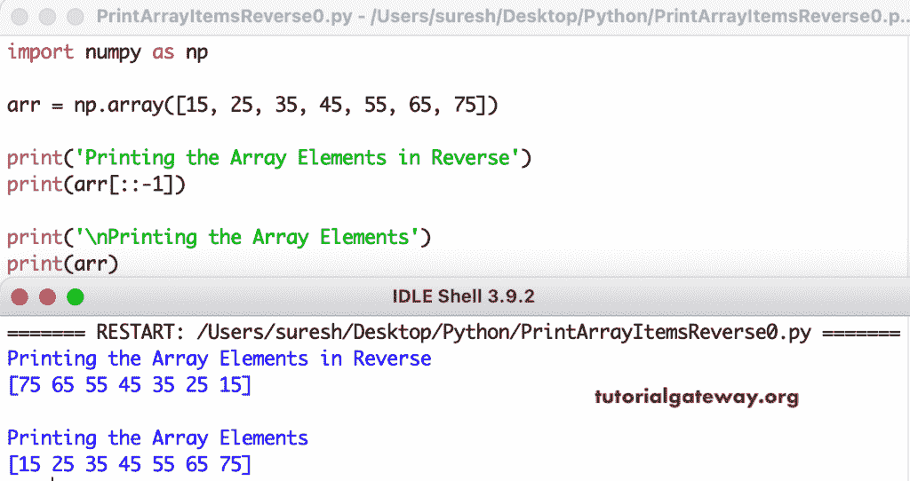

# Python 程序：以逆序打印数组元素

> 原文：<https://www.tutorialgateway.org/python-program-to-print-array-elements-in-reverse-order/>

编写一个 Python 程序，以逆序打印数组元素。在这个 Python 示例中，带有负值的列表切片以相反的顺序打印 numpy 数组元素。

```py
import numpy as np

arr = np.array([15, 25, 35, 45, 55, 65, 75])

print('Printing the Array Elements in Reverse')
print(arr[::-1])

print('\nPrinting the Array Elements')
print(arr)
```



在这个 Python 程序中，for 循环根据索引位置从最后到第一次迭代数组元素，并以相反的顺序打印数组项。

```py
import numpy as np

arr = np.array([15, 25, 35, 45, 55, 65, 75])

print('Printing the Array Elements in Reverse')
for i in range(len(arr) - 1, -1, -1):
    print(arr[i], end = '  ')
```

```py
Printing the Array Elements in Reverse
75  65  55  45  35  25  15 
```

Python 程序，使用 while 循环以相反的顺序打印数组元素。

```py
import numpy as np

arr = np.array([22, 44, 66, 77, 89, 11, 19])

print('Printing the Array Elements in Reverse')
i = len(arr) - 1
while i >= 0:
    print(arr[i], end = '  ')
    i = i - 1
```

```py
Printing the Array Elements in Reverse
19  11  89  77  66  44  22 
```

这个 [Python 示例](https://www.tutorialgateway.org/python-programming-examples/)允许输入 [Numpy](https://www.tutorialgateway.org/python-numpy-array/) 数组元素并以相反的顺序打印它们。

```py
import numpy as np

arrlist1 = []
arrTot = int(input("Total Number of Array Elements to enter = "))

for i in range(1, arrTot + 1):
    arrvalue = int(input("Please enter the %d Array Value = "  %i))
    arrlist1.append(arrvalue)

arr = np.array(arrlist1)

print('Printing the Array Elements in Reverse')
for i in range(len(arr) - 1, -1, -1):
    print(arr[i], end = '  ')
```

```py
Total Number of Array Elements to enter = 9
Please enter the 1 Array Value = 21
Please enter the 2 Array Value = 34
Please enter the 3 Array Value = 65
Please enter the 4 Array Value = 78
Please enter the 5 Array Value = 98
Please enter the 6 Array Value = 34
Please enter the 7 Array Value = 65
Please enter the 8 Array Value = 87
Please enter the 9 Array Value = 99
Printing the Array Elements in Reverse
99  87  65  34  98  78  65  34  21 
```