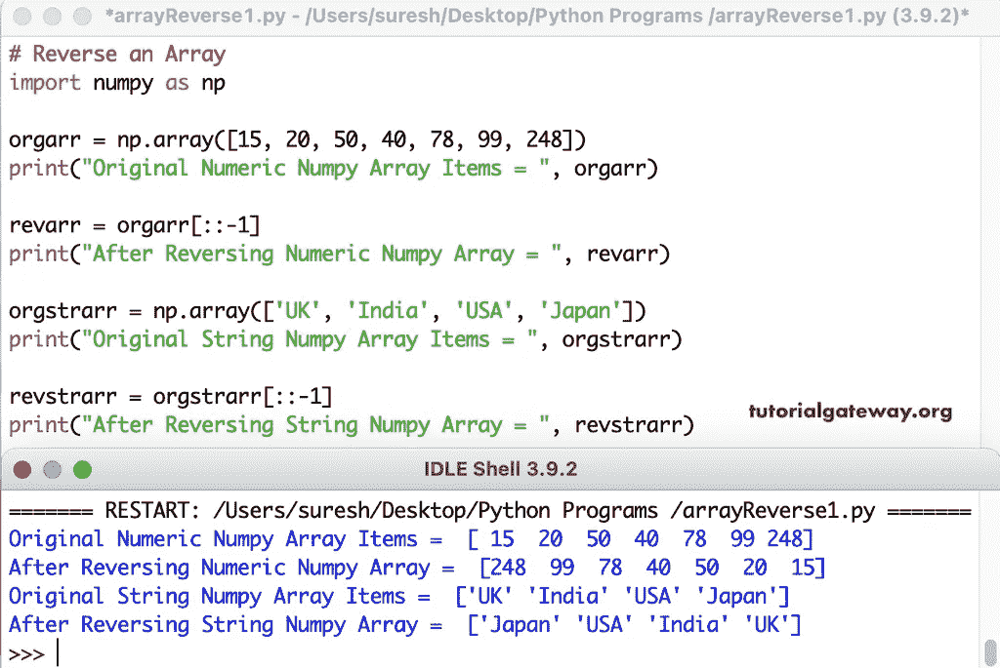

# Python 程序：反转数组

> 原文：<https://www.tutorialgateway.org/python-program-to-reverse-an-array/>

写一个 Python 程序来反转给定的 Numpy 数组。我们可以使用带有负值的切片技术来获得相反的 Numpy 数组。在本例中，我们使用相同的方法来反转数字和字符串数组。

```py
import numpy as np

orgarr = np.array([15, 20, 50, 40, 78, 99, 248])
print("Original Numeric Numpy Array Items = ", orgarr)

revarr = orgarr[::-1]
print("After Reversing Numeric Numpy Array = ", revarr)

orgstrarr = np.array(['UK', 'India', 'USA', 'Japan'])
print("Original String Numpy Array Items = ", orgstrarr)

revstrarr = orgstrarr[::-1]
print("After Reversing String Numpy Array = ", revstrarr)
```



## 使用 While 循环反转数组的 Python 程序

这个 Python 示例使用临时变量来移动 NumPy 数组项并反转它们。

```py
import numpy as np

orgarr = np.array([14, 27, 99, 50, 65, 18, 195, 100])
print("Original Numeric Numpy Array Items = ", orgarr)

j = len(orgarr) - 1
i = 0

while(i < j):
    temp = orgarr[i]
    orgarr[i] = orgarr[j]
    orgarr[j] = temp
    i += 1
    j -= 1

print("After Reversing Numeric Numpy Array = ", orgarr)
```

```py
Original Numeric Numpy Array Items =  [ 14  27  99  50  65  18 195 100]
After Reversing Numeric Numpy Array =  [100 195  18  65  50  99  27  14]
```

在这个 Python Numpy Array 示例中，我们创建了一个函数(def reverseArray(orgarr，number))来反转传递给它的[数组](https://www.tutorialgateway.org/python-numpy-array/)。

```py
import numpy as np

def reverseArray(orgarr, number) :
    j = number - 1
    i = 0

    while(i < j):
        temp = orgarr[i]
        orgarr[i] = orgarr[j]
        orgarr[j] = temp
        i += 1
        j -= 1

arrList = []
number = int(input("Enter the Total Array Items = "))
for i in range(1, number + 1):
    value = int(input("Enter the %d Array value = " %i))
    arrList.append(value)

orgarr = np.array(arrList)
print("Original Numeric Numpy Array Items = ", orgarr)

reverseArray(orgarr, number) 
print("After Reversing Numeric Numpy Array = ", orgarr)
```

```py
Enter the Total Array Items = 4
Enter the 1 Array value = 20
Enter the 2 Array value = 40
Enter the 3 Array value = 60
Enter the 4 Array value = 80
Original Numeric Numpy Array Items =  [20 40 60 80]
After Reversing Numeric Numpy Array =  [80 60 40 20]
```

在这个 Python 示例中，我们创建了一个递归函数来用更新的值反转数组(reverseArray(orgarr，i + 1，j–1))。

```py
import numpy as np

def reverseArray(orgarr, i, j) :
   if(i < j):
        temp = orgarr[i]
        orgarr[i] = orgarr[j]
        orgarr[j] = temp
        reverseArray(orgarr, i + 1, j - 1)

orgarr = np.array([22, 44, 87, 538, 89, 120, 197])
print("Original Numeric Numpy Array Items = ", orgarr)

reverseArray(orgarr, 0, (len(orgarr) - 1))
print("After Reversing Numeric Numpy Array = ", orgarr)
```

```py
Original Numeric Numpy Array Items =  [ 22  44  87 538  89 120 197]
After Reversing Numeric Numpy Array =  [197 120  89 538  87  44  22]
```