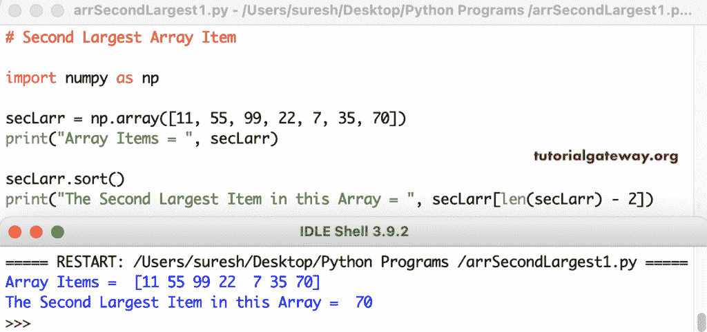

# Python 程序：寻找数组中第二大元素

> 原文：<https://www.tutorialgateway.org/python-program-to-find-second-largest-in-an-array/>

写一个 Python 程序来寻找 Numpy 数组中的第二大数字。我们使用 numpy 排序函数对数组进行升序排序。接下来，我们在最后一个索引位置打印该值。

```py
import numpy as np

secLarr = np.array([11, 55, 99, 22, 7, 35, 70])
print("Array Items = ", secLarr)

secLarr.sort()
print("The Second Largest Item in this Array = ", secLarr[len(secLarr) - 2])
```



使用 For 循环范围查找 numpy 数组中第二大数组的 Python 程序。

```py
import numpy as np

secLarr = np.array([15, 22, 75, 99, 35, 70, 120, 60])
print("Array Items = ", secLarr)

first = second = min(secLarr)

for i in range(len(secLarr)):
    if (secLarr[i] > first):
        second = first
        first = secLarr[i]
    elif(secLarr[i] > second and secLarr[i] < first):
        second = secLarr[i]

print("The Largest Item in this Array = ", first)
print("The Second Largest Item in this Array = ", second)
```

使用 for 循环范围输出的第二大 Python numpy 数组项

```py
Array Items =  [ 15  22  75  99  35  70 120  60]
The Largest Item in this Array =  120
The Second Largest Item in this Array =  99
```